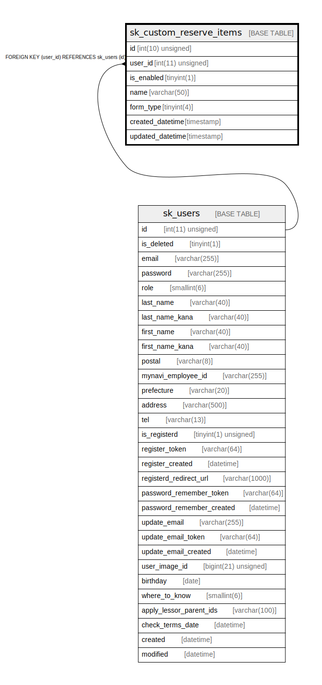

# sk_custom_reserve_items

## Description

<details>
<summary><strong>Table Definition</strong></summary>

```sql
CREATE TABLE `sk_custom_reserve_items` (
  `id` int(10) unsigned NOT NULL AUTO_INCREMENT,
  `user_id` int(11) unsigned NOT NULL COMMENT 'ユーザーID (本店・支店いずれか)',
  `is_enabled` tinyint(1) NOT NULL DEFAULT '0' COMMENT '有効・無効',
  `name` varchar(50) COLLATE utf8mb4_unicode_ci NOT NULL COMMENT '項目名',
  `form_type` tinyint(4) NOT NULL COMMENT 'フォームのタイプ',
  `created_datetime` timestamp NULL DEFAULT CURRENT_TIMESTAMP,
  `updated_datetime` timestamp NULL DEFAULT CURRENT_TIMESTAMP ON UPDATE CURRENT_TIMESTAMP,
  PRIMARY KEY (`id`),
  KEY `sk__idx` (`user_id`),
  CONSTRAINT `fk_admin_custom_forms__users_idx` FOREIGN KEY (`user_id`) REFERENCES `sk_users` (`id`) ON DELETE CASCADE ON UPDATE CASCADE
) ENGINE=InnoDB AUTO_INCREMENT=[Redacted by tbls] DEFAULT CHARSET=utf8mb4 COLLATE=utf8mb4_unicode_ci
```

</details>

## Columns

| Name | Type | Default | Nullable | Extra Definition | Children | Parents | Comment |
| ---- | ---- | ------- | -------- | ---------------- | -------- | ------- | ------- |
| id | int(10) unsigned |  | false | auto_increment |  |  |  |
| user_id | int(11) unsigned |  | false |  |  | [sk_users](sk_users.md) | ユーザーID (本店・支店いずれか) |
| is_enabled | tinyint(1) | 0 | false |  |  |  | 有効・無効 |
| name | varchar(50) |  | false |  |  |  | 項目名 |
| form_type | tinyint(4) |  | false |  |  |  | フォームのタイプ |
| created_datetime | timestamp | CURRENT_TIMESTAMP | true |  |  |  |  |
| updated_datetime | timestamp | CURRENT_TIMESTAMP | true | on update CURRENT_TIMESTAMP |  |  |  |

## Constraints

| Name | Type | Definition |
| ---- | ---- | ---------- |
| fk_admin_custom_forms__users_idx | FOREIGN KEY | FOREIGN KEY (user_id) REFERENCES sk_users (id) |
| PRIMARY | PRIMARY KEY | PRIMARY KEY (id) |

## Indexes

| Name | Definition |
| ---- | ---------- |
| sk__idx | KEY sk__idx (user_id) USING BTREE |
| PRIMARY | PRIMARY KEY (id) USING BTREE |

## Relations



---

> Generated by [tbls](https://github.com/k1LoW/tbls)
