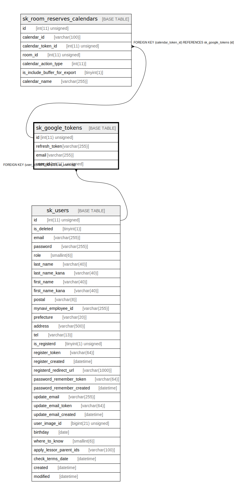

# sk_google_tokens

## Description

<details>
<summary><strong>Table Definition</strong></summary>

```sql
CREATE TABLE `sk_google_tokens` (
  `id` int(11) unsigned NOT NULL AUTO_INCREMENT,
  `refresh_token` varchar(255) COLLATE utf8mb4_unicode_ci NOT NULL COMMENT 'refresh_token',
  `email` varchar(255) COLLATE utf8mb4_unicode_ci NOT NULL COMMENT 'email',
  `user_id` int(11) unsigned NOT NULL COMMENT '借主ID',
  PRIMARY KEY (`id`),
  KEY `sk_relation_calendar_tokens_and_users` (`user_id`),
  CONSTRAINT `sk_relation_calendar_tokens_and_users` FOREIGN KEY (`user_id`) REFERENCES `sk_users` (`id`) ON DELETE CASCADE ON UPDATE CASCADE
) ENGINE=InnoDB AUTO_INCREMENT=[Redacted by tbls] DEFAULT CHARSET=utf8mb4 COLLATE=utf8mb4_unicode_ci
```

</details>

## Columns

| Name | Type | Default | Nullable | Extra Definition | Children | Parents | Comment |
| ---- | ---- | ------- | -------- | ---------------- | -------- | ------- | ------- |
| id | int(11) unsigned |  | false | auto_increment | [sk_room_reserves_calendars](sk_room_reserves_calendars.md) |  |  |
| refresh_token | varchar(255) |  | false |  |  |  | refresh_token |
| email | varchar(255) |  | false |  |  |  | email |
| user_id | int(11) unsigned |  | false |  |  | [sk_users](sk_users.md) | 借主ID |

## Constraints

| Name | Type | Definition |
| ---- | ---- | ---------- |
| PRIMARY | PRIMARY KEY | PRIMARY KEY (id) |
| sk_relation_calendar_tokens_and_users | FOREIGN KEY | FOREIGN KEY (user_id) REFERENCES sk_users (id) |

## Indexes

| Name | Definition |
| ---- | ---------- |
| sk_relation_calendar_tokens_and_users | KEY sk_relation_calendar_tokens_and_users (user_id) USING BTREE |
| PRIMARY | PRIMARY KEY (id) USING BTREE |

## Relations



---

> Generated by [tbls](https://github.com/k1LoW/tbls)
