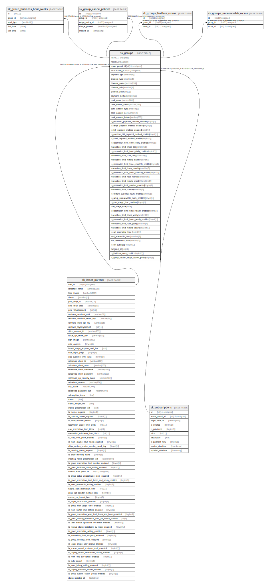

# sk_groups

## Description

グループ

<details>
<summary><strong>Table Definition</strong></summary>

```sql
CREATE TABLE `sk_groups` (
  `id` int(11) unsigned NOT NULL AUTO_INCREMENT COMMENT 'ID',
  `name` varchar(255) NOT NULL DEFAULT '' COMMENT 'グループ名',
  `lessor_parent_id` int(11) unsigned NOT NULL COMMENT '本店ID',
  `subscription_id` int(11) unsigned DEFAULT NULL,
  `payment_type` smallint(6) NOT NULL DEFAULT '1' COMMENT '1:都度決済（デフォルト）、2:まとめ払い',
  `discount_type` smallint(6) NOT NULL DEFAULT '0' COMMENT '0:割引なし、1:割引率指定、2:割引額指定',
  `discount_name` varchar(255) NOT NULL DEFAULT '' COMMENT '割引名',
  `discount_rate` smallint(3) NOT NULL DEFAULT '0' COMMENT '割引率',
  `discount_price` int(11) NOT NULL DEFAULT '0' COMMENT '割引額',
  `payment_method` smallint(2) DEFAULT NULL COMMENT '支払い方法 1:バーチャル口座、2:オーナー口座(まとめ払いの場合), 3:ペイジー',
  `bank_name` varchar(200) DEFAULT NULL COMMENT '金融機関名(まとめ払い+オーナー口座の場合)',
  `bank_branch_name` varchar(200) DEFAULT NULL COMMENT '支店名(まとめ払い+オーナー口座の場合)',
  `bank_account_type` smallint(2) DEFAULT NULL COMMENT '口座種別 1:普通 2:当座(まとめ払い+オーナー口座の場合)',
  `bank_account_no` varchar(10) DEFAULT NULL COMMENT '口座番号(まとめ払い+オーナー口座の場合)',
  `bank_account_holder` varchar(200) DEFAULT NULL COMMENT '口座名義(まとめ払い+オーナー口座の場合)',
  `is_creditcard_payment_method_enabled` tinyint(1) DEFAULT '0',
  `is_stripe_payment_method_enabled` tinyint(1) DEFAULT '0',
  `is_bill_payment_method_enabled` tinyint(1) DEFAULT '0',
  `is_onetime_bill_payment_method_enabled` tinyint(1) DEFAULT '0',
  `is_local_payment_method_enabled` tinyint(1) DEFAULT '0',
  `is_reservation_limit_times_daily_enabled` tinyint(1) DEFAULT '0',
  `reservation_limit_times_daily` smallint(6) DEFAULT NULL,
  `is_reservation_limit_hours_daily_enabled` tinyint(1) DEFAULT '0',
  `reservation_limit_hour_daily` smallint(6) DEFAULT NULL,
  `reservation_limit_minute_daily` smallint(6) DEFAULT NULL,
  `is_reservation_limit_times_monthly_enabled` tinyint(1) DEFAULT '0',
  `reservation_limit_times_monthly` smallint(6) DEFAULT NULL,
  `is_reservation_limit_hours_monthly_enabled` tinyint(1) DEFAULT '0',
  `reservation_limit_hour_monthly` smallint(6) DEFAULT NULL,
  `reservation_limit_minute_monthly` smallint(6) DEFAULT NULL,
  `is_reservation_limit_number_enabled` tinyint(1) DEFAULT '0',
  `reservation_limit_number` smallint(6) DEFAULT NULL,
  `is_custom_business_hours_enabled` tinyint(1) DEFAULT '0',
  `is_setup_unreservable_room_enabled` tinyint(1) NOT NULL DEFAULT '0',
  `is_max_usage_time_enabled` tinyint(1) DEFAULT '0',
  `max_usage_time` time DEFAULT NULL COMMENT '最大利用時間',
  `is_reservation_limit_times_yearly_enabled` tinyint(1) DEFAULT '0',
  `reservation_limit_times_yearly` smallint(6) DEFAULT NULL,
  `is_reservation_limit_hours_yearly_enabled` tinyint(1) DEFAULT '0',
  `reservation_limit_hour_yearly` smallint(6) DEFAULT NULL,
  `reservation_limit_minute_yearly` smallint(1) DEFAULT NULL,
  `is_set_reservable_time` tinyint(1) DEFAULT '0',
  `start_reservable_time` smallint(3) DEFAULT '0',
  `end_reservable_time` smallint(3) DEFAULT '14',
  `is_set_subgroup` tinyint(1) DEFAULT '0',
  `subgroup_id` int(11) DEFAULT NULL,
  `is_limitless_room_enabled` tinyint(1) DEFAULT '0',
  `is_group_custom_origin_cancel_policy` tinyint(1) DEFAULT '0',
  PRIMARY KEY (`id`),
  KEY `sk_relation_groups_and_lessor_parents` (`lessor_parent_id`),
  KEY `sk_groups__subscription_id__sk_subscriptions_id_idx` (`subscription_id`),
  CONSTRAINT `sk_groups__subscription_id__sk_subscriptions_id` FOREIGN KEY (`subscription_id`) REFERENCES `sk_subscriptions` (`id`) ON DELETE NO ACTION ON UPDATE NO ACTION,
  CONSTRAINT `sk_relation_groups_and_lessor_parents` FOREIGN KEY (`lessor_parent_id`) REFERENCES `sk_lessor_parents` (`user_id`) ON DELETE CASCADE ON UPDATE CASCADE
) ENGINE=InnoDB AUTO_INCREMENT=[Redacted by tbls] DEFAULT CHARSET=utf8 COMMENT='グループ'
```

</details>

## Columns

| Name | Type | Default | Nullable | Extra Definition | Children | Parents | Comment |
| ---- | ---- | ------- | -------- | ---------------- | -------- | ------- | ------- |
| id | int(11) unsigned |  | false | auto_increment | [sk_group_business_hour_weeks](sk_group_business_hour_weeks.md) [sk_group_cancel_policies](sk_group_cancel_policies.md) [sk_groups_limitless_rooms](sk_groups_limitless_rooms.md) [sk_groups_unreservable_rooms](sk_groups_unreservable_rooms.md) |  | ID |
| name | varchar(255) |  | false |  |  |  | グループ名 |
| lessor_parent_id | int(11) unsigned |  | false |  |  | [sk_lessor_parents](sk_lessor_parents.md) | 本店ID |
| subscription_id | int(11) unsigned |  | true |  |  | [sk_subscriptions](sk_subscriptions.md) |  |
| payment_type | smallint(6) | 1 | false |  |  |  | 1:都度決済（デフォルト）、2:まとめ払い |
| discount_type | smallint(6) | 0 | false |  |  |  | 0:割引なし、1:割引率指定、2:割引額指定 |
| discount_name | varchar(255) |  | false |  |  |  | 割引名 |
| discount_rate | smallint(3) | 0 | false |  |  |  | 割引率 |
| discount_price | int(11) | 0 | false |  |  |  | 割引額 |
| payment_method | smallint(2) |  | true |  |  |  | 支払い方法 1:バーチャル口座、2:オーナー口座(まとめ払いの場合), 3:ペイジー |
| bank_name | varchar(200) |  | true |  |  |  | 金融機関名(まとめ払い+オーナー口座の場合) |
| bank_branch_name | varchar(200) |  | true |  |  |  | 支店名(まとめ払い+オーナー口座の場合) |
| bank_account_type | smallint(2) |  | true |  |  |  | 口座種別 1:普通 2:当座(まとめ払い+オーナー口座の場合) |
| bank_account_no | varchar(10) |  | true |  |  |  | 口座番号(まとめ払い+オーナー口座の場合) |
| bank_account_holder | varchar(200) |  | true |  |  |  | 口座名義(まとめ払い+オーナー口座の場合) |
| is_creditcard_payment_method_enabled | tinyint(1) | 0 | true |  |  |  |  |
| is_stripe_payment_method_enabled | tinyint(1) | 0 | true |  |  |  |  |
| is_bill_payment_method_enabled | tinyint(1) | 0 | true |  |  |  |  |
| is_onetime_bill_payment_method_enabled | tinyint(1) | 0 | true |  |  |  |  |
| is_local_payment_method_enabled | tinyint(1) | 0 | true |  |  |  |  |
| is_reservation_limit_times_daily_enabled | tinyint(1) | 0 | true |  |  |  |  |
| reservation_limit_times_daily | smallint(6) |  | true |  |  |  |  |
| is_reservation_limit_hours_daily_enabled | tinyint(1) | 0 | true |  |  |  |  |
| reservation_limit_hour_daily | smallint(6) |  | true |  |  |  |  |
| reservation_limit_minute_daily | smallint(6) |  | true |  |  |  |  |
| is_reservation_limit_times_monthly_enabled | tinyint(1) | 0 | true |  |  |  |  |
| reservation_limit_times_monthly | smallint(6) |  | true |  |  |  |  |
| is_reservation_limit_hours_monthly_enabled | tinyint(1) | 0 | true |  |  |  |  |
| reservation_limit_hour_monthly | smallint(6) |  | true |  |  |  |  |
| reservation_limit_minute_monthly | smallint(6) |  | true |  |  |  |  |
| is_reservation_limit_number_enabled | tinyint(1) | 0 | true |  |  |  |  |
| reservation_limit_number | smallint(6) |  | true |  |  |  |  |
| is_custom_business_hours_enabled | tinyint(1) | 0 | true |  |  |  |  |
| is_setup_unreservable_room_enabled | tinyint(1) | 0 | false |  |  |  |  |
| is_max_usage_time_enabled | tinyint(1) | 0 | true |  |  |  |  |
| max_usage_time | time |  | true |  |  |  | 最大利用時間 |
| is_reservation_limit_times_yearly_enabled | tinyint(1) | 0 | true |  |  |  |  |
| reservation_limit_times_yearly | smallint(6) |  | true |  |  |  |  |
| is_reservation_limit_hours_yearly_enabled | tinyint(1) | 0 | true |  |  |  |  |
| reservation_limit_hour_yearly | smallint(6) |  | true |  |  |  |  |
| reservation_limit_minute_yearly | smallint(1) |  | true |  |  |  |  |
| is_set_reservable_time | tinyint(1) | 0 | true |  |  |  |  |
| start_reservable_time | smallint(3) | 0 | true |  |  |  |  |
| end_reservable_time | smallint(3) | 14 | true |  |  |  |  |
| is_set_subgroup | tinyint(1) | 0 | true |  |  |  |  |
| subgroup_id | int(11) |  | true |  |  |  |  |
| is_limitless_room_enabled | tinyint(1) | 0 | true |  |  |  |  |
| is_group_custom_origin_cancel_policy | tinyint(1) | 0 | true |  |  |  |  |

## Constraints

| Name | Type | Definition |
| ---- | ---- | ---------- |
| PRIMARY | PRIMARY KEY | PRIMARY KEY (id) |
| sk_groups__subscription_id__sk_subscriptions_id | FOREIGN KEY | FOREIGN KEY (subscription_id) REFERENCES sk_subscriptions (id) |
| sk_relation_groups_and_lessor_parents | FOREIGN KEY | FOREIGN KEY (lessor_parent_id) REFERENCES sk_lessor_parents (user_id) |

## Indexes

| Name | Definition |
| ---- | ---------- |
| sk_groups__subscription_id__sk_subscriptions_id_idx | KEY sk_groups__subscription_id__sk_subscriptions_id_idx (subscription_id) USING BTREE |
| sk_relation_groups_and_lessor_parents | KEY sk_relation_groups_and_lessor_parents (lessor_parent_id) USING BTREE |
| PRIMARY | PRIMARY KEY (id) USING BTREE |

## Relations



---

> Generated by [tbls](https://github.com/k1LoW/tbls)
