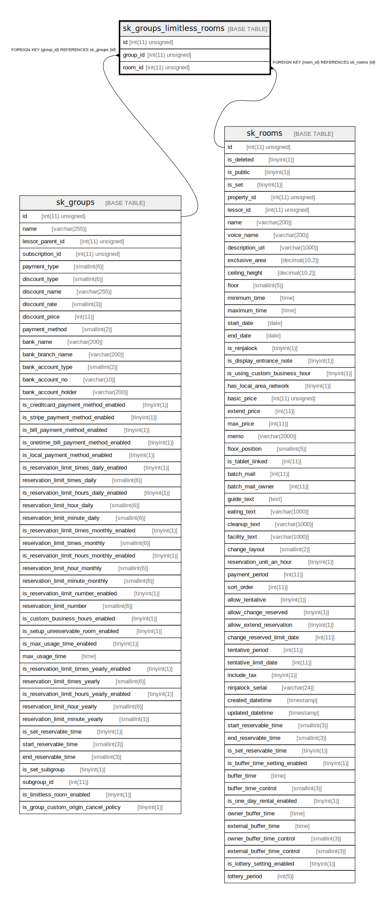

# sk_groups_limitless_rooms

## Description

<details>
<summary><strong>Table Definition</strong></summary>

```sql
CREATE TABLE `sk_groups_limitless_rooms` (
  `id` int(11) unsigned NOT NULL AUTO_INCREMENT,
  `group_id` int(11) unsigned NOT NULL,
  `room_id` int(11) unsigned NOT NULL,
  PRIMARY KEY (`id`),
  KEY `sk_relation__id__room_id__sk_groups_limitless_rooms_idx` (`room_id`),
  KEY `sk_relation__id__group_id__sk_groups_limitless_rooms_idx` (`group_id`),
  CONSTRAINT `sk_relation__id__group_id__sk_groups_limitless_rooms` FOREIGN KEY (`group_id`) REFERENCES `sk_groups` (`id`) ON DELETE CASCADE ON UPDATE CASCADE,
  CONSTRAINT `sk_relation__id__room_id__sk_groups_limitless_rooms` FOREIGN KEY (`room_id`) REFERENCES `sk_rooms` (`id`) ON DELETE CASCADE ON UPDATE CASCADE
) ENGINE=InnoDB DEFAULT CHARSET=utf8mb4 COLLATE=utf8mb4_unicode_ci
```

</details>

## Columns

| Name | Type | Default | Nullable | Extra Definition | Children | Parents | Comment |
| ---- | ---- | ------- | -------- | ---------------- | -------- | ------- | ------- |
| id | int(11) unsigned |  | false | auto_increment |  |  |  |
| group_id | int(11) unsigned |  | false |  |  | [sk_groups](sk_groups.md) |  |
| room_id | int(11) unsigned |  | false |  |  | [sk_rooms](sk_rooms.md) |  |

## Constraints

| Name | Type | Definition |
| ---- | ---- | ---------- |
| PRIMARY | PRIMARY KEY | PRIMARY KEY (id) |
| sk_relation__id__group_id__sk_groups_limitless_rooms | FOREIGN KEY | FOREIGN KEY (group_id) REFERENCES sk_groups (id) |
| sk_relation__id__room_id__sk_groups_limitless_rooms | FOREIGN KEY | FOREIGN KEY (room_id) REFERENCES sk_rooms (id) |

## Indexes

| Name | Definition |
| ---- | ---------- |
| sk_relation__id__group_id__sk_groups_limitless_rooms_idx | KEY sk_relation__id__group_id__sk_groups_limitless_rooms_idx (group_id) USING BTREE |
| sk_relation__id__room_id__sk_groups_limitless_rooms_idx | KEY sk_relation__id__room_id__sk_groups_limitless_rooms_idx (room_id) USING BTREE |
| PRIMARY | PRIMARY KEY (id) USING BTREE |

## Relations



---

> Generated by [tbls](https://github.com/k1LoW/tbls)
