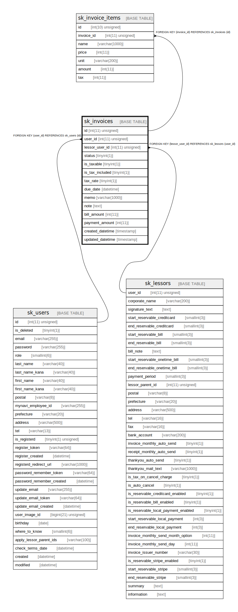

# sk_invoices

## Description

<details>
<summary><strong>Table Definition</strong></summary>

```sql
CREATE TABLE `sk_invoices` (
  `id` int(11) unsigned NOT NULL AUTO_INCREMENT,
  `user_id` int(11) unsigned NOT NULL COMMENT '宛先名',
  `lessor_user_id` int(11) unsigned NOT NULL COMMENT '請求先宛名',
  `status` tinyint(1) NOT NULL DEFAULT '0' COMMENT '0:未払い/未決済 1:支払済 2:未返金, 3:返金済, 4:振込金不足, 5:請求取り消し',
  `is_taxable` tinyint(1) NOT NULL DEFAULT '1' COMMENT '0:非課税, 1:課税',
  `is_tax_included` tinyint(1) NOT NULL DEFAULT '0' COMMENT '0:内税, 1:外税',
  `tax_rate` tinyint(1) DEFAULT '10',
  `due_date` datetime NOT NULL COMMENT '入金期日',
  `memo` varchar(1000) COLLATE utf8mb4_unicode_ci DEFAULT NULL COMMENT '摘要',
  `note` text COLLATE utf8mb4_unicode_ci,
  `bill_amount` int(11) DEFAULT NULL COMMENT '支払う金額',
  `payment_amount` int(11) DEFAULT NULL COMMENT '支払われた金額',
  `created_datetime` timestamp NOT NULL DEFAULT CURRENT_TIMESTAMP,
  `updated_datetime` timestamp NOT NULL DEFAULT CURRENT_TIMESTAMP ON UPDATE CURRENT_TIMESTAMP,
  PRIMARY KEY (`id`),
  KEY `fk_invoices__user_idx` (`user_id`),
  KEY `fk_invoices__lessor_user_idx` (`lessor_user_id`),
  CONSTRAINT `fk_invoices__lessor_user_idx` FOREIGN KEY (`lessor_user_id`) REFERENCES `sk_lessors` (`user_id`) ON DELETE CASCADE ON UPDATE NO ACTION,
  CONSTRAINT `fk_invoices__user_idx` FOREIGN KEY (`user_id`) REFERENCES `sk_users` (`id`) ON DELETE CASCADE ON UPDATE NO ACTION
) ENGINE=InnoDB AUTO_INCREMENT=[Redacted by tbls] DEFAULT CHARSET=utf8mb4 COLLATE=utf8mb4_unicode_ci
```

</details>

## Columns

| Name | Type | Default | Nullable | Extra Definition | Children | Parents | Comment |
| ---- | ---- | ------- | -------- | ---------------- | -------- | ------- | ------- |
| id | int(11) unsigned |  | false | auto_increment | [sk_invoice_items](sk_invoice_items.md) |  |  |
| user_id | int(11) unsigned |  | false |  |  | [sk_users](sk_users.md) | 宛先名 |
| lessor_user_id | int(11) unsigned |  | false |  |  | [sk_lessors](sk_lessors.md) | 請求先宛名 |
| status | tinyint(1) | 0 | false |  |  |  | 0:未払い/未決済 1:支払済 2:未返金, 3:返金済, 4:振込金不足, 5:請求取り消し |
| is_taxable | tinyint(1) | 1 | false |  |  |  | 0:非課税, 1:課税 |
| is_tax_included | tinyint(1) | 0 | false |  |  |  | 0:内税, 1:外税 |
| tax_rate | tinyint(1) | 10 | true |  |  |  |  |
| due_date | datetime |  | false |  |  |  | 入金期日 |
| memo | varchar(1000) |  | true |  |  |  | 摘要 |
| note | text |  | true |  |  |  |  |
| bill_amount | int(11) |  | true |  |  |  | 支払う金額 |
| payment_amount | int(11) |  | true |  |  |  | 支払われた金額 |
| created_datetime | timestamp | CURRENT_TIMESTAMP | false |  |  |  |  |
| updated_datetime | timestamp | CURRENT_TIMESTAMP | false | on update CURRENT_TIMESTAMP |  |  |  |

## Constraints

| Name | Type | Definition |
| ---- | ---- | ---------- |
| fk_invoices__lessor_user_idx | FOREIGN KEY | FOREIGN KEY (lessor_user_id) REFERENCES sk_lessors (user_id) |
| fk_invoices__user_idx | FOREIGN KEY | FOREIGN KEY (user_id) REFERENCES sk_users (id) |
| PRIMARY | PRIMARY KEY | PRIMARY KEY (id) |

## Indexes

| Name | Definition |
| ---- | ---------- |
| fk_invoices__lessor_user_idx | KEY fk_invoices__lessor_user_idx (lessor_user_id) USING BTREE |
| fk_invoices__user_idx | KEY fk_invoices__user_idx (user_id) USING BTREE |
| PRIMARY | PRIMARY KEY (id) USING BTREE |

## Relations



---

> Generated by [tbls](https://github.com/k1LoW/tbls)
