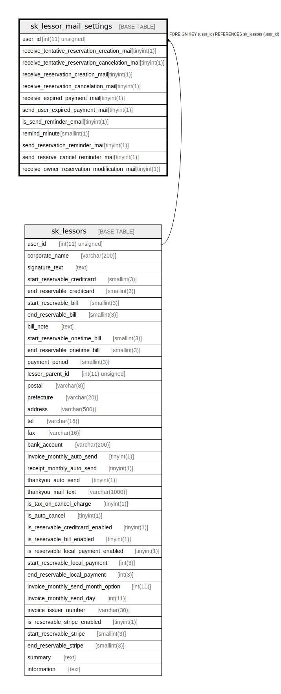

# sk_lessor_mail_settings

## Description

<details>
<summary><strong>Table Definition</strong></summary>

```sql
CREATE TABLE `sk_lessor_mail_settings` (
  `user_id` int(11) unsigned NOT NULL COMMENT 'ユーザーID(本店ID)',
  `receive_tentative_reservation_creation_mail` tinyint(1) DEFAULT '1' COMMENT '仮予約完了',
  `receive_tentative_reservation_cancelation_mail` tinyint(1) DEFAULT '1' COMMENT '仮予約キャンセル',
  `receive_reservation_creation_mail` tinyint(1) DEFAULT '1' COMMENT '本予約完了',
  `receive_reservation_cancelation_mail` tinyint(1) DEFAULT '1' COMMENT '本予約キャンセル',
  `receive_expired_payment_mail` tinyint(1) DEFAULT '0',
  `send_user_expired_payment_mail` tinyint(1) DEFAULT '1',
  `is_send_reminder_email` tinyint(1) NOT NULL DEFAULT '0',
  `remind_minute` smallint(1) DEFAULT '5',
  `send_reservation_reminder_mail` tinyint(1) DEFAULT '0',
  `send_reserve_cancel_reminder_mail` tinyint(1) DEFAULT '0',
  `receive_owner_reservation_modification_mail` tinyint(1) DEFAULT '1',
  PRIMARY KEY (`user_id`),
  KEY `sk_lessor_mail_settings` (`user_id`),
  CONSTRAINT `sk_lessor_mail_settings` FOREIGN KEY (`user_id`) REFERENCES `sk_lessors` (`user_id`) ON DELETE CASCADE ON UPDATE CASCADE
) ENGINE=InnoDB DEFAULT CHARSET=utf8mb4 COLLATE=utf8mb4_unicode_ci
```

</details>

## Columns

| Name | Type | Default | Nullable | Children | Parents | Comment |
| ---- | ---- | ------- | -------- | -------- | ------- | ------- |
| user_id | int(11) unsigned |  | false |  | [sk_lessors](sk_lessors.md) | ユーザーID(本店ID) |
| receive_tentative_reservation_creation_mail | tinyint(1) | 1 | true |  |  | 仮予約完了 |
| receive_tentative_reservation_cancelation_mail | tinyint(1) | 1 | true |  |  | 仮予約キャンセル |
| receive_reservation_creation_mail | tinyint(1) | 1 | true |  |  | 本予約完了 |
| receive_reservation_cancelation_mail | tinyint(1) | 1 | true |  |  | 本予約キャンセル |
| receive_expired_payment_mail | tinyint(1) | 0 | true |  |  |  |
| send_user_expired_payment_mail | tinyint(1) | 1 | true |  |  |  |
| is_send_reminder_email | tinyint(1) | 0 | false |  |  |  |
| remind_minute | smallint(1) | 5 | true |  |  |  |
| send_reservation_reminder_mail | tinyint(1) | 0 | true |  |  |  |
| send_reserve_cancel_reminder_mail | tinyint(1) | 0 | true |  |  |  |
| receive_owner_reservation_modification_mail | tinyint(1) | 1 | true |  |  |  |

## Constraints

| Name | Type | Definition |
| ---- | ---- | ---------- |
| PRIMARY | PRIMARY KEY | PRIMARY KEY (user_id) |
| sk_lessor_mail_settings | FOREIGN KEY | FOREIGN KEY (user_id) REFERENCES sk_lessors (user_id) |

## Indexes

| Name | Definition |
| ---- | ---------- |
| sk_lessor_mail_settings | KEY sk_lessor_mail_settings (user_id) USING BTREE |
| PRIMARY | PRIMARY KEY (user_id) USING BTREE |

## Relations



---

> Generated by [tbls](https://github.com/k1LoW/tbls)
