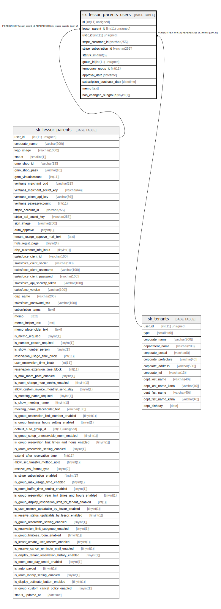

# sk_lessor_parents_users

## Description

本店 - 借主

<details>
<summary><strong>Table Definition</strong></summary>

```sql
CREATE TABLE `sk_lessor_parents_users` (
  `id` int(11) unsigned NOT NULL AUTO_INCREMENT COMMENT 'ID',
  `lessor_parent_id` int(11) unsigned NOT NULL COMMENT '本店ID',
  `user_id` int(11) unsigned NOT NULL COMMENT 'ユーザーID',
  `stripe_customer_id` varchar(255) DEFAULT NULL,
  `stripe_subscription_id` varchar(255) DEFAULT NULL,
  `status` smallint(6) NOT NULL COMMENT '1:承認済み、2:承認待ち、3:NGユーザー',
  `group_id` int(11) unsigned DEFAULT NULL COMMENT 'グループID',
  `temporary_group_id` int(11) DEFAULT NULL,
  `approval_date` datetime DEFAULT NULL,
  `subscription_purchase_date` datetime DEFAULT NULL,
  `memo` text COMMENT 'メモ',
  `has_changed_subgroup` tinyint(1) DEFAULT '0',
  PRIMARY KEY (`id`),
  UNIQUE KEY `sk_index_lessor_parents_users_on_lessor_parent_id_and_user_id` (`lessor_parent_id`,`user_id`),
  KEY `sk_relation_lessor_parents_users_and_tenants` (`user_id`),
  CONSTRAINT `sk_relation_lessor_parents_users_and_lessor_parents` FOREIGN KEY (`lessor_parent_id`) REFERENCES `sk_lessor_parents` (`user_id`) ON DELETE CASCADE ON UPDATE CASCADE,
  CONSTRAINT `sk_relation_lessor_parents_users_and_tenants` FOREIGN KEY (`user_id`) REFERENCES `sk_tenants` (`user_id`) ON DELETE CASCADE ON UPDATE CASCADE
) ENGINE=InnoDB AUTO_INCREMENT=[Redacted by tbls] DEFAULT CHARSET=utf8 COMMENT='本店 - 借主'
```

</details>

## Columns

| Name | Type | Default | Nullable | Extra Definition | Children | Parents | Comment |
| ---- | ---- | ------- | -------- | ---------------- | -------- | ------- | ------- |
| id | int(11) unsigned |  | false | auto_increment |  |  | ID |
| lessor_parent_id | int(11) unsigned |  | false |  |  | [sk_lessor_parents](sk_lessor_parents.md) | 本店ID |
| user_id | int(11) unsigned |  | false |  |  | [sk_tenants](sk_tenants.md) | ユーザーID |
| stripe_customer_id | varchar(255) |  | true |  |  |  |  |
| stripe_subscription_id | varchar(255) |  | true |  |  |  |  |
| status | smallint(6) |  | false |  |  |  | 1:承認済み、2:承認待ち、3:NGユーザー |
| group_id | int(11) unsigned |  | true |  |  |  | グループID |
| temporary_group_id | int(11) |  | true |  |  |  |  |
| approval_date | datetime |  | true |  |  |  |  |
| subscription_purchase_date | datetime |  | true |  |  |  |  |
| memo | text |  | true |  |  |  | メモ |
| has_changed_subgroup | tinyint(1) | 0 | true |  |  |  |  |

## Constraints

| Name | Type | Definition |
| ---- | ---- | ---------- |
| PRIMARY | PRIMARY KEY | PRIMARY KEY (id) |
| sk_index_lessor_parents_users_on_lessor_parent_id_and_user_id | UNIQUE | UNIQUE KEY sk_index_lessor_parents_users_on_lessor_parent_id_and_user_id (lessor_parent_id, user_id) |
| sk_relation_lessor_parents_users_and_lessor_parents | FOREIGN KEY | FOREIGN KEY (lessor_parent_id) REFERENCES sk_lessor_parents (user_id) |
| sk_relation_lessor_parents_users_and_tenants | FOREIGN KEY | FOREIGN KEY (user_id) REFERENCES sk_tenants (user_id) |

## Indexes

| Name | Definition |
| ---- | ---------- |
| sk_relation_lessor_parents_users_and_tenants | KEY sk_relation_lessor_parents_users_and_tenants (user_id) USING BTREE |
| PRIMARY | PRIMARY KEY (id) USING BTREE |
| sk_index_lessor_parents_users_on_lessor_parent_id_and_user_id | UNIQUE KEY sk_index_lessor_parents_users_on_lessor_parent_id_and_user_id (lessor_parent_id, user_id) USING BTREE |

## Relations



---

> Generated by [tbls](https://github.com/k1LoW/tbls)
