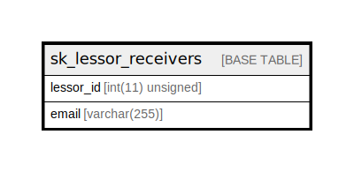

# sk_lessor_receivers

## Description

<details>
<summary><strong>Table Definition</strong></summary>

```sql
CREATE TABLE `sk_lessor_receivers` (
  `lessor_id` int(11) unsigned NOT NULL DEFAULT '0' COMMENT '支店ID',
  `email` varchar(255) NOT NULL COMMENT 'メールアドレス',
  PRIMARY KEY (`lessor_id`,`email`)
) ENGINE=InnoDB DEFAULT CHARSET=utf8
```

</details>

## Columns

| Name | Type | Default | Nullable | Children | Parents | Comment |
| ---- | ---- | ------- | -------- | -------- | ------- | ------- |
| lessor_id | int(11) unsigned | 0 | false |  |  | 支店ID |
| email | varchar(255) |  | false |  |  | メールアドレス |

## Constraints

| Name | Type | Definition |
| ---- | ---- | ---------- |
| PRIMARY | PRIMARY KEY | PRIMARY KEY (lessor_id, email) |

## Indexes

| Name | Definition |
| ---- | ---------- |
| PRIMARY | PRIMARY KEY (lessor_id, email) USING BTREE |

## Relations



---

> Generated by [tbls](https://github.com/k1LoW/tbls)
