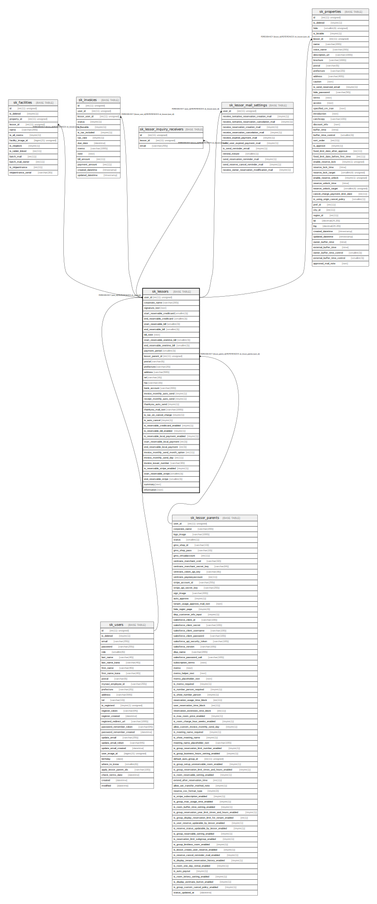

# sk_lessors

## Description

支店

<details>
<summary><strong>Table Definition</strong></summary>

```sql
CREATE TABLE `sk_lessors` (
  `user_id` int(11) unsigned NOT NULL COMMENT 'ユーザID(支店ID)',
  `corporate_name` varchar(200) NOT NULL DEFAULT '' COMMENT '法人名',
  `signature_text` text COMMENT '物件に紐づくオーナー署名',
  `start_reservable_creditcard` smallint(3) DEFAULT '0' COMMENT '予約可能期間開始日（クレジットカード）',
  `end_reservable_creditcard` smallint(3) DEFAULT '14' COMMENT '予約可能期間終了日（クレジットカード）',
  `start_reservable_bill` smallint(3) DEFAULT '1' COMMENT '予約可能期間開始日（銀行振込/請求書払い）',
  `end_reservable_bill` smallint(3) DEFAULT '14' COMMENT '予約可能期間終了日（銀行振込/請求書払い）',
  `bill_note` text COMMENT '請求書払いに関する注意文',
  `start_reservable_onetime_bill` smallint(3) DEFAULT '0',
  `end_reservable_onetime_bill` smallint(3) DEFAULT '14',
  `payment_period` smallint(3) DEFAULT '1' COMMENT '銀行振込/請求書払いの入金期日',
  `lessor_parent_id` int(11) unsigned NOT NULL COMMENT 'ユーザーID(本店ID)',
  `postal` varchar(8) DEFAULT '' COMMENT '郵便番号',
  `prefecture` varchar(20) DEFAULT '' COMMENT '都道府県',
  `address` varchar(500) DEFAULT '' COMMENT '住所',
  `tel` varchar(16) DEFAULT NULL COMMENT '電話番号',
  `fax` varchar(16) DEFAULT NULL COMMENT 'FAX番号',
  `bank_account` varchar(200) DEFAULT NULL COMMENT '振込先口座',
  `invoice_monthly_auto_send` tinyint(1) DEFAULT '1' COMMENT 'まとめ払い請求書自動送信フラグ',
  `receipt_monthly_auto_send` tinyint(1) DEFAULT '1' COMMENT 'まとめ払い領収書自動送信フラグ',
  `thankyou_auto_send` tinyint(1) DEFAULT '0' COMMENT 'thankyouメール自動送信フラグ',
  `thankyou_mail_text` varchar(1000) DEFAULT NULL COMMENT 'thankyouメールの内容',
  `is_tax_on_cancel_charge` tinyint(1) DEFAULT '0' COMMENT 'キャンセル料への課税の有無',
  `is_auto_cancel` tinyint(1) DEFAULT '1' COMMENT '入金期限が過ぎた場合の自動キャンセル 0:自動キャンセルしない 1:自動キャンセルする',
  `is_reservable_creditcard_enabled` tinyint(1) NOT NULL DEFAULT '1' COMMENT 'クレジットカード有効無効',
  `is_reservable_bill_enabled` tinyint(1) NOT NULL DEFAULT '1' COMMENT '銀行振込/請求書有効無効',
  `is_reservable_local_payment_enabled` tinyint(1) DEFAULT '0',
  `start_reservable_local_payment` int(3) DEFAULT '2',
  `end_reservable_local_payment` int(3) DEFAULT '14',
  `invoice_monthly_send_month_option` int(11) DEFAULT '2',
  `invoice_monthly_send_day` int(11) DEFAULT '1',
  `invoice_issuer_number` varchar(30) DEFAULT '',
  `is_reservable_stripe_enabled` tinyint(1) DEFAULT '0',
  `start_reservable_stripe` smallint(3) DEFAULT '0',
  `end_reservable_stripe` smallint(3) DEFAULT '14',
  `summary` text,
  `information` text,
  PRIMARY KEY (`user_id`),
  KEY `sk_relation_lessors_and_lessor_parents` (`lessor_parent_id`),
  CONSTRAINT `sk_relation_lessors_and_lessor_parents` FOREIGN KEY (`lessor_parent_id`) REFERENCES `sk_lessor_parents` (`user_id`) ON DELETE CASCADE ON UPDATE CASCADE,
  CONSTRAINT `sk_relation_lessors_and_users` FOREIGN KEY (`user_id`) REFERENCES `sk_users` (`id`) ON DELETE CASCADE ON UPDATE CASCADE
) ENGINE=InnoDB DEFAULT CHARSET=utf8 COMMENT='支店'
```

</details>

## Columns

| Name | Type | Default | Nullable | Children | Parents | Comment |
| ---- | ---- | ------- | -------- | -------- | ------- | ------- |
| user_id | int(11) unsigned |  | false | [sk_facilities](sk_facilities.md) [sk_invoices](sk_invoices.md) [sk_lessor_inquiry_receivers](sk_lessor_inquiry_receivers.md) [sk_lessor_mail_settings](sk_lessor_mail_settings.md) [sk_properties](sk_properties.md) | [sk_users](sk_users.md) | ユーザID(支店ID) |
| corporate_name | varchar(200) |  | false |  |  | 法人名 |
| signature_text | text |  | true |  |  | 物件に紐づくオーナー署名 |
| start_reservable_creditcard | smallint(3) | 0 | true |  |  | 予約可能期間開始日（クレジットカード） |
| end_reservable_creditcard | smallint(3) | 14 | true |  |  | 予約可能期間終了日（クレジットカード） |
| start_reservable_bill | smallint(3) | 1 | true |  |  | 予約可能期間開始日（銀行振込/請求書払い） |
| end_reservable_bill | smallint(3) | 14 | true |  |  | 予約可能期間終了日（銀行振込/請求書払い） |
| bill_note | text |  | true |  |  | 請求書払いに関する注意文 |
| start_reservable_onetime_bill | smallint(3) | 0 | true |  |  |  |
| end_reservable_onetime_bill | smallint(3) | 14 | true |  |  |  |
| payment_period | smallint(3) | 1 | true |  |  | 銀行振込/請求書払いの入金期日 |
| lessor_parent_id | int(11) unsigned |  | false |  | [sk_lessor_parents](sk_lessor_parents.md) | ユーザーID(本店ID) |
| postal | varchar(8) |  | true |  |  | 郵便番号 |
| prefecture | varchar(20) |  | true |  |  | 都道府県 |
| address | varchar(500) |  | true |  |  | 住所 |
| tel | varchar(16) |  | true |  |  | 電話番号 |
| fax | varchar(16) |  | true |  |  | FAX番号 |
| bank_account | varchar(200) |  | true |  |  | 振込先口座 |
| invoice_monthly_auto_send | tinyint(1) | 1 | true |  |  | まとめ払い請求書自動送信フラグ |
| receipt_monthly_auto_send | tinyint(1) | 1 | true |  |  | まとめ払い領収書自動送信フラグ |
| thankyou_auto_send | tinyint(1) | 0 | true |  |  | thankyouメール自動送信フラグ |
| thankyou_mail_text | varchar(1000) |  | true |  |  | thankyouメールの内容 |
| is_tax_on_cancel_charge | tinyint(1) | 0 | true |  |  | キャンセル料への課税の有無 |
| is_auto_cancel | tinyint(1) | 1 | true |  |  | 入金期限が過ぎた場合の自動キャンセル 0:自動キャンセルしない 1:自動キャンセルする |
| is_reservable_creditcard_enabled | tinyint(1) | 1 | false |  |  | クレジットカード有効無効 |
| is_reservable_bill_enabled | tinyint(1) | 1 | false |  |  | 銀行振込/請求書有効無効 |
| is_reservable_local_payment_enabled | tinyint(1) | 0 | true |  |  |  |
| start_reservable_local_payment | int(3) | 2 | true |  |  |  |
| end_reservable_local_payment | int(3) | 14 | true |  |  |  |
| invoice_monthly_send_month_option | int(11) | 2 | true |  |  |  |
| invoice_monthly_send_day | int(11) | 1 | true |  |  |  |
| invoice_issuer_number | varchar(30) |  | true |  |  |  |
| is_reservable_stripe_enabled | tinyint(1) | 0 | true |  |  |  |
| start_reservable_stripe | smallint(3) | 0 | true |  |  |  |
| end_reservable_stripe | smallint(3) | 14 | true |  |  |  |
| summary | text |  | true |  |  |  |
| information | text |  | true |  |  |  |

## Constraints

| Name | Type | Definition |
| ---- | ---- | ---------- |
| PRIMARY | PRIMARY KEY | PRIMARY KEY (user_id) |
| sk_relation_lessors_and_lessor_parents | FOREIGN KEY | FOREIGN KEY (lessor_parent_id) REFERENCES sk_lessor_parents (user_id) |
| sk_relation_lessors_and_users | FOREIGN KEY | FOREIGN KEY (user_id) REFERENCES sk_users (id) |

## Indexes

| Name | Definition |
| ---- | ---------- |
| sk_relation_lessors_and_lessor_parents | KEY sk_relation_lessors_and_lessor_parents (lessor_parent_id) USING BTREE |
| PRIMARY | PRIMARY KEY (user_id) USING BTREE |

## Relations



---

> Generated by [tbls](https://github.com/k1LoW/tbls)
