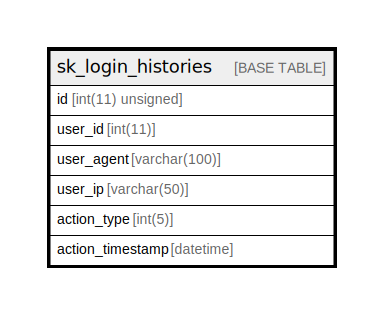

# sk_login_histories

## Description

<details>
<summary><strong>Table Definition</strong></summary>

```sql
CREATE TABLE `sk_login_histories` (
  `id` int(11) unsigned NOT NULL AUTO_INCREMENT,
  `user_id` int(11) NOT NULL,
  `user_agent` varchar(100) COLLATE utf8mb4_unicode_ci DEFAULT NULL,
  `user_ip` varchar(50) COLLATE utf8mb4_unicode_ci DEFAULT NULL,
  `action_type` int(5) NOT NULL COMMENT '1: Login, 2: Logout, 3: Error',
  `action_timestamp` datetime DEFAULT CURRENT_TIMESTAMP,
  PRIMARY KEY (`id`)
) ENGINE=InnoDB AUTO_INCREMENT=[Redacted by tbls] DEFAULT CHARSET=utf8mb4 COLLATE=utf8mb4_unicode_ci
```

</details>

## Columns

| Name | Type | Default | Nullable | Extra Definition | Children | Parents | Comment |
| ---- | ---- | ------- | -------- | ---------------- | -------- | ------- | ------- |
| id | int(11) unsigned |  | false | auto_increment |  |  |  |
| user_id | int(11) |  | false |  |  |  |  |
| user_agent | varchar(100) |  | true |  |  |  |  |
| user_ip | varchar(50) |  | true |  |  |  |  |
| action_type | int(5) |  | false |  |  |  | 1: Login, 2: Logout, 3: Error |
| action_timestamp | datetime | CURRENT_TIMESTAMP | true |  |  |  |  |

## Constraints

| Name | Type | Definition |
| ---- | ---- | ---------- |
| PRIMARY | PRIMARY KEY | PRIMARY KEY (id) |

## Indexes

| Name | Definition |
| ---- | ---------- |
| PRIMARY | PRIMARY KEY (id) USING BTREE |

## Relations



---

> Generated by [tbls](https://github.com/k1LoW/tbls)
