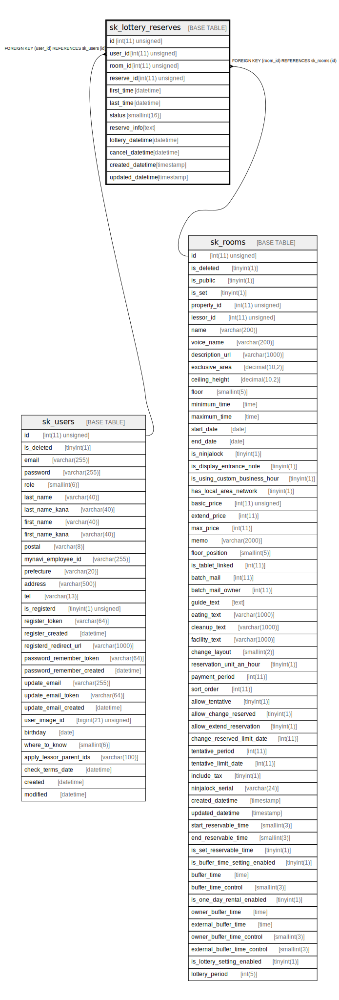

# sk_lottery_reserves

## Description

<details>
<summary><strong>Table Definition</strong></summary>

```sql
CREATE TABLE `sk_lottery_reserves` (
  `id` int(11) unsigned NOT NULL AUTO_INCREMENT,
  `user_id` int(11) unsigned NOT NULL,
  `room_id` int(11) unsigned NOT NULL,
  `reserve_id` int(11) unsigned DEFAULT NULL,
  `first_time` datetime NOT NULL,
  `last_time` datetime NOT NULL,
  `status` smallint(16) DEFAULT NULL,
  `reserve_info` text NOT NULL,
  `lottery_datetime` datetime NOT NULL,
  `cancel_datetime` datetime DEFAULT NULL,
  `created_datetime` timestamp NULL DEFAULT CURRENT_TIMESTAMP,
  `updated_datetime` timestamp NULL DEFAULT CURRENT_TIMESTAMP ON UPDATE CURRENT_TIMESTAMP,
  PRIMARY KEY (`id`),
  KEY `user_id` (`user_id`),
  KEY `room_id` (`room_id`),
  CONSTRAINT `sk_lottery_reserves_ibfk_1` FOREIGN KEY (`user_id`) REFERENCES `sk_users` (`id`) ON DELETE CASCADE ON UPDATE NO ACTION,
  CONSTRAINT `sk_lottery_reserves_ibfk_2` FOREIGN KEY (`room_id`) REFERENCES `sk_rooms` (`id`) ON DELETE CASCADE ON UPDATE NO ACTION
) ENGINE=InnoDB AUTO_INCREMENT=[Redacted by tbls] DEFAULT CHARSET=utf8
```

</details>

## Columns

| Name | Type | Default | Nullable | Extra Definition | Children | Parents | Comment |
| ---- | ---- | ------- | -------- | ---------------- | -------- | ------- | ------- |
| id | int(11) unsigned |  | false | auto_increment |  |  |  |
| user_id | int(11) unsigned |  | false |  |  | [sk_users](sk_users.md) |  |
| room_id | int(11) unsigned |  | false |  |  | [sk_rooms](sk_rooms.md) |  |
| reserve_id | int(11) unsigned |  | true |  |  |  |  |
| first_time | datetime |  | false |  |  |  |  |
| last_time | datetime |  | false |  |  |  |  |
| status | smallint(16) |  | true |  |  |  |  |
| reserve_info | text |  | false |  |  |  |  |
| lottery_datetime | datetime |  | false |  |  |  |  |
| cancel_datetime | datetime |  | true |  |  |  |  |
| created_datetime | timestamp | CURRENT_TIMESTAMP | true |  |  |  |  |
| updated_datetime | timestamp | CURRENT_TIMESTAMP | true | on update CURRENT_TIMESTAMP |  |  |  |

## Constraints

| Name | Type | Definition |
| ---- | ---- | ---------- |
| PRIMARY | PRIMARY KEY | PRIMARY KEY (id) |
| sk_lottery_reserves_ibfk_1 | FOREIGN KEY | FOREIGN KEY (user_id) REFERENCES sk_users (id) |
| sk_lottery_reserves_ibfk_2 | FOREIGN KEY | FOREIGN KEY (room_id) REFERENCES sk_rooms (id) |

## Indexes

| Name | Definition |
| ---- | ---------- |
| room_id | KEY room_id (room_id) USING BTREE |
| user_id | KEY user_id (user_id) USING BTREE |
| PRIMARY | PRIMARY KEY (id) USING BTREE |

## Relations



---

> Generated by [tbls](https://github.com/k1LoW/tbls)
