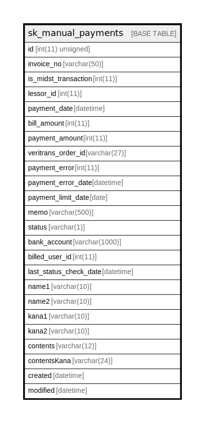

# sk_manual_payments

## Description

手動支払い

<details>
<summary><strong>Table Definition</strong></summary>

```sql
CREATE TABLE `sk_manual_payments` (
  `id` int(11) unsigned NOT NULL AUTO_INCREMENT COMMENT 'id',
  `invoice_no` varchar(50) DEFAULT NULL COMMENT '請求書番号',
  `is_midst_transaction` int(11) NOT NULL DEFAULT '1' COMMENT '1:現在の取引、0:過去の取引',
  `lessor_id` int(11) DEFAULT NULL COMMENT '支店ID',
  `payment_date` datetime DEFAULT NULL COMMENT '支払われた日',
  `bill_amount` int(11) DEFAULT NULL COMMENT '請求金額',
  `payment_amount` int(11) DEFAULT NULL COMMENT '支払われた金額',
  `veritrans_order_id` varchar(27) NOT NULL DEFAULT '' COMMENT 'ベリトランスのオーダーID',
  `payment_error` int(11) NOT NULL DEFAULT '0' COMMENT '決済処理時にエラーが発生したか判断するフラグ',
  `payment_error_date` datetime DEFAULT NULL COMMENT '決済処理でエラーになった日時',
  `payment_limit_date` date DEFAULT NULL COMMENT '銀行振込の支払期限',
  `memo` varchar(500) DEFAULT NULL COMMENT '支払い情報の説明',
  `status` varchar(1) NOT NULL DEFAULT '0' COMMENT '支払いステータス',
  `bank_account` varchar(1000) DEFAULT NULL COMMENT '振込先口座情報',
  `billed_user_id` int(11) DEFAULT NULL COMMENT '請求先ユーザーID',
  `last_status_check_date` datetime DEFAULT NULL,
  `name1` varchar(10) DEFAULT NULL COMMENT '顧客名１',
  `name2` varchar(10) DEFAULT NULL COMMENT '顧客名２',
  `kana1` varchar(10) DEFAULT NULL COMMENT '顧客名カナ１',
  `kana2` varchar(10) DEFAULT NULL COMMENT '顧客名カナ２',
  `contents` varchar(12) DEFAULT NULL COMMENT '請求内容',
  `contentsKana` varchar(24) DEFAULT NULL COMMENT '請求内容カナ',
  `created` datetime NOT NULL COMMENT '作成時刻',
  `modified` datetime NOT NULL COMMENT '更新時刻',
  PRIMARY KEY (`id`)
) ENGINE=InnoDB AUTO_INCREMENT=[Redacted by tbls] DEFAULT CHARSET=utf8 COMMENT='手動支払い'
```

</details>

## Columns

| Name | Type | Default | Nullable | Extra Definition | Children | Parents | Comment |
| ---- | ---- | ------- | -------- | ---------------- | -------- | ------- | ------- |
| id | int(11) unsigned |  | false | auto_increment |  |  | id |
| invoice_no | varchar(50) |  | true |  |  |  | 請求書番号 |
| is_midst_transaction | int(11) | 1 | false |  |  |  | 1:現在の取引、0:過去の取引 |
| lessor_id | int(11) |  | true |  |  |  | 支店ID |
| payment_date | datetime |  | true |  |  |  | 支払われた日 |
| bill_amount | int(11) |  | true |  |  |  | 請求金額 |
| payment_amount | int(11) |  | true |  |  |  | 支払われた金額 |
| veritrans_order_id | varchar(27) |  | false |  |  |  | ベリトランスのオーダーID |
| payment_error | int(11) | 0 | false |  |  |  | 決済処理時にエラーが発生したか判断するフラグ |
| payment_error_date | datetime |  | true |  |  |  | 決済処理でエラーになった日時 |
| payment_limit_date | date |  | true |  |  |  | 銀行振込の支払期限 |
| memo | varchar(500) |  | true |  |  |  | 支払い情報の説明 |
| status | varchar(1) | 0 | false |  |  |  | 支払いステータス |
| bank_account | varchar(1000) |  | true |  |  |  | 振込先口座情報 |
| billed_user_id | int(11) |  | true |  |  |  | 請求先ユーザーID |
| last_status_check_date | datetime |  | true |  |  |  |  |
| name1 | varchar(10) |  | true |  |  |  | 顧客名１ |
| name2 | varchar(10) |  | true |  |  |  | 顧客名２ |
| kana1 | varchar(10) |  | true |  |  |  | 顧客名カナ１ |
| kana2 | varchar(10) |  | true |  |  |  | 顧客名カナ２ |
| contents | varchar(12) |  | true |  |  |  | 請求内容 |
| contentsKana | varchar(24) |  | true |  |  |  | 請求内容カナ |
| created | datetime |  | false |  |  |  | 作成時刻 |
| modified | datetime |  | false |  |  |  | 更新時刻 |

## Constraints

| Name | Type | Definition |
| ---- | ---- | ---------- |
| PRIMARY | PRIMARY KEY | PRIMARY KEY (id) |

## Indexes

| Name | Definition |
| ---- | ---------- |
| PRIMARY | PRIMARY KEY (id) USING BTREE |

## Relations



---

> Generated by [tbls](https://github.com/k1LoW/tbls)
