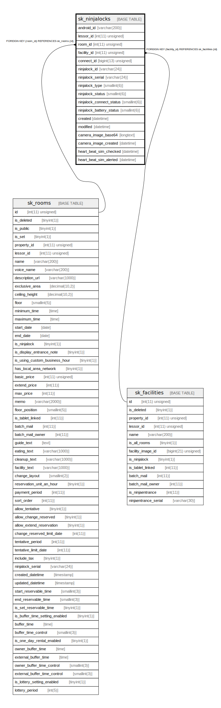

# sk_ninjalocks

## Description

登録されているNinjaLock

<details>
<summary><strong>Table Definition</strong></summary>

```sql
CREATE TABLE `sk_ninjalocks` (
  `android_id` varchar(200) NOT NULL DEFAULT '' COMMENT 'タブレットID(GCMのreg_id)',
  `lessor_id` int(11) unsigned DEFAULT NULL COMMENT '支店ID',
  `room_id` int(11) unsigned DEFAULT NULL COMMENT '部屋ID(ユニーク)、設備の場合null',
  `facility_id` int(11) unsigned DEFAULT NULL COMMENT '設備ID(ユニーク)、部屋の場合null',
  `connect_id` bigint(13) unsigned DEFAULT NULL COMMENT 'NinjaLockに伝える紐づく施設のID、部屋と設備の2種類があるため、先頭の数値で判別、部屋:先頭1+部屋ID11桁、設備:先頭2+設備ID11桁',
  `ninjalock_id` varchar(24) DEFAULT NULL COMMENT 'NinjaLockのMACアドレス',
  `ninjalock_serial` varchar(24) DEFAULT NULL COMMENT 'NinjaLockのシリアル番号',
  `ninjalock_type` smallint(6) DEFAULT NULL COMMENT '1:左回り、2:右回り',
  `ninjalock_status` smallint(6) DEFAULT NULL COMMENT '0:施錠、1:解錠、-1:通信失敗',
  `ninjalock_connect_status` smallint(6) DEFAULT NULL COMMENT 'Bluetooth接続状態、0:正常、1:接続不可、2:他端末接続',
  `ninjalock_battery_status` smallint(6) DEFAULT NULL COMMENT 'NinjaLockの残りバッテリー',
  `created` datetime DEFAULT NULL COMMENT '作成時刻',
  `modified` datetime DEFAULT NULL COMMENT '更新時刻',
  `camera_image_base64` longtext COMMENT '最後にカメラで撮影した画像をbase64で一時保存',
  `camera_image_created` datetime DEFAULT NULL COMMENT '最後にカメラで撮影した時間',
  `heart_beat_sim_checked` datetime DEFAULT NULL COMMENT 'ハートビートの最終確認時間',
  `heart_beat_sim_alerted` datetime DEFAULT NULL COMMENT 'ハートビートの最終アラート時間',
  PRIMARY KEY (`android_id`),
  UNIQUE KEY `sk_index_ninjalocks_on_connect_id` (`connect_id`),
  KEY `sk_relation_ninjalocks_and_rooms` (`room_id`),
  KEY `sk_relation_ninjalocks_and_facilities` (`facility_id`),
  KEY `sk_index_ninjalocks_on_heart_beat_sim` (`heart_beat_sim_checked`,`heart_beat_sim_alerted`),
  CONSTRAINT `sk_relation_ninjalocks_and_facilities` FOREIGN KEY (`facility_id`) REFERENCES `sk_facilities` (`id`) ON DELETE CASCADE ON UPDATE CASCADE,
  CONSTRAINT `sk_relation_ninjalocks_and_rooms` FOREIGN KEY (`room_id`) REFERENCES `sk_rooms` (`id`) ON DELETE CASCADE ON UPDATE CASCADE
) ENGINE=InnoDB DEFAULT CHARSET=utf8 COMMENT='登録されているNinjaLock'
```

</details>

## Columns

| Name | Type | Default | Nullable | Children | Parents | Comment |
| ---- | ---- | ------- | -------- | -------- | ------- | ------- |
| android_id | varchar(200) |  | false |  |  | タブレットID(GCMのreg_id) |
| lessor_id | int(11) unsigned |  | true |  |  | 支店ID |
| room_id | int(11) unsigned |  | true |  | [sk_rooms](sk_rooms.md) | 部屋ID(ユニーク)、設備の場合null |
| facility_id | int(11) unsigned |  | true |  | [sk_facilities](sk_facilities.md) | 設備ID(ユニーク)、部屋の場合null |
| connect_id | bigint(13) unsigned |  | true |  |  | NinjaLockに伝える紐づく施設のID、部屋と設備の2種類があるため、先頭の数値で判別、部屋:先頭1+部屋ID11桁、設備:先頭2+設備ID11桁 |
| ninjalock_id | varchar(24) |  | true |  |  | NinjaLockのMACアドレス |
| ninjalock_serial | varchar(24) |  | true |  |  | NinjaLockのシリアル番号 |
| ninjalock_type | smallint(6) |  | true |  |  | 1:左回り、2:右回り |
| ninjalock_status | smallint(6) |  | true |  |  | 0:施錠、1:解錠、-1:通信失敗 |
| ninjalock_connect_status | smallint(6) |  | true |  |  | Bluetooth接続状態、0:正常、1:接続不可、2:他端末接続 |
| ninjalock_battery_status | smallint(6) |  | true |  |  | NinjaLockの残りバッテリー |
| created | datetime |  | true |  |  | 作成時刻 |
| modified | datetime |  | true |  |  | 更新時刻 |
| camera_image_base64 | longtext |  | true |  |  | 最後にカメラで撮影した画像をbase64で一時保存 |
| camera_image_created | datetime |  | true |  |  | 最後にカメラで撮影した時間 |
| heart_beat_sim_checked | datetime |  | true |  |  | ハートビートの最終確認時間 |
| heart_beat_sim_alerted | datetime |  | true |  |  | ハートビートの最終アラート時間 |

## Constraints

| Name | Type | Definition |
| ---- | ---- | ---------- |
| PRIMARY | PRIMARY KEY | PRIMARY KEY (android_id) |
| sk_index_ninjalocks_on_connect_id | UNIQUE | UNIQUE KEY sk_index_ninjalocks_on_connect_id (connect_id) |
| sk_relation_ninjalocks_and_facilities | FOREIGN KEY | FOREIGN KEY (facility_id) REFERENCES sk_facilities (id) |
| sk_relation_ninjalocks_and_rooms | FOREIGN KEY | FOREIGN KEY (room_id) REFERENCES sk_rooms (id) |

## Indexes

| Name | Definition |
| ---- | ---------- |
| sk_index_ninjalocks_on_heart_beat_sim | KEY sk_index_ninjalocks_on_heart_beat_sim (heart_beat_sim_checked, heart_beat_sim_alerted) USING BTREE |
| sk_relation_ninjalocks_and_facilities | KEY sk_relation_ninjalocks_and_facilities (facility_id) USING BTREE |
| sk_relation_ninjalocks_and_rooms | KEY sk_relation_ninjalocks_and_rooms (room_id) USING BTREE |
| PRIMARY | PRIMARY KEY (android_id) USING BTREE |
| sk_index_ninjalocks_on_connect_id | UNIQUE KEY sk_index_ninjalocks_on_connect_id (connect_id) USING BTREE |

## Relations



---

> Generated by [tbls](https://github.com/k1LoW/tbls)
