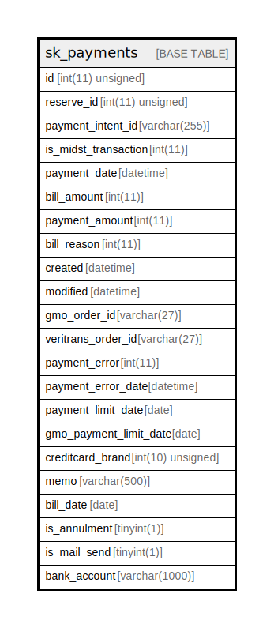

# sk_payments

## Description

支払い

<details>
<summary><strong>Table Definition</strong></summary>

```sql
CREATE TABLE `sk_payments` (
  `id` int(11) unsigned NOT NULL AUTO_INCREMENT COMMENT 'id',
  `reserve_id` int(11) unsigned DEFAULT NULL COMMENT '予約ID',
  `payment_intent_id` varchar(255) DEFAULT NULL,
  `is_midst_transaction` int(11) NOT NULL DEFAULT '1' COMMENT '1:現在の取引、0:過去の取引',
  `payment_date` datetime DEFAULT NULL COMMENT '支払われた期日',
  `bill_amount` int(11) DEFAULT NULL COMMENT '請求金額',
  `payment_amount` int(11) DEFAULT NULL COMMENT '支払われた金額',
  `bill_reason` int(11) NOT NULL DEFAULT '1' COMMENT '請求理由 1:利用料支払い、2:キャンセル料支払い',
  `created` datetime NOT NULL COMMENT '作成時刻',
  `modified` datetime NOT NULL COMMENT '更新時刻',
  `gmo_order_id` varchar(27) NOT NULL DEFAULT '' COMMENT 'GMOのオーダーID',
  `veritrans_order_id` varchar(27) NOT NULL DEFAULT '' COMMENT 'ベリトランスのオーダーID',
  `payment_error` int(11) NOT NULL DEFAULT '0' COMMENT 'GMO決済処理時にエラーが発生したか判断するフラグ',
  `payment_error_date` datetime DEFAULT NULL COMMENT 'GMO決済処理でエラーになった日時',
  `payment_limit_date` date DEFAULT NULL COMMENT '銀行振込の支払期限',
  `gmo_payment_limit_date` date DEFAULT NULL COMMENT 'バーチャル口座の支払期限',
  `creditcard_brand` int(10) unsigned DEFAULT NULL COMMENT 'クレジットカードのブランドコード',
  `memo` varchar(500) DEFAULT NULL COMMENT '支払い情報の説明',
  `bill_date` date DEFAULT NULL COMMENT '請求年月（日付は無視）',
  `is_annulment` tinyint(1) NOT NULL DEFAULT '0' COMMENT '請求取消',
  `is_mail_send` tinyint(1) NOT NULL DEFAULT '0' COMMENT 'リマインドメール送信済みフラグ',
  `bank_account` varchar(1000) DEFAULT NULL COMMENT '振込先口座情報',
  PRIMARY KEY (`id`),
  KEY `sk_relation_payments_and_reserves` (`reserve_id`)
) ENGINE=InnoDB AUTO_INCREMENT=[Redacted by tbls] DEFAULT CHARSET=utf8 COMMENT='支払い'
```

</details>

## Columns

| Name | Type | Default | Nullable | Extra Definition | Children | Parents | Comment |
| ---- | ---- | ------- | -------- | ---------------- | -------- | ------- | ------- |
| id | int(11) unsigned |  | false | auto_increment |  |  | id |
| reserve_id | int(11) unsigned |  | true |  |  |  | 予約ID |
| payment_intent_id | varchar(255) |  | true |  |  |  |  |
| is_midst_transaction | int(11) | 1 | false |  |  |  | 1:現在の取引、0:過去の取引 |
| payment_date | datetime |  | true |  |  |  | 支払われた期日 |
| bill_amount | int(11) |  | true |  |  |  | 請求金額 |
| payment_amount | int(11) |  | true |  |  |  | 支払われた金額 |
| bill_reason | int(11) | 1 | false |  |  |  | 請求理由 1:利用料支払い、2:キャンセル料支払い |
| created | datetime |  | false |  |  |  | 作成時刻 |
| modified | datetime |  | false |  |  |  | 更新時刻 |
| gmo_order_id | varchar(27) |  | false |  |  |  | GMOのオーダーID |
| veritrans_order_id | varchar(27) |  | false |  |  |  | ベリトランスのオーダーID |
| payment_error | int(11) | 0 | false |  |  |  | GMO決済処理時にエラーが発生したか判断するフラグ |
| payment_error_date | datetime |  | true |  |  |  | GMO決済処理でエラーになった日時 |
| payment_limit_date | date |  | true |  |  |  | 銀行振込の支払期限 |
| gmo_payment_limit_date | date |  | true |  |  |  | バーチャル口座の支払期限 |
| creditcard_brand | int(10) unsigned |  | true |  |  |  | クレジットカードのブランドコード |
| memo | varchar(500) |  | true |  |  |  | 支払い情報の説明 |
| bill_date | date |  | true |  |  |  | 請求年月（日付は無視） |
| is_annulment | tinyint(1) | 0 | false |  |  |  | 請求取消 |
| is_mail_send | tinyint(1) | 0 | false |  |  |  | リマインドメール送信済みフラグ |
| bank_account | varchar(1000) |  | true |  |  |  | 振込先口座情報 |

## Constraints

| Name | Type | Definition |
| ---- | ---- | ---------- |
| PRIMARY | PRIMARY KEY | PRIMARY KEY (id) |

## Indexes

| Name | Definition |
| ---- | ---------- |
| sk_relation_payments_and_reserves | KEY sk_relation_payments_and_reserves (reserve_id) USING BTREE |
| PRIMARY | PRIMARY KEY (id) USING BTREE |

## Relations



---

> Generated by [tbls](https://github.com/k1LoW/tbls)
