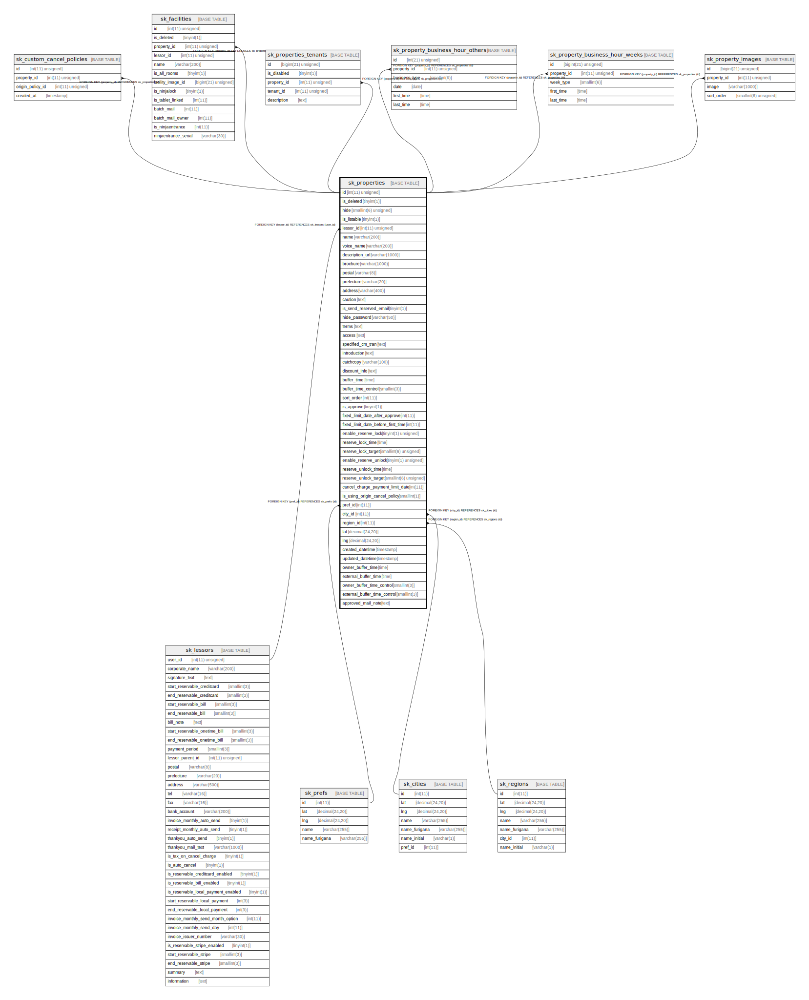

# sk_properties

## Description

物件

<details>
<summary><strong>Table Definition</strong></summary>

```sql
CREATE TABLE `sk_properties` (
  `id` int(11) unsigned NOT NULL AUTO_INCREMENT COMMENT '物件ID',
  `is_deleted` tinyint(1) DEFAULT '0' COMMENT '削除フラグ',
  `hide` smallint(6) unsigned NOT NULL DEFAULT '0' COMMENT '公開制限　0:公開、1:限定公開、2:非公開',
  `is_listable` tinyint(1) NOT NULL DEFAULT '1' COMMENT '一覧表示／非表示フラグ',
  `lessor_id` int(11) unsigned NOT NULL COMMENT '支店ID',
  `name` varchar(200) CHARACTER SET utf8 NOT NULL DEFAULT '' COMMENT '名前',
  `voice_name` varchar(200) CHARACTER SET utf8 DEFAULT NULL COMMENT '音声読上物件名',
  `description_url` varchar(1000) CHARACTER SET utf8 DEFAULT NULL COMMENT '詳細URL',
  `brochure` varchar(1000) CHARACTER SET utf8 NOT NULL DEFAULT '' COMMENT '物件資料PDFパス',
  `postal` varchar(8) CHARACTER SET utf8 NOT NULL DEFAULT '' COMMENT '郵便番号',
  `prefecture` varchar(20) CHARACTER SET utf8 NOT NULL DEFAULT '' COMMENT '都道府県',
  `address` varchar(400) CHARACTER SET utf8 NOT NULL DEFAULT '' COMMENT '住所',
  `caution` text CHARACTER SET utf8 NOT NULL COMMENT '注意事項',
  `is_send_reserved_email` tinyint(1) NOT NULL DEFAULT '0' COMMENT '予約メール送信フラグ',
  `hide_password` varchar(50) CHARACTER SET utf8 NOT NULL DEFAULT '' COMMENT '公開制限パスワード',
  `terms` text CHARACTER SET utf8 NOT NULL COMMENT '使用規約',
  `access` text CHARACTER SET utf8 COMMENT '最寄り駅からの交通アクセス説明',
  `specified_cm_tran` text COLLATE utf8mb4_unicode_ci NOT NULL COMMENT '特定商取引法',
  `introduction` text CHARACTER SET utf8 COMMENT '紹介文',
  `catchcopy` varchar(100) CHARACTER SET utf8 DEFAULT NULL COMMENT 'キャッチコピー',
  `discount_info` text CHARACTER SET utf8 NOT NULL COMMENT '割引料金情報',
  `buffer_time` time NOT NULL DEFAULT '00:00:00' COMMENT '予約間の清掃、準備するための時間',
  `buffer_time_control` smallint(3) DEFAULT '1' COMMENT '1:予約の前後 2:予約の前のみ 3:予約の後のみ',
  `sort_order` int(11) DEFAULT '0' COMMENT '物件の表示順',
  `is_approve` tinyint(1) DEFAULT '0' COMMENT '承認機能の使用有無',
  `fixed_limit_date_after_approve` int(11) DEFAULT NULL COMMENT '予約確定期日-承認後〇日',
  `fixed_limit_date_before_first_time` int(11) DEFAULT NULL COMMENT '予約確定期日-利用日の〇日前',
  `enable_reserve_lock` tinyint(1) unsigned NOT NULL DEFAULT '0' COMMENT '自動開錠 0:無効、1:有効',
  `reserve_lock_time` time NOT NULL DEFAULT '00:00:00' COMMENT '自動開錠から使用開始までの時間',
  `reserve_lock_target` smallint(6) unsigned NOT NULL DEFAULT '1' COMMENT '自動施錠対象 1:オーナー予約、2:ユーザー予約、3:全ての予約対象',
  `enable_reserve_unlock` tinyint(1) unsigned NOT NULL DEFAULT '0' COMMENT '自動施錠 0:無効、1:有効',
  `reserve_unlock_time` time NOT NULL DEFAULT '00:00:00' COMMENT '使用終了から自動施錠までの時間',
  `reserve_unlock_target` smallint(6) unsigned NOT NULL DEFAULT '1' COMMENT '自動解錠対象 1:オーナー予約、2:ユーザー予約、3:全ての予約対象',
  `cancel_charge_payment_limit_date` int(11) DEFAULT '30' COMMENT 'キャンセル料の支払期限',
  `is_using_origin_cancel_policy` smallint(1) DEFAULT '1',
  `pref_id` int(11) DEFAULT NULL COMMENT 'prefecture''s id',
  `city_id` int(11) DEFAULT NULL COMMENT 'city''s id',
  `region_id` int(11) DEFAULT NULL COMMENT 'prefecture''s id',
  `lat` decimal(24,20) DEFAULT NULL COMMENT 'lat Geocode',
  `lng` decimal(24,20) DEFAULT NULL COMMENT 'lng Geocode',
  `created_datetime` timestamp NULL DEFAULT CURRENT_TIMESTAMP,
  `updated_datetime` timestamp NULL DEFAULT CURRENT_TIMESTAMP ON UPDATE CURRENT_TIMESTAMP,
  `owner_buffer_time` time NOT NULL DEFAULT '00:00:00' COMMENT 'owner自身が取った予約',
  `external_buffer_time` time NOT NULL DEFAULT '00:00:00' COMMENT 'Googleカレンダー連携によりインポートされる予約',
  `owner_buffer_time_control` smallint(3) DEFAULT '1' COMMENT '1:予約の前後 2:予約の前のみ 3:予約の後のみ',
  `external_buffer_time_control` smallint(3) DEFAULT '1' COMMENT '1:予約の前後 2:予約の前のみ 3:予約の後のみ',
  `approved_mail_note` text COLLATE utf8mb4_unicode_ci,
  PRIMARY KEY (`id`),
  KEY `sk_relation_properties_and_lessors` (`lessor_id`),
  KEY `sk_relation_properties_and_cities` (`city_id`),
  KEY `sk_relation_properties_and_prefs` (`pref_id`),
  KEY `sk_relation_properties_and_regions` (`region_id`),
  CONSTRAINT `sk_relation_properties_and_cities` FOREIGN KEY (`city_id`) REFERENCES `sk_cities` (`id`) ON DELETE CASCADE ON UPDATE CASCADE,
  CONSTRAINT `sk_relation_properties_and_lessors` FOREIGN KEY (`lessor_id`) REFERENCES `sk_lessors` (`user_id`) ON DELETE CASCADE ON UPDATE CASCADE,
  CONSTRAINT `sk_relation_properties_and_prefs` FOREIGN KEY (`pref_id`) REFERENCES `sk_prefs` (`id`) ON DELETE CASCADE ON UPDATE CASCADE,
  CONSTRAINT `sk_relation_properties_and_regions` FOREIGN KEY (`region_id`) REFERENCES `sk_regions` (`id`) ON DELETE CASCADE ON UPDATE CASCADE
) ENGINE=InnoDB AUTO_INCREMENT=[Redacted by tbls] DEFAULT CHARSET=utf8mb4 COLLATE=utf8mb4_unicode_ci COMMENT='物件'
```

</details>

## Columns

| Name | Type | Default | Nullable | Extra Definition | Children | Parents | Comment |
| ---- | ---- | ------- | -------- | ---------------- | -------- | ------- | ------- |
| id | int(11) unsigned |  | false | auto_increment | [sk_custom_cancel_policies](sk_custom_cancel_policies.md) [sk_facilities](sk_facilities.md) [sk_properties_tenants](sk_properties_tenants.md) [sk_property_business_hour_others](sk_property_business_hour_others.md) [sk_property_business_hour_weeks](sk_property_business_hour_weeks.md) [sk_property_images](sk_property_images.md) |  | 物件ID |
| is_deleted | tinyint(1) | 0 | true |  |  |  | 削除フラグ |
| hide | smallint(6) unsigned | 0 | false |  |  |  | 公開制限　0:公開、1:限定公開、2:非公開 |
| is_listable | tinyint(1) | 1 | false |  |  |  | 一覧表示／非表示フラグ |
| lessor_id | int(11) unsigned |  | false |  |  | [sk_lessors](sk_lessors.md) | 支店ID |
| name | varchar(200) |  | false |  |  |  | 名前 |
| voice_name | varchar(200) |  | true |  |  |  | 音声読上物件名 |
| description_url | varchar(1000) |  | true |  |  |  | 詳細URL |
| brochure | varchar(1000) |  | false |  |  |  | 物件資料PDFパス |
| postal | varchar(8) |  | false |  |  |  | 郵便番号 |
| prefecture | varchar(20) |  | false |  |  |  | 都道府県 |
| address | varchar(400) |  | false |  |  |  | 住所 |
| caution | text |  | false |  |  |  | 注意事項 |
| is_send_reserved_email | tinyint(1) | 0 | false |  |  |  | 予約メール送信フラグ |
| hide_password | varchar(50) |  | false |  |  |  | 公開制限パスワード |
| terms | text |  | false |  |  |  | 使用規約 |
| access | text |  | true |  |  |  | 最寄り駅からの交通アクセス説明 |
| specified_cm_tran | text |  | false |  |  |  | 特定商取引法 |
| introduction | text |  | true |  |  |  | 紹介文 |
| catchcopy | varchar(100) |  | true |  |  |  | キャッチコピー |
| discount_info | text |  | false |  |  |  | 割引料金情報 |
| buffer_time | time | 00:00:00 | false |  |  |  | 予約間の清掃、準備するための時間 |
| buffer_time_control | smallint(3) | 1 | true |  |  |  | 1:予約の前後 2:予約の前のみ 3:予約の後のみ |
| sort_order | int(11) | 0 | true |  |  |  | 物件の表示順 |
| is_approve | tinyint(1) | 0 | true |  |  |  | 承認機能の使用有無 |
| fixed_limit_date_after_approve | int(11) |  | true |  |  |  | 予約確定期日-承認後〇日 |
| fixed_limit_date_before_first_time | int(11) |  | true |  |  |  | 予約確定期日-利用日の〇日前 |
| enable_reserve_lock | tinyint(1) unsigned | 0 | false |  |  |  | 自動開錠 0:無効、1:有効 |
| reserve_lock_time | time | 00:00:00 | false |  |  |  | 自動開錠から使用開始までの時間 |
| reserve_lock_target | smallint(6) unsigned | 1 | false |  |  |  | 自動施錠対象 1:オーナー予約、2:ユーザー予約、3:全ての予約対象 |
| enable_reserve_unlock | tinyint(1) unsigned | 0 | false |  |  |  | 自動施錠 0:無効、1:有効 |
| reserve_unlock_time | time | 00:00:00 | false |  |  |  | 使用終了から自動施錠までの時間 |
| reserve_unlock_target | smallint(6) unsigned | 1 | false |  |  |  | 自動解錠対象 1:オーナー予約、2:ユーザー予約、3:全ての予約対象 |
| cancel_charge_payment_limit_date | int(11) | 30 | true |  |  |  | キャンセル料の支払期限 |
| is_using_origin_cancel_policy | smallint(1) | 1 | true |  |  |  |  |
| pref_id | int(11) |  | true |  |  | [sk_prefs](sk_prefs.md) | prefecture's id |
| city_id | int(11) |  | true |  |  | [sk_cities](sk_cities.md) | city's id |
| region_id | int(11) |  | true |  |  | [sk_regions](sk_regions.md) | prefecture's id |
| lat | decimal(24,20) |  | true |  |  |  | lat Geocode |
| lng | decimal(24,20) |  | true |  |  |  | lng Geocode |
| created_datetime | timestamp | CURRENT_TIMESTAMP | true |  |  |  |  |
| updated_datetime | timestamp | CURRENT_TIMESTAMP | true | on update CURRENT_TIMESTAMP |  |  |  |
| owner_buffer_time | time | 00:00:00 | false |  |  |  | owner自身が取った予約 |
| external_buffer_time | time | 00:00:00 | false |  |  |  | Googleカレンダー連携によりインポートされる予約 |
| owner_buffer_time_control | smallint(3) | 1 | true |  |  |  | 1:予約の前後 2:予約の前のみ 3:予約の後のみ |
| external_buffer_time_control | smallint(3) | 1 | true |  |  |  | 1:予約の前後 2:予約の前のみ 3:予約の後のみ |
| approved_mail_note | text |  | true |  |  |  |  |

## Constraints

| Name | Type | Definition |
| ---- | ---- | ---------- |
| PRIMARY | PRIMARY KEY | PRIMARY KEY (id) |
| sk_relation_properties_and_cities | FOREIGN KEY | FOREIGN KEY (city_id) REFERENCES sk_cities (id) |
| sk_relation_properties_and_lessors | FOREIGN KEY | FOREIGN KEY (lessor_id) REFERENCES sk_lessors (user_id) |
| sk_relation_properties_and_prefs | FOREIGN KEY | FOREIGN KEY (pref_id) REFERENCES sk_prefs (id) |
| sk_relation_properties_and_regions | FOREIGN KEY | FOREIGN KEY (region_id) REFERENCES sk_regions (id) |

## Indexes

| Name | Definition |
| ---- | ---------- |
| sk_relation_properties_and_cities | KEY sk_relation_properties_and_cities (city_id) USING BTREE |
| sk_relation_properties_and_lessors | KEY sk_relation_properties_and_lessors (lessor_id) USING BTREE |
| sk_relation_properties_and_prefs | KEY sk_relation_properties_and_prefs (pref_id) USING BTREE |
| sk_relation_properties_and_regions | KEY sk_relation_properties_and_regions (region_id) USING BTREE |
| PRIMARY | PRIMARY KEY (id) USING BTREE |

## Relations



---

> Generated by [tbls](https://github.com/k1LoW/tbls)
