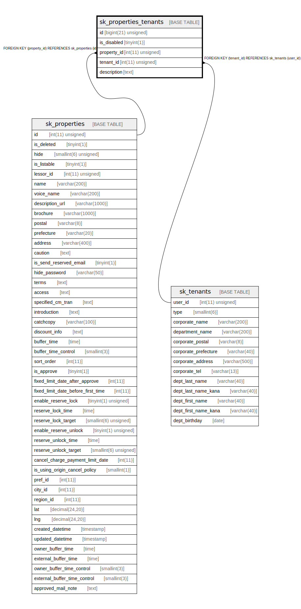

# sk_properties_tenants

## Description

物件ー借主

<details>
<summary><strong>Table Definition</strong></summary>

```sql
CREATE TABLE `sk_properties_tenants` (
  `id` bigint(21) unsigned NOT NULL AUTO_INCREMENT,
  `is_disabled` tinyint(1) NOT NULL DEFAULT '0' COMMENT '一時的に無効とする',
  `property_id` int(11) unsigned NOT NULL COMMENT '物件ID',
  `tenant_id` int(11) unsigned NOT NULL COMMENT 'ユーザーID(借主ID)',
  `description` text COMMENT '詳細',
  PRIMARY KEY (`id`),
  UNIQUE KEY `sk_index_properties_tenants_on_property_id_and_tenant_id` (`property_id`,`tenant_id`),
  KEY `sk_relation_properties_tenants_and_properties` (`property_id`),
  KEY `sk_relation_properties_tenants_and_tenants` (`tenant_id`),
  CONSTRAINT `sk_relation_properties_tenants_and_properties` FOREIGN KEY (`property_id`) REFERENCES `sk_properties` (`id`) ON DELETE CASCADE ON UPDATE CASCADE,
  CONSTRAINT `sk_relation_properties_tenants_and_tenants` FOREIGN KEY (`tenant_id`) REFERENCES `sk_tenants` (`user_id`) ON DELETE CASCADE ON UPDATE CASCADE
) ENGINE=InnoDB AUTO_INCREMENT=[Redacted by tbls] DEFAULT CHARSET=utf8 COMMENT='物件ー借主'
```

</details>

## Columns

| Name | Type | Default | Nullable | Extra Definition | Children | Parents | Comment |
| ---- | ---- | ------- | -------- | ---------------- | -------- | ------- | ------- |
| id | bigint(21) unsigned |  | false | auto_increment |  |  |  |
| is_disabled | tinyint(1) | 0 | false |  |  |  | 一時的に無効とする |
| property_id | int(11) unsigned |  | false |  |  | [sk_properties](sk_properties.md) | 物件ID |
| tenant_id | int(11) unsigned |  | false |  |  | [sk_tenants](sk_tenants.md) | ユーザーID(借主ID) |
| description | text |  | true |  |  |  | 詳細 |

## Constraints

| Name | Type | Definition |
| ---- | ---- | ---------- |
| PRIMARY | PRIMARY KEY | PRIMARY KEY (id) |
| sk_index_properties_tenants_on_property_id_and_tenant_id | UNIQUE | UNIQUE KEY sk_index_properties_tenants_on_property_id_and_tenant_id (property_id, tenant_id) |
| sk_relation_properties_tenants_and_properties | FOREIGN KEY | FOREIGN KEY (property_id) REFERENCES sk_properties (id) |
| sk_relation_properties_tenants_and_tenants | FOREIGN KEY | FOREIGN KEY (tenant_id) REFERENCES sk_tenants (user_id) |

## Indexes

| Name | Definition |
| ---- | ---------- |
| sk_relation_properties_tenants_and_properties | KEY sk_relation_properties_tenants_and_properties (property_id) USING BTREE |
| sk_relation_properties_tenants_and_tenants | KEY sk_relation_properties_tenants_and_tenants (tenant_id) USING BTREE |
| PRIMARY | PRIMARY KEY (id) USING BTREE |
| sk_index_properties_tenants_on_property_id_and_tenant_id | UNIQUE KEY sk_index_properties_tenants_on_property_id_and_tenant_id (property_id, tenant_id) USING BTREE |

## Relations



---

> Generated by [tbls](https://github.com/k1LoW/tbls)
