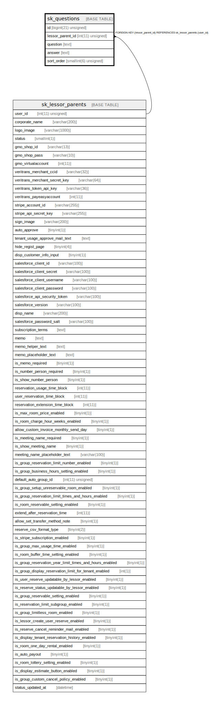

# sk_questions

## Description

FAQ

<details>
<summary><strong>Table Definition</strong></summary>

```sql
CREATE TABLE `sk_questions` (
  `id` bigint(21) unsigned NOT NULL AUTO_INCREMENT COMMENT 'FAQ ID',
  `lessor_parent_id` int(11) unsigned NOT NULL COMMENT '本店ID',
  `question` text NOT NULL COMMENT '質問（タイトル）',
  `answer` text NOT NULL COMMENT '質問の答え',
  `sort_order` smallint(6) unsigned NOT NULL DEFAULT '0' COMMENT 'ソート順',
  PRIMARY KEY (`id`),
  KEY `sk_relation_questions_and_lessor_parents` (`lessor_parent_id`),
  CONSTRAINT `sk_relation_questions_and_lessor_parents` FOREIGN KEY (`lessor_parent_id`) REFERENCES `sk_lessor_parents` (`user_id`) ON DELETE CASCADE ON UPDATE CASCADE
) ENGINE=InnoDB AUTO_INCREMENT=[Redacted by tbls] DEFAULT CHARSET=utf8 COMMENT='FAQ'
```

</details>

## Columns

| Name | Type | Default | Nullable | Extra Definition | Children | Parents | Comment |
| ---- | ---- | ------- | -------- | ---------------- | -------- | ------- | ------- |
| id | bigint(21) unsigned |  | false | auto_increment |  |  | FAQ ID |
| lessor_parent_id | int(11) unsigned |  | false |  |  | [sk_lessor_parents](sk_lessor_parents.md) | 本店ID |
| question | text |  | false |  |  |  | 質問（タイトル） |
| answer | text |  | false |  |  |  | 質問の答え |
| sort_order | smallint(6) unsigned | 0 | false |  |  |  | ソート順 |

## Constraints

| Name | Type | Definition |
| ---- | ---- | ---------- |
| PRIMARY | PRIMARY KEY | PRIMARY KEY (id) |
| sk_relation_questions_and_lessor_parents | FOREIGN KEY | FOREIGN KEY (lessor_parent_id) REFERENCES sk_lessor_parents (user_id) |

## Indexes

| Name | Definition |
| ---- | ---------- |
| sk_relation_questions_and_lessor_parents | KEY sk_relation_questions_and_lessor_parents (lessor_parent_id) USING BTREE |
| PRIMARY | PRIMARY KEY (id) USING BTREE |

## Relations



---

> Generated by [tbls](https://github.com/k1LoW/tbls)
