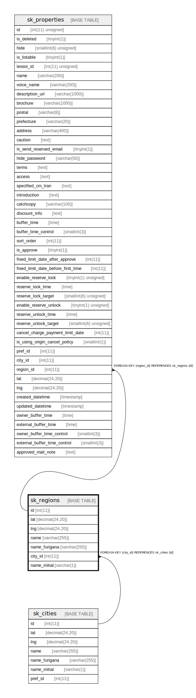

# sk_regions

## Description

<details>
<summary><strong>Table Definition</strong></summary>

```sql
CREATE TABLE `sk_regions` (
  `id` int(11) NOT NULL AUTO_INCREMENT,
  `lat` decimal(24,20) NOT NULL,
  `lng` decimal(24,20) NOT NULL,
  `name` varchar(255) NOT NULL,
  `name_furigana` varchar(255) NOT NULL,
  `city_id` int(11) NOT NULL,
  `name_initial` varchar(1) NOT NULL,
  PRIMARY KEY (`id`),
  KEY `sk_region_c33bcf38` (`name_furigana`),
  KEY `sk_region_b376980e` (`city_id`),
  KEY `sk_region_b068931c` (`name`),
  CONSTRAINT `sk_region_city_id_716d74cc49256f88_fk_sk_city_id` FOREIGN KEY (`city_id`) REFERENCES `sk_cities` (`id`)
) ENGINE=InnoDB AUTO_INCREMENT=[Redacted by tbls] DEFAULT CHARSET=utf8
```

</details>

## Columns

| Name | Type | Default | Nullable | Extra Definition | Children | Parents | Comment |
| ---- | ---- | ------- | -------- | ---------------- | -------- | ------- | ------- |
| id | int(11) |  | false | auto_increment | [sk_properties](sk_properties.md) |  |  |
| lat | decimal(24,20) |  | false |  |  |  |  |
| lng | decimal(24,20) |  | false |  |  |  |  |
| name | varchar(255) |  | false |  |  |  |  |
| name_furigana | varchar(255) |  | false |  |  |  |  |
| city_id | int(11) |  | false |  |  | [sk_cities](sk_cities.md) |  |
| name_initial | varchar(1) |  | false |  |  |  |  |

## Constraints

| Name | Type | Definition |
| ---- | ---- | ---------- |
| PRIMARY | PRIMARY KEY | PRIMARY KEY (id) |
| sk_region_city_id_716d74cc49256f88_fk_sk_city_id | FOREIGN KEY | FOREIGN KEY (city_id) REFERENCES sk_cities (id) |

## Indexes

| Name | Definition |
| ---- | ---------- |
| sk_region_b068931c | KEY sk_region_b068931c (name) USING BTREE |
| sk_region_b376980e | KEY sk_region_b376980e (city_id) USING BTREE |
| sk_region_c33bcf38 | KEY sk_region_c33bcf38 (name_furigana) USING BTREE |
| PRIMARY | PRIMARY KEY (id) USING BTREE |

## Relations



---

> Generated by [tbls](https://github.com/k1LoW/tbls)
