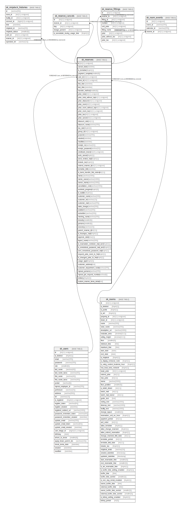

# sk_reserves

## Description

内覧予約

<details>
<summary><strong>Table Definition</strong></summary>

```sql
CREATE TABLE `sk_reserves` (
  `id` int(11) unsigned NOT NULL AUTO_INCREMENT COMMENT '予約ID',
  `cancel_date` datetime DEFAULT NULL COMMENT 'キャンセル日',
  `is_tentative` tinyint(1) DEFAULT '0' COMMENT '仮予約フラグ',
  `payment_complete` smallint(6) DEFAULT '0' COMMENT '支払い状況、1:支払済,2:未返金,3:返金済,4:振込金不足,5:請求取消',
  `user_id` int(11) unsigned DEFAULT NULL COMMENT '借主ID',
  `room_id` int(11) unsigned NOT NULL COMMENT '部屋ID',
  `first_time` datetime NOT NULL COMMENT '予約開始時刻',
  `last_time` datetime NOT NULL COMMENT '予約終了時刻',
  `transfer_method` smallint(6) NOT NULL COMMENT '決済方法　1:クレジットカード、2:銀行振込、3:請求書払い',
  `price_total` int(11) unsigned NOT NULL COMMENT '合計請求金額',
  `price_total_without_tax` int(11) unsigned NOT NULL COMMENT '合計請求金額（税抜)',
  `price_discount` int(11) unsigned NOT NULL DEFAULT '0' COMMENT '割引額（税抜）',
  `price_room` int(11) unsigned NOT NULL COMMENT '請求金額のうち部屋代',
  `price_room_without_tax` int(11) unsigned NOT NULL COMMENT '請求金額のうち部屋代（税抜)',
  `price_room_tax` int(11) unsigned NOT NULL COMMENT '部屋代の消費税代',
  `price_tax` int(11) unsigned NOT NULL COMMENT '請求金額のうち消費税代',
  `price_cancel` int(11) unsigned DEFAULT NULL COMMENT 'キャンセル料',
  `discount_rate` int(11) NOT NULL DEFAULT '0' COMMENT '予約時の割引率',
  `discount_name` varchar(255) DEFAULT NULL COMMENT '予約時の割引名',
  `tax_rate` tinyint(4) DEFAULT '0' COMMENT '税率',
  `group_id` int(11) unsigned DEFAULT NULL,
  `purpose` varchar(255) DEFAULT '0' COMMENT '使用目的',
  `created` datetime NOT NULL COMMENT '作成時刻',
  `modified` datetime NOT NULL COMMENT '更新時刻',
  `receipt_no` varchar(32) DEFAULT NULL COMMENT '電話による鍵開閉の受付ID',
  `receipt_password` varchar(32) DEFAULT NULL COMMENT '電話による鍵開閉の受付パスワード',
  `creditcard_brand` int(10) unsigned DEFAULT NULL COMMENT 'クレジットカードのブランドコード',
  `auto_cancel` tinyint(1) DEFAULT '1' COMMENT '支払期限が過ぎた場合の自動キャンセル　1:有効　0:無効',
  `send_remind_mail` tinyint(1) DEFAULT '1' COMMENT 'リマインドメールの送付　1:有効　0:無効',
  `include_tax` tinyint(1) DEFAULT '0' COMMENT '税込み価格が設定されているか',
  `extend_reserve_id` int(11) unsigned DEFAULT NULL COMMENT '延長元のreserve_id',
  `tentative_limit` datetime DEFAULT NULL COMMENT '仮予約期限',
  `is_bank_transfer_first_extend` int(11) DEFAULT '0' COMMENT '元の予約が銀行振込、延長データ1件目のフラグ',
  `memo` varchar(1000) DEFAULT NULL COMMENT '内部メモ',
  `memo_owner` varchar(1000) DEFAULT NULL,
  `owner_memo` varchar(1000) DEFAULT NULL,
  `cancellation_note` varchar(1000) DEFAULT NULL,
  `autolock_progress` tinyint(4) NOT NULL DEFAULT '1' COMMENT '予約中オートロック解除機能の進捗',
  `is_waitlist` tinyint(1) DEFAULT '0' COMMENT 'キャンセル待ちフラグ',
  `customer_name` varchar(200) DEFAULT NULL COMMENT '利用者名',
  `customer_tel` varchar(13) DEFAULT NULL,
  `customer_mail` varchar(255) DEFAULT NULL,
  `sales_charge` varchar(200) DEFAULT NULL COMMENT '営業担当',
  `assistant` varchar(200) DEFAULT NULL COMMENT '支援担当',
  `subscriber` varchar(200) DEFAULT NULL COMMENT '予約者',
  `meeting_name` varchar(200) DEFAULT NULL COMMENT '開催名',
  `industry` smallint(6) DEFAULT NULL COMMENT '業界種別',
  `persons` smallint(6) DEFAULT NULL COMMENT '利用人数',
  `accuracy` varchar(10) DEFAULT NULL COMMENT '仮予約決定確度',
  `parent_reserve_id` int(11) DEFAULT NULL COMMENT '親予約ID',
  `is_thankyou_mail` tinyint(1) DEFAULT '0' COMMENT 'thankyou送信済みフラグ',
  `approve_state` char(1) DEFAULT '0' COMMENT '0:初期値　1:申請中　2:承認済み 9:却下',
  `layout_name` varchar(200) DEFAULT NULL COMMENT '予約時のレイアウトの名前',
  `is_reservation_reminder_mail_sent` tinyint(1) DEFAULT '0',
  `is_remotelock_password_mail_sent` tinyint(1) DEFAULT '0',
  `sent_remotelock_password_mail` tinyint(1) DEFAULT '0',
  `request_price_room_to_free` tinyint(1) DEFAULT '0',
  `is_changed_price_to_free` tinyint(1) DEFAULT '0',
  `usage_type` tinyint(2) DEFAULT NULL,
  `customer_address` text,
  `customer_department_name` varchar(255) DEFAULT NULL,
  `mynavi_persons` varchar(255) DEFAULT NULL,
  `mynavi_job_request_number` varchar(8) DEFAULT NULL,
  `delivery` tinyint(2) DEFAULT NULL,
  `custom_reserve_items_detail` text,
  PRIMARY KEY (`id`),
  KEY `sk_relation_reserves_and_users` (`user_id`),
  KEY `sk_relation_reserves_and_rooms` (`room_id`),
  KEY `index_reserves_on_first_time` (`first_time`),
  KEY `sk_extend_reserve_id_idx` (`extend_reserve_id`),
  CONSTRAINT `sk_relation_reserves_and_rooms` FOREIGN KEY (`room_id`) REFERENCES `sk_rooms` (`id`) ON DELETE CASCADE ON UPDATE CASCADE,
  CONSTRAINT `sk_relation_reserves_and_users` FOREIGN KEY (`user_id`) REFERENCES `sk_users` (`id`) ON DELETE SET NULL ON UPDATE SET NULL
) ENGINE=InnoDB AUTO_INCREMENT=[Redacted by tbls] DEFAULT CHARSET=utf8 COMMENT='内覧予約'
```

</details>

## Columns

| Name | Type | Default | Nullable | Extra Definition | Children | Parents | Comment |
| ---- | ---- | ------- | -------- | ---------------- | -------- | ------- | ------- |
| id | int(11) unsigned |  | false | auto_increment | [sk_ninjalock_histories](sk_ninjalock_histories.md) [sk_reserve_cancels](sk_reserve_cancels.md) [sk_reserve_fittings](sk_reserve_fittings.md) [sk_room_events](sk_room_events.md) |  | 予約ID |
| cancel_date | datetime |  | true |  |  |  | キャンセル日 |
| is_tentative | tinyint(1) | 0 | true |  |  |  | 仮予約フラグ |
| payment_complete | smallint(6) | 0 | true |  |  |  | 支払い状況、1:支払済,2:未返金,3:返金済,4:振込金不足,5:請求取消 |
| user_id | int(11) unsigned |  | true |  |  | [sk_users](sk_users.md) | 借主ID |
| room_id | int(11) unsigned |  | false |  |  | [sk_rooms](sk_rooms.md) | 部屋ID |
| first_time | datetime |  | false |  |  |  | 予約開始時刻 |
| last_time | datetime |  | false |  |  |  | 予約終了時刻 |
| transfer_method | smallint(6) |  | false |  |  |  | 決済方法　1:クレジットカード、2:銀行振込、3:請求書払い |
| price_total | int(11) unsigned |  | false |  |  |  | 合計請求金額 |
| price_total_without_tax | int(11) unsigned |  | false |  |  |  | 合計請求金額（税抜) |
| price_discount | int(11) unsigned | 0 | false |  |  |  | 割引額（税抜） |
| price_room | int(11) unsigned |  | false |  |  |  | 請求金額のうち部屋代 |
| price_room_without_tax | int(11) unsigned |  | false |  |  |  | 請求金額のうち部屋代（税抜) |
| price_room_tax | int(11) unsigned |  | false |  |  |  | 部屋代の消費税代 |
| price_tax | int(11) unsigned |  | false |  |  |  | 請求金額のうち消費税代 |
| price_cancel | int(11) unsigned |  | true |  |  |  | キャンセル料 |
| discount_rate | int(11) | 0 | false |  |  |  | 予約時の割引率 |
| discount_name | varchar(255) |  | true |  |  |  | 予約時の割引名 |
| tax_rate | tinyint(4) | 0 | true |  |  |  | 税率 |
| group_id | int(11) unsigned |  | true |  |  |  |  |
| purpose | varchar(255) | 0 | true |  |  |  | 使用目的 |
| created | datetime |  | false |  |  |  | 作成時刻 |
| modified | datetime |  | false |  |  |  | 更新時刻 |
| receipt_no | varchar(32) |  | true |  |  |  | 電話による鍵開閉の受付ID |
| receipt_password | varchar(32) |  | true |  |  |  | 電話による鍵開閉の受付パスワード |
| creditcard_brand | int(10) unsigned |  | true |  |  |  | クレジットカードのブランドコード |
| auto_cancel | tinyint(1) | 1 | true |  |  |  | 支払期限が過ぎた場合の自動キャンセル　1:有効　0:無効 |
| send_remind_mail | tinyint(1) | 1 | true |  |  |  | リマインドメールの送付　1:有効　0:無効 |
| include_tax | tinyint(1) | 0 | true |  |  |  | 税込み価格が設定されているか |
| extend_reserve_id | int(11) unsigned |  | true |  |  |  | 延長元のreserve_id |
| tentative_limit | datetime |  | true |  |  |  | 仮予約期限 |
| is_bank_transfer_first_extend | int(11) | 0 | true |  |  |  | 元の予約が銀行振込、延長データ1件目のフラグ |
| memo | varchar(1000) |  | true |  |  |  | 内部メモ |
| memo_owner | varchar(1000) |  | true |  |  |  |  |
| owner_memo | varchar(1000) |  | true |  |  |  |  |
| cancellation_note | varchar(1000) |  | true |  |  |  |  |
| autolock_progress | tinyint(4) | 1 | false |  |  |  | 予約中オートロック解除機能の進捗 |
| is_waitlist | tinyint(1) | 0 | true |  |  |  | キャンセル待ちフラグ |
| customer_name | varchar(200) |  | true |  |  |  | 利用者名 |
| customer_tel | varchar(13) |  | true |  |  |  |  |
| customer_mail | varchar(255) |  | true |  |  |  |  |
| sales_charge | varchar(200) |  | true |  |  |  | 営業担当 |
| assistant | varchar(200) |  | true |  |  |  | 支援担当 |
| subscriber | varchar(200) |  | true |  |  |  | 予約者 |
| meeting_name | varchar(200) |  | true |  |  |  | 開催名 |
| industry | smallint(6) |  | true |  |  |  | 業界種別 |
| persons | smallint(6) |  | true |  |  |  | 利用人数 |
| accuracy | varchar(10) |  | true |  |  |  | 仮予約決定確度 |
| parent_reserve_id | int(11) |  | true |  |  |  | 親予約ID |
| is_thankyou_mail | tinyint(1) | 0 | true |  |  |  | thankyou送信済みフラグ |
| approve_state | char(1) | 0 | true |  |  |  | 0:初期値　1:申請中　2:承認済み 9:却下 |
| layout_name | varchar(200) |  | true |  |  |  | 予約時のレイアウトの名前 |
| is_reservation_reminder_mail_sent | tinyint(1) | 0 | true |  |  |  |  |
| is_remotelock_password_mail_sent | tinyint(1) | 0 | true |  |  |  |  |
| sent_remotelock_password_mail | tinyint(1) | 0 | true |  |  |  |  |
| request_price_room_to_free | tinyint(1) | 0 | true |  |  |  |  |
| is_changed_price_to_free | tinyint(1) | 0 | true |  |  |  |  |
| usage_type | tinyint(2) |  | true |  |  |  |  |
| customer_address | text |  | true |  |  |  |  |
| customer_department_name | varchar(255) |  | true |  |  |  |  |
| mynavi_persons | varchar(255) |  | true |  |  |  |  |
| mynavi_job_request_number | varchar(8) |  | true |  |  |  |  |
| delivery | tinyint(2) |  | true |  |  |  |  |
| custom_reserve_items_detail | text |  | true |  |  |  |  |

## Constraints

| Name | Type | Definition |
| ---- | ---- | ---------- |
| PRIMARY | PRIMARY KEY | PRIMARY KEY (id) |
| sk_relation_reserves_and_rooms | FOREIGN KEY | FOREIGN KEY (room_id) REFERENCES sk_rooms (id) |
| sk_relation_reserves_and_users | FOREIGN KEY | FOREIGN KEY (user_id) REFERENCES sk_users (id) |

## Indexes

| Name | Definition |
| ---- | ---------- |
| index_reserves_on_first_time | KEY index_reserves_on_first_time (first_time) USING BTREE |
| sk_extend_reserve_id_idx | KEY sk_extend_reserve_id_idx (extend_reserve_id) USING BTREE |
| sk_relation_reserves_and_rooms | KEY sk_relation_reserves_and_rooms (room_id) USING BTREE |
| sk_relation_reserves_and_users | KEY sk_relation_reserves_and_users (user_id) USING BTREE |
| PRIMARY | PRIMARY KEY (id) USING BTREE |

## Triggers

| Name | Definition |
| ---- | ---------- |
| prevent_duplicate_reservation | CREATE TRIGGER prevent_duplicate_reservation BEFORE INSERT ON sk_reserves<br>FOR EACH ROW<br>BEGIN<br>DECLARE num_rows INT;<br>SET num_rows = (<br>SELECT COUNT(*)<br>FROM sk_reserves<br>WHERE NEW.room_id = room_id<br>AND NEW.first_time < last_time<br>AND NEW.last_time > first_time<br>AND NEW.is_waitlist = false<br>AND cancel_date IS NULL<br>);<br>IF num_rows > 0 THEN<br>SIGNAL SQLSTATE '45000' SET MESSAGE_TEXT = 'ご指定の日時は予約ができません。空き状況や予約可能期間、最低（最大）利用時間など再度ご確認ください。';<br>END IF;<br>END |
| prevent_duplicate_reservation_update | CREATE TRIGGER prevent_duplicate_reservation_update BEFORE UPDATE ON sk_reserves<br>FOR EACH ROW<br>BEGIN<br>DECLARE num_rows INT;<br>SET num_rows = (<br>SELECT COUNT(*)<br>FROM sk_reserves<br>WHERE NEW.room_id = room_id<br>AND NEW.first_time < last_time<br>AND NEW.last_time > first_time<br>AND NEW.is_waitlist = false<br>AND cancel_date IS NULL<br>AND id != NEW.id -- Exclude the row that is being updated<br>);<br>IF num_rows > 0 THEN<br>SIGNAL SQLSTATE '45000' SET MESSAGE_TEXT = 'ご指定の日時は予約ができません。空き状況や予約可能期間、最低（最大）利用時間など再度ご確認ください。';<br>END IF;<br>END |

## Relations



---

> Generated by [tbls](https://github.com/k1LoW/tbls)
