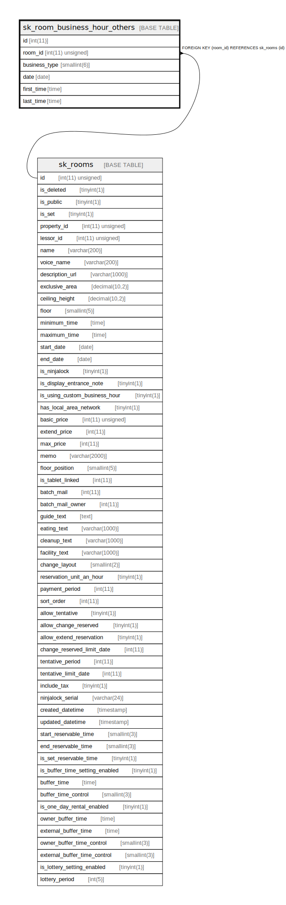

# sk_room_business_hour_others

## Description

<details>
<summary><strong>Table Definition</strong></summary>

```sql
CREATE TABLE `sk_room_business_hour_others` (
  `id` int(11) NOT NULL AUTO_INCREMENT,
  `room_id` int(11) unsigned NOT NULL,
  `business_type` smallint(6) NOT NULL DEFAULT '0' COMMENT '0:営業しない、1:営業する',
  `date` date NOT NULL COMMENT '指定日',
  `first_time` time NOT NULL COMMENT '営業開始時間',
  `last_time` time NOT NULL COMMENT '営業終了時間',
  PRIMARY KEY (`id`),
  KEY `fk_room_business_hour_others__room_id_idx` (`room_id`),
  CONSTRAINT `fk_room_business_hour_others__room_id` FOREIGN KEY (`room_id`) REFERENCES `sk_rooms` (`id`) ON DELETE CASCADE ON UPDATE NO ACTION
) ENGINE=InnoDB AUTO_INCREMENT=[Redacted by tbls] DEFAULT CHARSET=utf8mb4 COLLATE=utf8mb4_unicode_ci
```

</details>

## Columns

| Name | Type | Default | Nullable | Extra Definition | Children | Parents | Comment |
| ---- | ---- | ------- | -------- | ---------------- | -------- | ------- | ------- |
| id | int(11) |  | false | auto_increment |  |  |  |
| room_id | int(11) unsigned |  | false |  |  | [sk_rooms](sk_rooms.md) |  |
| business_type | smallint(6) | 0 | false |  |  |  | 0:営業しない、1:営業する |
| date | date |  | false |  |  |  | 指定日 |
| first_time | time |  | false |  |  |  | 営業開始時間 |
| last_time | time |  | false |  |  |  | 営業終了時間 |

## Constraints

| Name | Type | Definition |
| ---- | ---- | ---------- |
| fk_room_business_hour_others__room_id | FOREIGN KEY | FOREIGN KEY (room_id) REFERENCES sk_rooms (id) |
| PRIMARY | PRIMARY KEY | PRIMARY KEY (id) |

## Indexes

| Name | Definition |
| ---- | ---------- |
| fk_room_business_hour_others__room_id_idx | KEY fk_room_business_hour_others__room_id_idx (room_id) USING BTREE |
| PRIMARY | PRIMARY KEY (id) USING BTREE |

## Relations



---

> Generated by [tbls](https://github.com/k1LoW/tbls)
