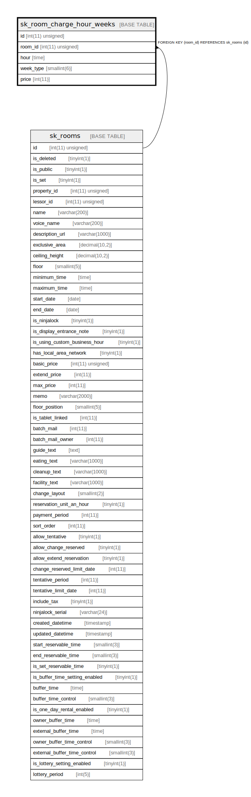

# sk_room_charge_hour_weeks

## Description

<details>
<summary><strong>Table Definition</strong></summary>

```sql
CREATE TABLE `sk_room_charge_hour_weeks` (
  `id` int(11) unsigned NOT NULL AUTO_INCREMENT,
  `room_id` int(11) unsigned NOT NULL,
  `hour` time NOT NULL DEFAULT '00:00:00',
  `week_type` smallint(6) NOT NULL COMMENT '0:日、1:月、2:火、3:水、4:木、5:金、6:土、7:祝',
  `price` int(11) NOT NULL DEFAULT '0',
  PRIMARY KEY (`id`),
  KEY `sk_relation__id__room_id__sk_room_charge_hour_weeks_idx` (`room_id`),
  CONSTRAINT `sk_relation__id__room_id__sk_room_charge_hour_weeks` FOREIGN KEY (`room_id`) REFERENCES `sk_rooms` (`id`) ON DELETE CASCADE ON UPDATE CASCADE
) ENGINE=InnoDB AUTO_INCREMENT=[Redacted by tbls] DEFAULT CHARSET=utf8mb4 COLLATE=utf8mb4_unicode_ci
```

</details>

## Columns

| Name | Type | Default | Nullable | Extra Definition | Children | Parents | Comment |
| ---- | ---- | ------- | -------- | ---------------- | -------- | ------- | ------- |
| id | int(11) unsigned |  | false | auto_increment |  |  |  |
| room_id | int(11) unsigned |  | false |  |  | [sk_rooms](sk_rooms.md) |  |
| hour | time | 00:00:00 | false |  |  |  |  |
| week_type | smallint(6) |  | false |  |  |  | 0:日、1:月、2:火、3:水、4:木、5:金、6:土、7:祝 |
| price | int(11) | 0 | false |  |  |  |  |

## Constraints

| Name | Type | Definition |
| ---- | ---- | ---------- |
| PRIMARY | PRIMARY KEY | PRIMARY KEY (id) |
| sk_relation__id__room_id__sk_room_charge_hour_weeks | FOREIGN KEY | FOREIGN KEY (room_id) REFERENCES sk_rooms (id) |

## Indexes

| Name | Definition |
| ---- | ---------- |
| sk_relation__id__room_id__sk_room_charge_hour_weeks_idx | KEY sk_relation__id__room_id__sk_room_charge_hour_weeks_idx (room_id) USING BTREE |
| PRIMARY | PRIMARY KEY (id) USING BTREE |

## Relations



---

> Generated by [tbls](https://github.com/k1LoW/tbls)
