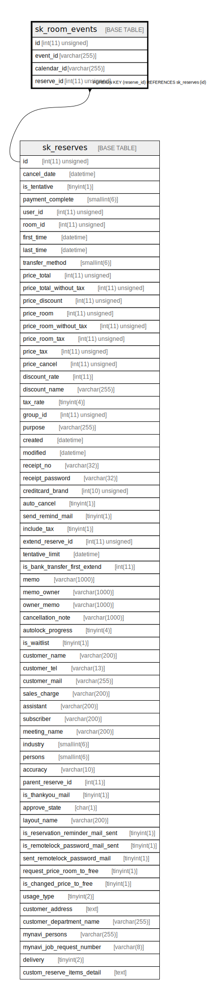

# sk_room_events

## Description

<details>
<summary><strong>Table Definition</strong></summary>

```sql
CREATE TABLE `sk_room_events` (
  `id` int(11) unsigned NOT NULL AUTO_INCREMENT,
  `event_id` varchar(255) COLLATE utf8mb4_unicode_ci NOT NULL COMMENT 'Id of event in google calendar',
  `calendar_id` varchar(255) COLLATE utf8mb4_unicode_ci NOT NULL COMMENT 'Id of calendar',
  `reserve_id` int(11) unsigned NOT NULL COMMENT 'Id of reservation',
  PRIMARY KEY (`id`),
  KEY `sk_relation_events_and_reserves` (`reserve_id`),
  CONSTRAINT `sk_relation_events_and_reserves` FOREIGN KEY (`reserve_id`) REFERENCES `sk_reserves` (`id`) ON DELETE CASCADE ON UPDATE CASCADE
) ENGINE=InnoDB AUTO_INCREMENT=[Redacted by tbls] DEFAULT CHARSET=utf8mb4 COLLATE=utf8mb4_unicode_ci
```

</details>

## Columns

| Name | Type | Default | Nullable | Extra Definition | Children | Parents | Comment |
| ---- | ---- | ------- | -------- | ---------------- | -------- | ------- | ------- |
| id | int(11) unsigned |  | false | auto_increment |  |  |  |
| event_id | varchar(255) |  | false |  |  |  | Id of event in google calendar |
| calendar_id | varchar(255) |  | false |  |  |  | Id of calendar |
| reserve_id | int(11) unsigned |  | false |  |  | [sk_reserves](sk_reserves.md) | Id of reservation |

## Constraints

| Name | Type | Definition |
| ---- | ---- | ---------- |
| PRIMARY | PRIMARY KEY | PRIMARY KEY (id) |
| sk_relation_events_and_reserves | FOREIGN KEY | FOREIGN KEY (reserve_id) REFERENCES sk_reserves (id) |

## Indexes

| Name | Definition |
| ---- | ---------- |
| sk_relation_events_and_reserves | KEY sk_relation_events_and_reserves (reserve_id) USING BTREE |
| PRIMARY | PRIMARY KEY (id) USING BTREE |

## Relations



---

> Generated by [tbls](https://github.com/k1LoW/tbls)
