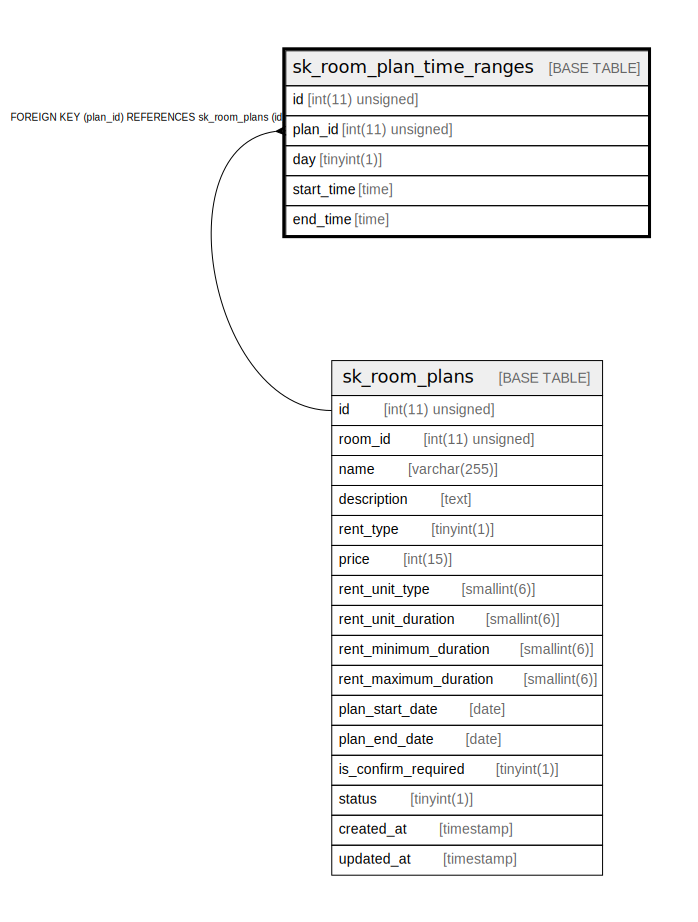

# sk_room_plan_time_ranges

## Description

<details>
<summary><strong>Table Definition</strong></summary>

```sql
CREATE TABLE `sk_room_plan_time_ranges` (
  `id` int(11) unsigned NOT NULL AUTO_INCREMENT COMMENT 'id',
  `plan_id` int(11) unsigned NOT NULL,
  `day` tinyint(1) NOT NULL COMMENT '2-Monday, 3-Tueday, 4-Wednesday, 5-Thurday, 6-Friday, 7-Saturday, 8-Sunday',
  `start_time` time NOT NULL,
  `end_time` time NOT NULL,
  PRIMARY KEY (`id`),
  KEY `fk_room_plan_time_ranges__plan_id_idx` (`plan_id`),
  CONSTRAINT `fk_room_plan_time_ranges__plan_id_idx` FOREIGN KEY (`plan_id`) REFERENCES `sk_room_plans` (`id`) ON DELETE CASCADE ON UPDATE NO ACTION
) ENGINE=InnoDB AUTO_INCREMENT=[Redacted by tbls] DEFAULT CHARSET=utf8mb4 COLLATE=utf8mb4_unicode_ci
```

</details>

## Columns

| Name | Type | Default | Nullable | Extra Definition | Children | Parents | Comment |
| ---- | ---- | ------- | -------- | ---------------- | -------- | ------- | ------- |
| id | int(11) unsigned |  | false | auto_increment |  |  | id |
| plan_id | int(11) unsigned |  | false |  |  | [sk_room_plans](sk_room_plans.md) |  |
| day | tinyint(1) |  | false |  |  |  | 2-Monday, 3-Tueday, 4-Wednesday, 5-Thurday, 6-Friday, 7-Saturday, 8-Sunday |
| start_time | time |  | false |  |  |  |  |
| end_time | time |  | false |  |  |  |  |

## Constraints

| Name | Type | Definition |
| ---- | ---- | ---------- |
| fk_room_plan_time_ranges__plan_id_idx | FOREIGN KEY | FOREIGN KEY (plan_id) REFERENCES sk_room_plans (id) |
| PRIMARY | PRIMARY KEY | PRIMARY KEY (id) |

## Indexes

| Name | Definition |
| ---- | ---------- |
| fk_room_plan_time_ranges__plan_id_idx | KEY fk_room_plan_time_ranges__plan_id_idx (plan_id) USING BTREE |
| PRIMARY | PRIMARY KEY (id) USING BTREE |

## Relations



---

> Generated by [tbls](https://github.com/k1LoW/tbls)
