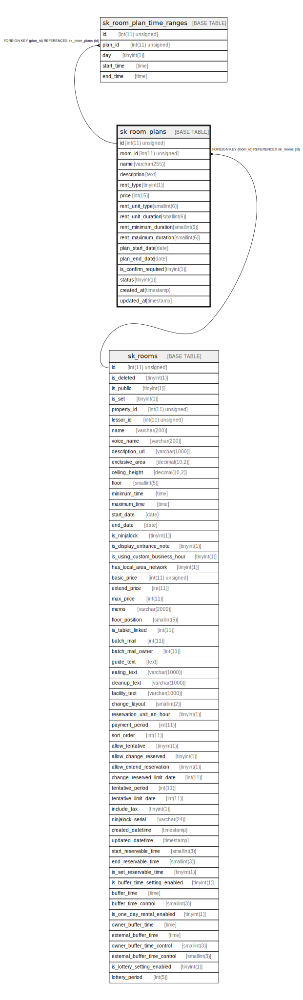

# sk_room_plans

## Description

<details>
<summary><strong>Table Definition</strong></summary>

```sql
CREATE TABLE `sk_room_plans` (
  `id` int(11) unsigned NOT NULL AUTO_INCREMENT COMMENT 'id',
  `room_id` int(11) unsigned NOT NULL,
  `name` varchar(255) COLLATE utf8mb4_unicode_ci NOT NULL,
  `description` text COLLATE utf8mb4_unicode_ci,
  `rent_type` tinyint(1) DEFAULT '0' COMMENT '0-date, 1-hour',
  `price` int(15) NOT NULL DEFAULT '0',
  `rent_unit_type` smallint(6) DEFAULT NULL COMMENT 'Only use for hourly rent type, units are hours or minutes',
  `rent_unit_duration` smallint(6) DEFAULT NULL,
  `rent_minimum_duration` smallint(6) DEFAULT NULL,
  `rent_maximum_duration` smallint(6) DEFAULT NULL,
  `plan_start_date` date DEFAULT NULL,
  `plan_end_date` date DEFAULT NULL,
  `is_confirm_required` tinyint(1) DEFAULT '0' COMMENT '0-unconfirmed, 1-confirmed',
  `status` tinyint(1) DEFAULT '0' COMMENT '1-apply or 0',
  `created_at` timestamp NULL DEFAULT CURRENT_TIMESTAMP,
  `updated_at` timestamp NULL DEFAULT CURRENT_TIMESTAMP,
  PRIMARY KEY (`id`),
  KEY `fk_room_plans__room_id_idx` (`room_id`),
  CONSTRAINT `fk_room_plans__room_id_idx` FOREIGN KEY (`room_id`) REFERENCES `sk_rooms` (`id`) ON DELETE CASCADE ON UPDATE NO ACTION
) ENGINE=InnoDB AUTO_INCREMENT=[Redacted by tbls] DEFAULT CHARSET=utf8mb4 COLLATE=utf8mb4_unicode_ci
```

</details>

## Columns

| Name | Type | Default | Nullable | Extra Definition | Children | Parents | Comment |
| ---- | ---- | ------- | -------- | ---------------- | -------- | ------- | ------- |
| id | int(11) unsigned |  | false | auto_increment | [sk_room_plan_time_ranges](sk_room_plan_time_ranges.md) |  | id |
| room_id | int(11) unsigned |  | false |  |  | [sk_rooms](sk_rooms.md) |  |
| name | varchar(255) |  | false |  |  |  |  |
| description | text |  | true |  |  |  |  |
| rent_type | tinyint(1) | 0 | true |  |  |  | 0-date, 1-hour |
| price | int(15) | 0 | false |  |  |  |  |
| rent_unit_type | smallint(6) |  | true |  |  |  | Only use for hourly rent type, units are hours or minutes |
| rent_unit_duration | smallint(6) |  | true |  |  |  |  |
| rent_minimum_duration | smallint(6) |  | true |  |  |  |  |
| rent_maximum_duration | smallint(6) |  | true |  |  |  |  |
| plan_start_date | date |  | true |  |  |  |  |
| plan_end_date | date |  | true |  |  |  |  |
| is_confirm_required | tinyint(1) | 0 | true |  |  |  | 0-unconfirmed, 1-confirmed |
| status | tinyint(1) | 0 | true |  |  |  | 1-apply or 0 |
| created_at | timestamp | CURRENT_TIMESTAMP | true |  |  |  |  |
| updated_at | timestamp | CURRENT_TIMESTAMP | true |  |  |  |  |

## Constraints

| Name | Type | Definition |
| ---- | ---- | ---------- |
| fk_room_plans__room_id_idx | FOREIGN KEY | FOREIGN KEY (room_id) REFERENCES sk_rooms (id) |
| PRIMARY | PRIMARY KEY | PRIMARY KEY (id) |

## Indexes

| Name | Definition |
| ---- | ---------- |
| fk_room_plans__room_id_idx | KEY fk_room_plans__room_id_idx (room_id) USING BTREE |
| PRIMARY | PRIMARY KEY (id) USING BTREE |

## Relations



---

> Generated by [tbls](https://github.com/k1LoW/tbls)
