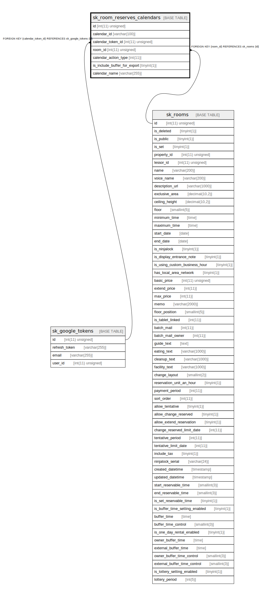

# sk_room_reserves_calendars

## Description

<details>
<summary><strong>Table Definition</strong></summary>

```sql
CREATE TABLE `sk_room_reserves_calendars` (
  `id` int(11) unsigned NOT NULL AUTO_INCREMENT,
  `calendar_id` varchar(100) COLLATE utf8mb4_unicode_ci NOT NULL COMMENT 'ID of mapping object',
  `calendar_token_id` int(11) unsigned NOT NULL COMMENT 'token id',
  `room_id` int(11) unsigned NOT NULL COMMENT '部屋ID',
  `calendar_action_type` int(11) NOT NULL COMMENT 'Type of mapping. 1: export 2: import',
  `is_include_buffer_for_export` tinyint(1) NOT NULL DEFAULT '1',
  `calendar_name` varchar(255) COLLATE utf8mb4_unicode_ci DEFAULT NULL COMMENT 'Name of calendar',
  PRIMARY KEY (`id`),
  KEY `sk_relation_calendars_and_rooms` (`room_id`),
  KEY `sk_relation_calendars_and_tokens` (`calendar_token_id`),
  CONSTRAINT `sk_relation_calendars_and_rooms` FOREIGN KEY (`room_id`) REFERENCES `sk_rooms` (`id`) ON DELETE CASCADE ON UPDATE CASCADE,
  CONSTRAINT `sk_relation_calendars_and_tokens` FOREIGN KEY (`calendar_token_id`) REFERENCES `sk_google_tokens` (`id`) ON DELETE CASCADE ON UPDATE CASCADE
) ENGINE=InnoDB AUTO_INCREMENT=[Redacted by tbls] DEFAULT CHARSET=utf8mb4 COLLATE=utf8mb4_unicode_ci
```

</details>

## Columns

| Name | Type | Default | Nullable | Extra Definition | Children | Parents | Comment |
| ---- | ---- | ------- | -------- | ---------------- | -------- | ------- | ------- |
| id | int(11) unsigned |  | false | auto_increment |  |  |  |
| calendar_id | varchar(100) |  | false |  |  |  | ID of mapping object |
| calendar_token_id | int(11) unsigned |  | false |  |  | [sk_google_tokens](sk_google_tokens.md) | token id |
| room_id | int(11) unsigned |  | false |  |  | [sk_rooms](sk_rooms.md) | 部屋ID |
| calendar_action_type | int(11) |  | false |  |  |  | Type of mapping. 1: export 2: import |
| is_include_buffer_for_export | tinyint(1) | 1 | false |  |  |  |  |
| calendar_name | varchar(255) |  | true |  |  |  | Name of calendar |

## Constraints

| Name | Type | Definition |
| ---- | ---- | ---------- |
| PRIMARY | PRIMARY KEY | PRIMARY KEY (id) |
| sk_relation_calendars_and_rooms | FOREIGN KEY | FOREIGN KEY (room_id) REFERENCES sk_rooms (id) |
| sk_relation_calendars_and_tokens | FOREIGN KEY | FOREIGN KEY (calendar_token_id) REFERENCES sk_google_tokens (id) |

## Indexes

| Name | Definition |
| ---- | ---------- |
| sk_relation_calendars_and_rooms | KEY sk_relation_calendars_and_rooms (room_id) USING BTREE |
| sk_relation_calendars_and_tokens | KEY sk_relation_calendars_and_tokens (calendar_token_id) USING BTREE |
| PRIMARY | PRIMARY KEY (id) USING BTREE |

## Relations



---

> Generated by [tbls](https://github.com/k1LoW/tbls)
