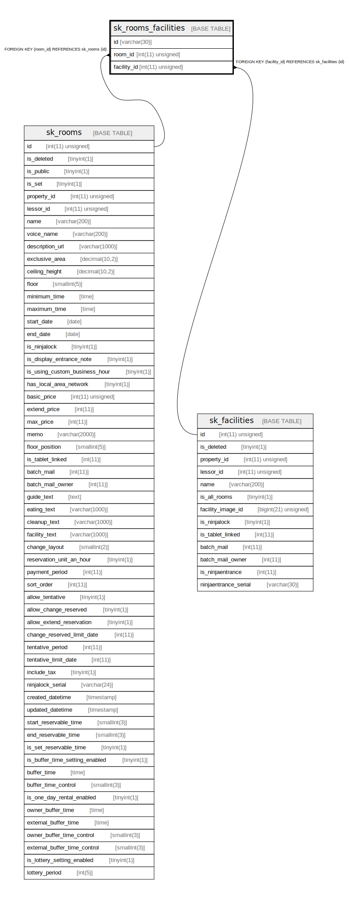

# sk_rooms_facilities

## Description

部屋-設備

<details>
<summary><strong>Table Definition</strong></summary>

```sql
CREATE TABLE `sk_rooms_facilities` (
  `id` varchar(30) NOT NULL DEFAULT '' COMMENT '[room_id]_[facility_id]',
  `room_id` int(11) unsigned NOT NULL,
  `facility_id` int(11) unsigned NOT NULL,
  PRIMARY KEY (`id`),
  KEY `sk_relation_rooms_facilities_and_rooms` (`room_id`),
  KEY `sk_relation_rooms_facilities_and_facilities` (`facility_id`),
  CONSTRAINT `sk_relation_rooms_facilities_and_facilities` FOREIGN KEY (`facility_id`) REFERENCES `sk_facilities` (`id`) ON DELETE CASCADE ON UPDATE CASCADE,
  CONSTRAINT `sk_relation_rooms_facilities_and_rooms` FOREIGN KEY (`room_id`) REFERENCES `sk_rooms` (`id`) ON DELETE CASCADE ON UPDATE CASCADE
) ENGINE=InnoDB DEFAULT CHARSET=utf8 COMMENT='部屋-設備'
```

</details>

## Columns

| Name | Type | Default | Nullable | Children | Parents | Comment |
| ---- | ---- | ------- | -------- | -------- | ------- | ------- |
| id | varchar(30) |  | false |  |  | [room_id]_[facility_id] |
| room_id | int(11) unsigned |  | false |  | [sk_rooms](sk_rooms.md) |  |
| facility_id | int(11) unsigned |  | false |  | [sk_facilities](sk_facilities.md) |  |

## Constraints

| Name | Type | Definition |
| ---- | ---- | ---------- |
| PRIMARY | PRIMARY KEY | PRIMARY KEY (id) |
| sk_relation_rooms_facilities_and_facilities | FOREIGN KEY | FOREIGN KEY (facility_id) REFERENCES sk_facilities (id) |
| sk_relation_rooms_facilities_and_rooms | FOREIGN KEY | FOREIGN KEY (room_id) REFERENCES sk_rooms (id) |

## Indexes

| Name | Definition |
| ---- | ---------- |
| sk_relation_rooms_facilities_and_facilities | KEY sk_relation_rooms_facilities_and_facilities (facility_id) USING BTREE |
| sk_relation_rooms_facilities_and_rooms | KEY sk_relation_rooms_facilities_and_rooms (room_id) USING BTREE |
| PRIMARY | PRIMARY KEY (id) USING BTREE |

## Relations



---

> Generated by [tbls](https://github.com/k1LoW/tbls)
