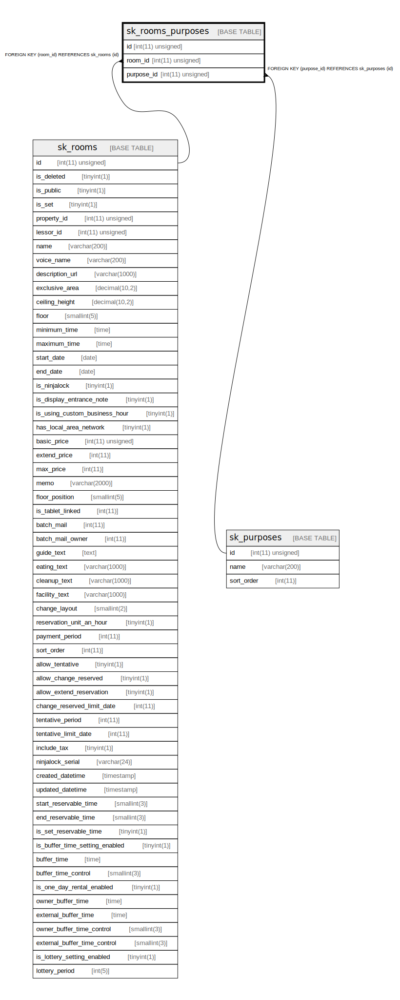

# sk_rooms_purposes

## Description

部屋-利用用途

<details>
<summary><strong>Table Definition</strong></summary>

```sql
CREATE TABLE `sk_rooms_purposes` (
  `id` int(11) unsigned NOT NULL AUTO_INCREMENT,
  `room_id` int(11) unsigned NOT NULL,
  `purpose_id` int(11) unsigned NOT NULL,
  PRIMARY KEY (`id`),
  KEY `sk_relation_rooms_purposes_and_rooms` (`room_id`),
  KEY `sk_relation_rooms_purposes_and_purposes` (`purpose_id`),
  CONSTRAINT `sk_relation_rooms_purposes_and_purposes` FOREIGN KEY (`purpose_id`) REFERENCES `sk_purposes` (`id`) ON DELETE CASCADE ON UPDATE CASCADE,
  CONSTRAINT `sk_relation_rooms_purposes_and_rooms` FOREIGN KEY (`room_id`) REFERENCES `sk_rooms` (`id`) ON DELETE CASCADE ON UPDATE CASCADE
) ENGINE=InnoDB AUTO_INCREMENT=[Redacted by tbls] DEFAULT CHARSET=utf8 COMMENT='部屋-利用用途'
```

</details>

## Columns

| Name | Type | Default | Nullable | Extra Definition | Children | Parents | Comment |
| ---- | ---- | ------- | -------- | ---------------- | -------- | ------- | ------- |
| id | int(11) unsigned |  | false | auto_increment |  |  |  |
| room_id | int(11) unsigned |  | false |  |  | [sk_rooms](sk_rooms.md) |  |
| purpose_id | int(11) unsigned |  | false |  |  | [sk_purposes](sk_purposes.md) |  |

## Constraints

| Name | Type | Definition |
| ---- | ---- | ---------- |
| PRIMARY | PRIMARY KEY | PRIMARY KEY (id) |
| sk_relation_rooms_purposes_and_purposes | FOREIGN KEY | FOREIGN KEY (purpose_id) REFERENCES sk_purposes (id) |
| sk_relation_rooms_purposes_and_rooms | FOREIGN KEY | FOREIGN KEY (room_id) REFERENCES sk_rooms (id) |

## Indexes

| Name | Definition |
| ---- | ---------- |
| sk_relation_rooms_purposes_and_purposes | KEY sk_relation_rooms_purposes_and_purposes (purpose_id) USING BTREE |
| sk_relation_rooms_purposes_and_rooms | KEY sk_relation_rooms_purposes_and_rooms (room_id) USING BTREE |
| PRIMARY | PRIMARY KEY (id) USING BTREE |

## Relations



---

> Generated by [tbls](https://github.com/k1LoW/tbls)
