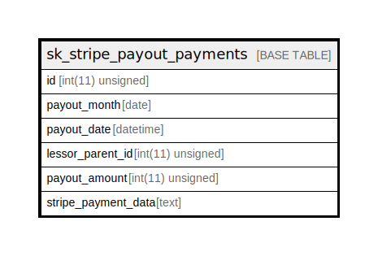

# sk_stripe_payout_payments

## Description

<details>
<summary><strong>Table Definition</strong></summary>

```sql
CREATE TABLE `sk_stripe_payout_payments` (
  `id` int(11) unsigned NOT NULL AUTO_INCREMENT,
  `payout_month` date DEFAULT NULL,
  `payout_date` datetime DEFAULT NULL,
  `lessor_parent_id` int(11) unsigned DEFAULT NULL,
  `payout_amount` int(11) unsigned DEFAULT NULL,
  `stripe_payment_data` text COLLATE utf8mb4_unicode_ci,
  PRIMARY KEY (`id`)
) ENGINE=InnoDB DEFAULT CHARSET=utf8mb4 COLLATE=utf8mb4_unicode_ci
```

</details>

## Columns

| Name | Type | Default | Nullable | Extra Definition | Children | Parents | Comment |
| ---- | ---- | ------- | -------- | ---------------- | -------- | ------- | ------- |
| id | int(11) unsigned |  | false | auto_increment |  |  |  |
| payout_month | date |  | true |  |  |  |  |
| payout_date | datetime |  | true |  |  |  |  |
| lessor_parent_id | int(11) unsigned |  | true |  |  |  |  |
| payout_amount | int(11) unsigned |  | true |  |  |  |  |
| stripe_payment_data | text |  | true |  |  |  |  |

## Constraints

| Name | Type | Definition |
| ---- | ---- | ---------- |
| PRIMARY | PRIMARY KEY | PRIMARY KEY (id) |

## Indexes

| Name | Definition |
| ---- | ---------- |
| PRIMARY | PRIMARY KEY (id) USING BTREE |

## Relations



---

> Generated by [tbls](https://github.com/k1LoW/tbls)
