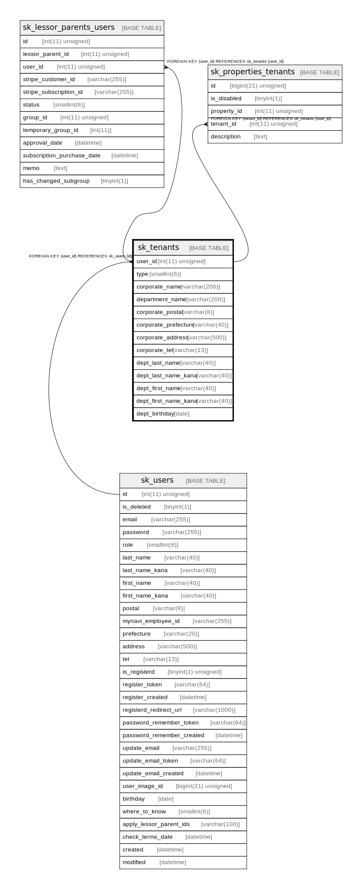

# sk_tenants

## Description

借主

<details>
<summary><strong>Table Definition</strong></summary>

```sql
CREATE TABLE `sk_tenants` (
  `user_id` int(11) unsigned NOT NULL COMMENT 'ユーザID(借主ID)',
  `type` smallint(6) NOT NULL COMMENT '1:一般、2:仲介業者',
  `corporate_name` varchar(200) DEFAULT NULL COMMENT '法人名',
  `department_name` varchar(200) DEFAULT NULL COMMENT '部署名',
  `corporate_postal` varchar(8) DEFAULT NULL COMMENT '会社の郵便番号',
  `corporate_prefecture` varchar(40) DEFAULT NULL COMMENT '会社の都道府県',
  `corporate_address` varchar(500) DEFAULT NULL COMMENT '会社の住所',
  `corporate_tel` varchar(13) DEFAULT NULL COMMENT '会社の電話番号',
  `dept_last_name` varchar(40) DEFAULT NULL COMMENT '代表者姓',
  `dept_last_name_kana` varchar(40) DEFAULT NULL COMMENT '代表者姓カナ',
  `dept_first_name` varchar(40) DEFAULT NULL COMMENT '代表者名',
  `dept_first_name_kana` varchar(40) DEFAULT NULL COMMENT '代表者名カナ',
  `dept_birthday` date DEFAULT NULL COMMENT '代表者生年月日',
  PRIMARY KEY (`user_id`),
  CONSTRAINT `sk_relation_tenants_and_users` FOREIGN KEY (`user_id`) REFERENCES `sk_users` (`id`) ON DELETE CASCADE ON UPDATE CASCADE
) ENGINE=InnoDB DEFAULT CHARSET=utf8 COMMENT='借主'
```

</details>

## Columns

| Name | Type | Default | Nullable | Children | Parents | Comment |
| ---- | ---- | ------- | -------- | -------- | ------- | ------- |
| user_id | int(11) unsigned |  | false | [sk_lessor_parents_users](sk_lessor_parents_users.md) [sk_properties_tenants](sk_properties_tenants.md) | [sk_users](sk_users.md) | ユーザID(借主ID) |
| type | smallint(6) |  | false |  |  | 1:一般、2:仲介業者 |
| corporate_name | varchar(200) |  | true |  |  | 法人名 |
| department_name | varchar(200) |  | true |  |  | 部署名 |
| corporate_postal | varchar(8) |  | true |  |  | 会社の郵便番号 |
| corporate_prefecture | varchar(40) |  | true |  |  | 会社の都道府県 |
| corporate_address | varchar(500) |  | true |  |  | 会社の住所 |
| corporate_tel | varchar(13) |  | true |  |  | 会社の電話番号 |
| dept_last_name | varchar(40) |  | true |  |  | 代表者姓 |
| dept_last_name_kana | varchar(40) |  | true |  |  | 代表者姓カナ |
| dept_first_name | varchar(40) |  | true |  |  | 代表者名 |
| dept_first_name_kana | varchar(40) |  | true |  |  | 代表者名カナ |
| dept_birthday | date |  | true |  |  | 代表者生年月日 |

## Constraints

| Name | Type | Definition |
| ---- | ---- | ---------- |
| PRIMARY | PRIMARY KEY | PRIMARY KEY (user_id) |
| sk_relation_tenants_and_users | FOREIGN KEY | FOREIGN KEY (user_id) REFERENCES sk_users (id) |

## Indexes

| Name | Definition |
| ---- | ---------- |
| PRIMARY | PRIMARY KEY (user_id) USING BTREE |

## Relations



---

> Generated by [tbls](https://github.com/k1LoW/tbls)
