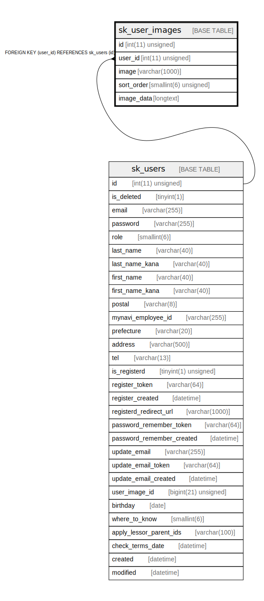

# sk_user_images

## Description

ユーザー身分証明書・名刺画像

<details>
<summary><strong>Table Definition</strong></summary>

```sql
CREATE TABLE `sk_user_images` (
  `id` int(11) unsigned NOT NULL AUTO_INCREMENT COMMENT 'ID',
  `user_id` int(11) unsigned NOT NULL COMMENT 'ユーザーID',
  `image` varchar(1000) NOT NULL DEFAULT '' COMMENT '画像パス',
  `sort_order` smallint(6) unsigned NOT NULL DEFAULT '0' COMMENT 'ソート順',
  `image_data` longtext COMMENT '画像データ（Data URI Scheme）',
  PRIMARY KEY (`id`),
  KEY `sk_relation_user_images_and_users` (`user_id`),
  CONSTRAINT `sk_relation_user_images_and_facilities` FOREIGN KEY (`user_id`) REFERENCES `sk_users` (`id`) ON DELETE CASCADE ON UPDATE CASCADE
) ENGINE=InnoDB AUTO_INCREMENT=[Redacted by tbls] DEFAULT CHARSET=utf8 COMMENT='ユーザー身分証明書・名刺画像'
```

</details>

## Columns

| Name | Type | Default | Nullable | Extra Definition | Children | Parents | Comment |
| ---- | ---- | ------- | -------- | ---------------- | -------- | ------- | ------- |
| id | int(11) unsigned |  | false | auto_increment |  |  | ID |
| user_id | int(11) unsigned |  | false |  |  | [sk_users](sk_users.md) | ユーザーID |
| image | varchar(1000) |  | false |  |  |  | 画像パス |
| sort_order | smallint(6) unsigned | 0 | false |  |  |  | ソート順 |
| image_data | longtext |  | true |  |  |  | 画像データ（Data URI Scheme） |

## Constraints

| Name | Type | Definition |
| ---- | ---- | ---------- |
| PRIMARY | PRIMARY KEY | PRIMARY KEY (id) |
| sk_relation_user_images_and_facilities | FOREIGN KEY | FOREIGN KEY (user_id) REFERENCES sk_users (id) |

## Indexes

| Name | Definition |
| ---- | ---------- |
| sk_relation_user_images_and_users | KEY sk_relation_user_images_and_users (user_id) USING BTREE |
| PRIMARY | PRIMARY KEY (id) USING BTREE |

## Relations



---

> Generated by [tbls](https://github.com/k1LoW/tbls)
