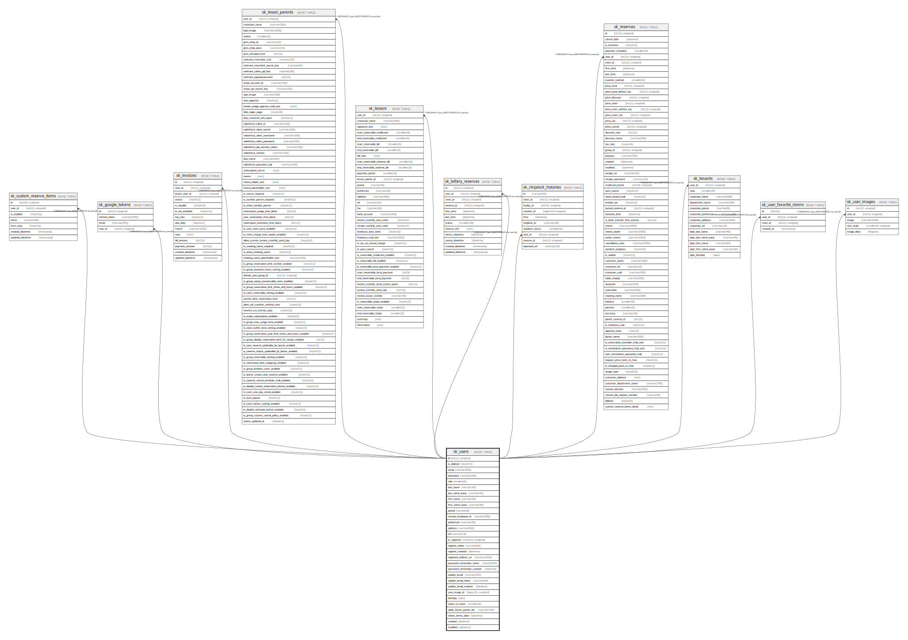

# sk_users

## Description

使用者（システム管理者・支店・借主）

<details>
<summary><strong>Table Definition</strong></summary>

```sql
CREATE TABLE `sk_users` (
  `id` int(11) unsigned NOT NULL AUTO_INCREMENT COMMENT 'ユーザID',
  `is_deleted` tinyint(1) DEFAULT '0' COMMENT '削除フラグ',
  `email` varchar(255) NOT NULL DEFAULT '' COMMENT 'メールアドレス(ユニーク)',
  `password` varchar(255) NOT NULL DEFAULT '' COMMENT 'パスワード',
  `role` smallint(6) NOT NULL COMMENT '1:システム管理者、2:支店、3:借主、4:本店',
  `last_name` varchar(40) DEFAULT '' COMMENT '担当者・利用者姓',
  `last_name_kana` varchar(40) DEFAULT '' COMMENT '担当者・利用者姓カナ',
  `first_name` varchar(40) DEFAULT '' COMMENT '担当者・利用者名',
  `first_name_kana` varchar(40) DEFAULT '' COMMENT '担当者・利用者名カナ',
  `postal` varchar(8) DEFAULT '' COMMENT '担当者・利用者郵便番号',
  `mynavi_employee_id` varchar(255) DEFAULT NULL,
  `prefecture` varchar(20) DEFAULT '' COMMENT '担当者・利用者都道府県',
  `address` varchar(500) DEFAULT '' COMMENT '担当者・利用者住所',
  `tel` varchar(13) DEFAULT NULL COMMENT '担当者・利用者電話番号',
  `is_registerd` tinyint(1) unsigned NOT NULL DEFAULT '0' COMMENT '登録済フラグ',
  `register_token` varchar(64) NOT NULL COMMENT '登録用トークン',
  `register_created` datetime NOT NULL COMMENT '登録時刻',
  `registerd_redirect_url` varchar(1000) DEFAULT NULL COMMENT '登録後のリダイレクトURL',
  `password_remember_token` varchar(64) DEFAULT NULL COMMENT 'パスワード再発行用トークン',
  `password_remember_created` datetime DEFAULT NULL COMMENT 'パスワード再発行時刻',
  `update_email` varchar(255) DEFAULT NULL COMMENT 'メール変更予定アドレス',
  `update_email_token` varchar(64) DEFAULT NULL COMMENT 'メール変更用トークン',
  `update_email_created` datetime DEFAULT NULL COMMENT 'メール変更時刻',
  `user_image_id` bigint(21) unsigned DEFAULT NULL COMMENT '身分証明書・名刺画像ID',
  `birthday` date DEFAULT NULL COMMENT '生年月日',
  `where_to_know` smallint(6) NOT NULL DEFAULT '0' COMMENT 'どこで知りましたか',
  `apply_lessor_parent_ids` varchar(100) DEFAULT NULL COMMENT '新規登録時に申請したコミュニティ（本店アカウントID）',
  `check_terms_date` datetime DEFAULT NULL COMMENT '利用規約変更確認日',
  `created` datetime DEFAULT NULL,
  `modified` datetime DEFAULT NULL,
  PRIMARY KEY (`id`),
  UNIQUE KEY `mynavi_employee_id` (`mynavi_employee_id`)
) ENGINE=InnoDB AUTO_INCREMENT=[Redacted by tbls] DEFAULT CHARSET=utf8 COMMENT='使用者（システム管理者・支店・借主）'
```

</details>

## Columns

| Name | Type | Default | Nullable | Extra Definition | Children | Parents | Comment |
| ---- | ---- | ------- | -------- | ---------------- | -------- | ------- | ------- |
| id | int(11) unsigned |  | false | auto_increment | [sk_custom_reserve_items](sk_custom_reserve_items.md) [sk_google_tokens](sk_google_tokens.md) [sk_invoices](sk_invoices.md) [sk_lessor_parents](sk_lessor_parents.md) [sk_lessors](sk_lessors.md) [sk_lottery_reserves](sk_lottery_reserves.md) [sk_ninjalock_histories](sk_ninjalock_histories.md) [sk_reserves](sk_reserves.md) [sk_tenants](sk_tenants.md) [sk_user_favorite_rooms](sk_user_favorite_rooms.md) [sk_user_images](sk_user_images.md) |  | ユーザID |
| is_deleted | tinyint(1) | 0 | true |  |  |  | 削除フラグ |
| email | varchar(255) |  | false |  |  |  | メールアドレス(ユニーク) |
| password | varchar(255) |  | false |  |  |  | パスワード |
| role | smallint(6) |  | false |  |  |  | 1:システム管理者、2:支店、3:借主、4:本店 |
| last_name | varchar(40) |  | true |  |  |  | 担当者・利用者姓 |
| last_name_kana | varchar(40) |  | true |  |  |  | 担当者・利用者姓カナ |
| first_name | varchar(40) |  | true |  |  |  | 担当者・利用者名 |
| first_name_kana | varchar(40) |  | true |  |  |  | 担当者・利用者名カナ |
| postal | varchar(8) |  | true |  |  |  | 担当者・利用者郵便番号 |
| mynavi_employee_id | varchar(255) |  | true |  |  |  |  |
| prefecture | varchar(20) |  | true |  |  |  | 担当者・利用者都道府県 |
| address | varchar(500) |  | true |  |  |  | 担当者・利用者住所 |
| tel | varchar(13) |  | true |  |  |  | 担当者・利用者電話番号 |
| is_registerd | tinyint(1) unsigned | 0 | false |  |  |  | 登録済フラグ |
| register_token | varchar(64) |  | false |  |  |  | 登録用トークン |
| register_created | datetime |  | false |  |  |  | 登録時刻 |
| registerd_redirect_url | varchar(1000) |  | true |  |  |  | 登録後のリダイレクトURL |
| password_remember_token | varchar(64) |  | true |  |  |  | パスワード再発行用トークン |
| password_remember_created | datetime |  | true |  |  |  | パスワード再発行時刻 |
| update_email | varchar(255) |  | true |  |  |  | メール変更予定アドレス |
| update_email_token | varchar(64) |  | true |  |  |  | メール変更用トークン |
| update_email_created | datetime |  | true |  |  |  | メール変更時刻 |
| user_image_id | bigint(21) unsigned |  | true |  |  |  | 身分証明書・名刺画像ID |
| birthday | date |  | true |  |  |  | 生年月日 |
| where_to_know | smallint(6) | 0 | false |  |  |  | どこで知りましたか |
| apply_lessor_parent_ids | varchar(100) |  | true |  |  |  | 新規登録時に申請したコミュニティ（本店アカウントID） |
| check_terms_date | datetime |  | true |  |  |  | 利用規約変更確認日 |
| created | datetime |  | true |  |  |  |  |
| modified | datetime |  | true |  |  |  |  |

## Constraints

| Name | Type | Definition |
| ---- | ---- | ---------- |
| mynavi_employee_id | UNIQUE | UNIQUE KEY mynavi_employee_id (mynavi_employee_id) |
| PRIMARY | PRIMARY KEY | PRIMARY KEY (id) |

## Indexes

| Name | Definition |
| ---- | ---------- |
| PRIMARY | PRIMARY KEY (id) USING BTREE |
| mynavi_employee_id | UNIQUE KEY mynavi_employee_id (mynavi_employee_id) USING BTREE |

## Relations



---

> Generated by [tbls](https://github.com/k1LoW/tbls)
