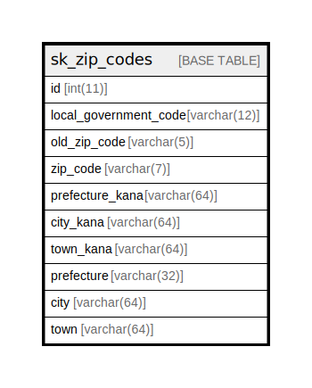

# sk_zip_codes

## Description

郵便番号と住所テーブル

<details>
<summary><strong>Table Definition</strong></summary>

```sql
CREATE TABLE `sk_zip_codes` (
  `id` int(11) NOT NULL COMMENT 'ID',
  `local_government_code` varchar(12) DEFAULT NULL COMMENT '全国地方公共団体コード',
  `old_zip_code` varchar(5) DEFAULT NULL COMMENT '（旧）郵便番号（5桁）',
  `zip_code` varchar(7) NOT NULL COMMENT '郵便番号（7桁）',
  `prefecture_kana` varchar(64) NOT NULL COMMENT '都道府県カナ',
  `city_kana` varchar(64) NOT NULL COMMENT '市区町村カナ',
  `town_kana` varchar(64) NOT NULL COMMENT '町丁目カナ',
  `prefecture` varchar(32) NOT NULL COMMENT '都道府県',
  `city` varchar(64) NOT NULL COMMENT '市区町村',
  `town` varchar(64) NOT NULL COMMENT '町丁目',
  PRIMARY KEY (`id`)
) ENGINE=InnoDB DEFAULT CHARSET=utf8 COMMENT='郵便番号と住所テーブル'
```

</details>

## Columns

| Name | Type | Default | Nullable | Children | Parents | Comment |
| ---- | ---- | ------- | -------- | -------- | ------- | ------- |
| id | int(11) |  | false |  |  | ID |
| local_government_code | varchar(12) |  | true |  |  | 全国地方公共団体コード |
| old_zip_code | varchar(5) |  | true |  |  | （旧）郵便番号（5桁） |
| zip_code | varchar(7) |  | false |  |  | 郵便番号（7桁） |
| prefecture_kana | varchar(64) |  | false |  |  | 都道府県カナ |
| city_kana | varchar(64) |  | false |  |  | 市区町村カナ |
| town_kana | varchar(64) |  | false |  |  | 町丁目カナ |
| prefecture | varchar(32) |  | false |  |  | 都道府県 |
| city | varchar(64) |  | false |  |  | 市区町村 |
| town | varchar(64) |  | false |  |  | 町丁目 |

## Constraints

| Name | Type | Definition |
| ---- | ---- | ---------- |
| PRIMARY | PRIMARY KEY | PRIMARY KEY (id) |

## Indexes

| Name | Definition |
| ---- | ---------- |
| PRIMARY | PRIMARY KEY (id) USING BTREE |

## Relations



---

> Generated by [tbls](https://github.com/k1LoW/tbls)
