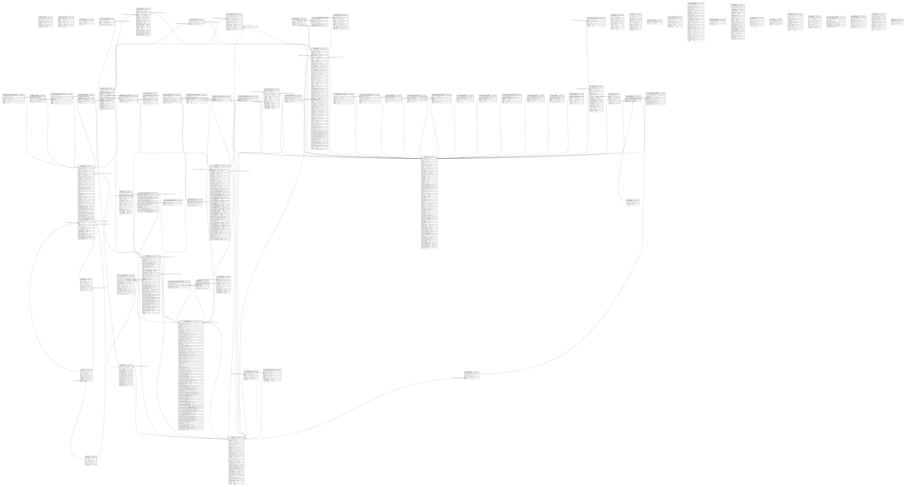

# smkg_staging

## Tables

| Name | Columns | Comment | Type |
| ---- | ------- | ------- | ---- |
| [sk_ads_trackings](sk_ads_trackings.md) | 6 |  | BASE TABLE |
| [sk_appli_api_tokens](sk_appli_api_tokens.md) | 6 | アプリのAPI用トークン | BASE TABLE |
| [sk_cake_sessions](sk_cake_sessions.md) | 3 |  | BASE TABLE |
| [sk_cancel_policies](sk_cancel_policies.md) | 4 | キャンセルポリシー | BASE TABLE |
| [sk_cities](sk_cities.md) | 7 |  | BASE TABLE |
| [sk_custom_cancel_policies](sk_custom_cancel_policies.md) | 4 |  | BASE TABLE |
| [sk_custom_reserve_items](sk_custom_reserve_items.md) | 7 |  | BASE TABLE |
| [sk_documents](sk_documents.md) | 9 |  | BASE TABLE |
| [sk_facilities](sk_facilities.md) | 13 | 設備 | BASE TABLE |
| [sk_facility_images](sk_facility_images.md) | 4 | 設備画像 | BASE TABLE |
| [sk_fittings](sk_fittings.md) | 6 | 室内備品 | BASE TABLE |
| [sk_google_tokens](sk_google_tokens.md) | 4 |  | BASE TABLE |
| [sk_group_business_hour_weeks](sk_group_business_hour_weeks.md) | 5 |  | BASE TABLE |
| [sk_group_cancel_policies](sk_group_cancel_policies.md) | 5 |  | BASE TABLE |
| [sk_groups](sk_groups.md) | 48 | グループ | BASE TABLE |
| [sk_groups_limitless_rooms](sk_groups_limitless_rooms.md) | 3 |  | BASE TABLE |
| [sk_groups_unreservable_rooms](sk_groups_unreservable_rooms.md) | 3 |  | BASE TABLE |
| [sk_inquiries](sk_inquiries.md) | 10 |  | BASE TABLE |
| [sk_invoice_items](sk_invoice_items.md) | 7 |  | BASE TABLE |
| [sk_invoices](sk_invoices.md) | 14 |  | BASE TABLE |
| [sk_lessor_inquiry_receivers](sk_lessor_inquiry_receivers.md) | 3 |  | BASE TABLE |
| [sk_lessor_mail_settings](sk_lessor_mail_settings.md) | 12 |  | BASE TABLE |
| [sk_lessor_parents](sk_lessor_parents.md) | 70 | 本店 | BASE TABLE |
| [sk_lessor_parents_transfer_methods](sk_lessor_parents_transfer_methods.md) | 4 | 本店の決済手段 | BASE TABLE |
| [sk_lessor_parents_users](sk_lessor_parents_users.md) | 12 | 本店 - 借主 | BASE TABLE |
| [sk_lessor_receivers](sk_lessor_receivers.md) | 2 |  | BASE TABLE |
| [sk_lessors](sk_lessors.md) | 37 | 支店 | BASE TABLE |
| [sk_login_histories](sk_login_histories.md) | 6 |  | BASE TABLE |
| [sk_lottery_reserves](sk_lottery_reserves.md) | 12 |  | BASE TABLE |
| [sk_manual_payments](sk_manual_payments.md) | 24 | 手動支払い | BASE TABLE |
| [sk_ninjalock_histories](sk_ninjalock_histories.md) | 10 | NinjaLock使用履歴 | BASE TABLE |
| [sk_ninjalocks](sk_ninjalocks.md) | 17 | 登録されているNinjaLock | BASE TABLE |
| [sk_payment_reserves](sk_payment_reserves.md) | 3 |  | BASE TABLE |
| [sk_payments](sk_payments.md) | 22 | 支払い | BASE TABLE |
| [sk_prefs](sk_prefs.md) | 5 |  | BASE TABLE |
| [sk_properties](sk_properties.md) | 47 | 物件 | BASE TABLE |
| [sk_properties_tenants](sk_properties_tenants.md) | 5 | 物件ー借主 | BASE TABLE |
| [sk_property_business_hour_others](sk_property_business_hour_others.md) | 6 | 例外の営業時間 | BASE TABLE |
| [sk_property_business_hour_weeks](sk_property_business_hour_weeks.md) | 5 | 曜日＋祝日毎の営業時間 | BASE TABLE |
| [sk_property_images](sk_property_images.md) | 4 | 物件画像 | BASE TABLE |
| [sk_purposes](sk_purposes.md) | 3 | 部屋の利用用途 | BASE TABLE |
| [sk_questions](sk_questions.md) | 5 | FAQ | BASE TABLE |
| [sk_regions](sk_regions.md) | 7 |  | BASE TABLE |
| [sk_reserve_cancels](sk_reserve_cancels.md) | 5 | 予約時のキャンセル割合 | BASE TABLE |
| [sk_reserve_fittings](sk_reserve_fittings.md) | 9 | 予約した室内備品 | BASE TABLE |
| [sk_reserve_jobs](sk_reserve_jobs.md) | 5 | 予約送信用ジョブデータ | BASE TABLE |
| [sk_reserves](sk_reserves.md) | 65 | 内覧予約 | BASE TABLE |
| [sk_room_business_hour_others](sk_room_business_hour_others.md) | 6 |  | BASE TABLE |
| [sk_room_business_hour_weeks](sk_room_business_hour_weeks.md) | 5 |  | BASE TABLE |
| [sk_room_charge_days](sk_room_charge_days.md) | 4 | 日毎の利用料調整 | BASE TABLE |
| [sk_room_charge_early_days](sk_room_charge_early_days.md) | 4 | 直前の日の部屋利用料金 | BASE TABLE |
| [sk_room_charge_hour_weeks](sk_room_charge_hour_weeks.md) | 5 |  | BASE TABLE |
| [sk_room_charge_hours](sk_room_charge_hours.md) | 4 | 時刻毎の部屋利用料金 | BASE TABLE |
| [sk_room_charge_months](sk_room_charge_months.md) | 4 | 月毎の利用料調整 | BASE TABLE |
| [sk_room_charge_utility_times](sk_room_charge_utility_times.md) | 5 | 利用時間毎の利用料調整 | BASE TABLE |
| [sk_room_charge_weeks](sk_room_charge_weeks.md) | 4 | 曜日毎の利用料調整 | BASE TABLE |
| [sk_room_events](sk_room_events.md) | 4 |  | BASE TABLE |
| [sk_room_images](sk_room_images.md) | 4 | 部屋画像 | BASE TABLE |
| [sk_room_layouts](sk_room_layouts.md) | 6 | 室内机椅子レイアウト | BASE TABLE |
| [sk_room_plan_time_ranges](sk_room_plan_time_ranges.md) | 5 |  | BASE TABLE |
| [sk_room_plans](sk_room_plans.md) | 16 |  | BASE TABLE |
| [sk_room_reserves_calendars](sk_room_reserves_calendars.md) | 7 |  | BASE TABLE |
| [sk_room_sets](sk_room_sets.md) | 3 | 部屋セットに所属する部屋 | BASE TABLE |
| [sk_rooms](sk_rooms.md) | 59 | 部屋 | BASE TABLE |
| [sk_rooms_facilities](sk_rooms_facilities.md) | 3 | 部屋-設備 | BASE TABLE |
| [sk_rooms_purposes](sk_rooms_purposes.md) | 3 | 部屋-利用用途 | BASE TABLE |
| [sk_salesforce_jobs](sk_salesforce_jobs.md) | 10 | セールスフォース送信用ジョブデータ | BASE TABLE |
| [sk_schedules](sk_schedules.md) | 7 |  | BASE TABLE |
| [sk_stripe_payout_payments](sk_stripe_payout_payments.md) | 6 |  | BASE TABLE |
| [sk_subscriptions](sk_subscriptions.md) | 10 |  | BASE TABLE |
| [sk_tenants](sk_tenants.md) | 13 | 借主 | BASE TABLE |
| [sk_user_documents](sk_user_documents.md) | 7 |  | BASE TABLE |
| [sk_user_favorite_rooms](sk_user_favorite_rooms.md) | 4 |  | BASE TABLE |
| [sk_user_images](sk_user_images.md) | 5 | ユーザー身分証明書・名刺画像 | BASE TABLE |
| [sk_users](sk_users.md) | 30 | 使用者（システム管理者・支店・借主） | BASE TABLE |
| [sk_zip_codes](sk_zip_codes.md) | 10 | 郵便番号と住所テーブル | BASE TABLE |
| [test_results](test_results.md) | 3 |  | BASE TABLE |

## Relations

---

> Generated by [tbls](https://github.com/k1LoW/tbls)
