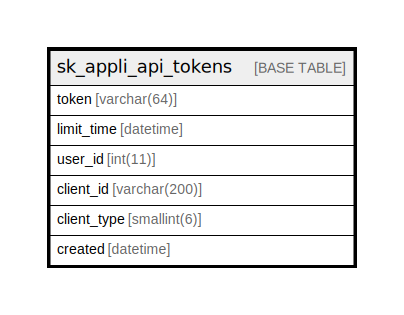

# sk_appli_api_tokens

## Description

アプリのAPI用トークン

<details>
<summary><strong>Table Definition</strong></summary>

```sql
CREATE TABLE `sk_appli_api_tokens` (
  `token` varchar(64) NOT NULL DEFAULT '',
  `limit_time` datetime NOT NULL,
  `user_id` int(11) NOT NULL,
  `client_id` varchar(200) DEFAULT NULL,
  `client_type` smallint(6) DEFAULT NULL,
  `created` datetime NOT NULL,
  PRIMARY KEY (`token`)
) ENGINE=InnoDB DEFAULT CHARSET=utf8 COMMENT='アプリのAPI用トークン'
```

</details>

## Columns

| Name | Type | Default | Nullable | Children | Parents | Comment |
| ---- | ---- | ------- | -------- | -------- | ------- | ------- |
| token | varchar(64) |  | false |  |  |  |
| limit_time | datetime |  | false |  |  |  |
| user_id | int(11) |  | false |  |  |  |
| client_id | varchar(200) |  | true |  |  |  |
| client_type | smallint(6) |  | true |  |  |  |
| created | datetime |  | false |  |  |  |

## Constraints

| Name | Type | Definition |
| ---- | ---- | ---------- |
| PRIMARY | PRIMARY KEY | PRIMARY KEY (token) |

## Indexes

| Name | Definition |
| ---- | ---------- |
| PRIMARY | PRIMARY KEY (token) USING BTREE |

## Relations



---

> Generated by [tbls](https://github.com/k1LoW/tbls)
