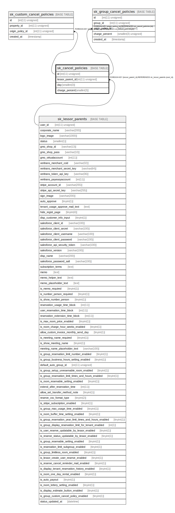

# sk_cancel_policies

## Description

キャンセルポリシー

<details>
<summary><strong>Table Definition</strong></summary>

```sql
CREATE TABLE `sk_cancel_policies` (
  `id` int(11) unsigned NOT NULL AUTO_INCREMENT COMMENT 'id',
  `lessor_parent_id` int(11) unsigned NOT NULL COMMENT '本店id',
  `day` smallint(3) NOT NULL COMMENT '利用日の何日前のキャンセルか',
  `charge_percent` smallint(3) NOT NULL COMMENT 'キャンセル料金は利用料の何パーセントか',
  PRIMARY KEY (`id`),
  KEY `sk_relation_cancel_policies_and_lessor_parents` (`lessor_parent_id`),
  CONSTRAINT `sk_relation_cancel_policies_and_lessor_parents` FOREIGN KEY (`lessor_parent_id`) REFERENCES `sk_lessor_parents` (`user_id`) ON DELETE CASCADE ON UPDATE CASCADE
) ENGINE=InnoDB AUTO_INCREMENT=[Redacted by tbls] DEFAULT CHARSET=utf8 COMMENT='キャンセルポリシー'
```

</details>

## Columns

| Name | Type | Default | Nullable | Extra Definition | Children | Parents | Comment |
| ---- | ---- | ------- | -------- | ---------------- | -------- | ------- | ------- |
| id | int(11) unsigned |  | false | auto_increment | [sk_custom_cancel_policies](sk_custom_cancel_policies.md) [sk_group_cancel_policies](sk_group_cancel_policies.md) |  | id |
| lessor_parent_id | int(11) unsigned |  | false |  |  | [sk_lessor_parents](sk_lessor_parents.md) | 本店id |
| day | smallint(3) |  | false |  |  |  | 利用日の何日前のキャンセルか |
| charge_percent | smallint(3) |  | false |  |  |  | キャンセル料金は利用料の何パーセントか |

## Constraints

| Name | Type | Definition |
| ---- | ---- | ---------- |
| PRIMARY | PRIMARY KEY | PRIMARY KEY (id) |
| sk_relation_cancel_policies_and_lessor_parents | FOREIGN KEY | FOREIGN KEY (lessor_parent_id) REFERENCES sk_lessor_parents (user_id) |

## Indexes

| Name | Definition |
| ---- | ---------- |
| sk_relation_cancel_policies_and_lessor_parents | KEY sk_relation_cancel_policies_and_lessor_parents (lessor_parent_id) USING BTREE |
| PRIMARY | PRIMARY KEY (id) USING BTREE |

## Relations



---

> Generated by [tbls](https://github.com/k1LoW/tbls)
