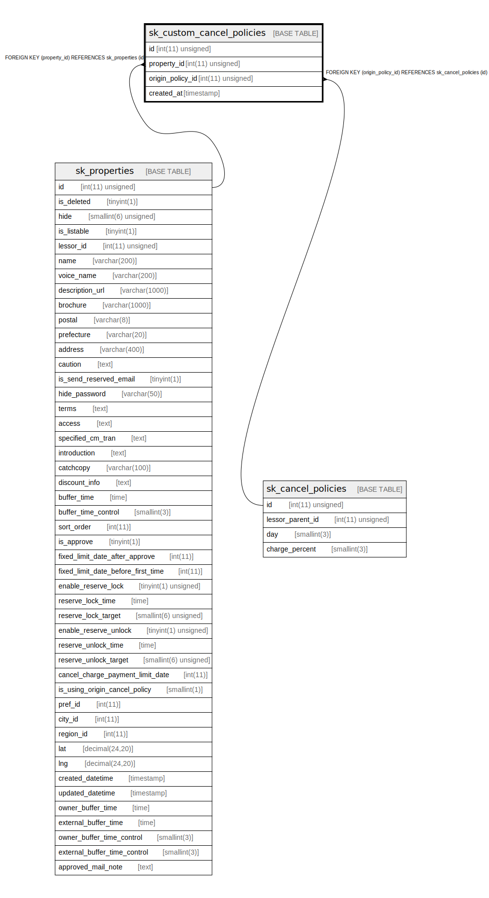

# sk_custom_cancel_policies

## Description

<details>
<summary><strong>Table Definition</strong></summary>

```sql
CREATE TABLE `sk_custom_cancel_policies` (
  `id` int(11) unsigned NOT NULL AUTO_INCREMENT COMMENT 'id',
  `property_id` int(11) unsigned NOT NULL,
  `origin_policy_id` int(11) unsigned NOT NULL,
  `created_at` timestamp NULL DEFAULT CURRENT_TIMESTAMP,
  PRIMARY KEY (`id`),
  KEY `fk_custom_cancel_policy__property_id_idx` (`property_id`),
  KEY `fk_custom_cancel_policy__origin_policy_id_idx` (`origin_policy_id`),
  CONSTRAINT `fk_custom_cancel_policy__origin_policy_id` FOREIGN KEY (`origin_policy_id`) REFERENCES `sk_cancel_policies` (`id`) ON DELETE CASCADE ON UPDATE CASCADE,
  CONSTRAINT `fk_custom_cancel_policy__property_id` FOREIGN KEY (`property_id`) REFERENCES `sk_properties` (`id`) ON DELETE CASCADE ON UPDATE CASCADE
) ENGINE=InnoDB AUTO_INCREMENT=[Redacted by tbls] DEFAULT CHARSET=utf8mb4 COLLATE=utf8mb4_unicode_ci
```

</details>

## Columns

| Name | Type | Default | Nullable | Extra Definition | Children | Parents | Comment |
| ---- | ---- | ------- | -------- | ---------------- | -------- | ------- | ------- |
| id | int(11) unsigned |  | false | auto_increment |  |  | id |
| property_id | int(11) unsigned |  | false |  |  | [sk_properties](sk_properties.md) |  |
| origin_policy_id | int(11) unsigned |  | false |  |  | [sk_cancel_policies](sk_cancel_policies.md) |  |
| created_at | timestamp | CURRENT_TIMESTAMP | true |  |  |  |  |

## Constraints

| Name | Type | Definition |
| ---- | ---- | ---------- |
| fk_custom_cancel_policy__origin_policy_id | FOREIGN KEY | FOREIGN KEY (origin_policy_id) REFERENCES sk_cancel_policies (id) |
| fk_custom_cancel_policy__property_id | FOREIGN KEY | FOREIGN KEY (property_id) REFERENCES sk_properties (id) |
| PRIMARY | PRIMARY KEY | PRIMARY KEY (id) |

## Indexes

| Name | Definition |
| ---- | ---------- |
| fk_custom_cancel_policy__origin_policy_id_idx | KEY fk_custom_cancel_policy__origin_policy_id_idx (origin_policy_id) USING BTREE |
| fk_custom_cancel_policy__property_id_idx | KEY fk_custom_cancel_policy__property_id_idx (property_id) USING BTREE |
| PRIMARY | PRIMARY KEY (id) USING BTREE |

## Relations



---

> Generated by [tbls](https://github.com/k1LoW/tbls)
