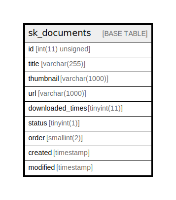

# sk_documents

## Description

<details>
<summary><strong>Table Definition</strong></summary>

```sql
CREATE TABLE `sk_documents` (
  `id` int(11) unsigned NOT NULL AUTO_INCREMENT,
  `title` varchar(255) COLLATE utf8mb4_unicode_ci NOT NULL,
  `thumbnail` varchar(1000) COLLATE utf8mb4_unicode_ci NOT NULL,
  `url` varchar(1000) COLLATE utf8mb4_unicode_ci NOT NULL,
  `downloaded_times` tinyint(11) DEFAULT '0',
  `status` tinyint(1) DEFAULT '1',
  `order` smallint(2) DEFAULT NULL,
  `created` timestamp NULL DEFAULT CURRENT_TIMESTAMP,
  `modified` timestamp NULL DEFAULT CURRENT_TIMESTAMP ON UPDATE CURRENT_TIMESTAMP,
  PRIMARY KEY (`id`)
) ENGINE=InnoDB AUTO_INCREMENT=[Redacted by tbls] DEFAULT CHARSET=utf8mb4 COLLATE=utf8mb4_unicode_ci
```

</details>

## Columns

| Name | Type | Default | Nullable | Extra Definition | Children | Parents | Comment |
| ---- | ---- | ------- | -------- | ---------------- | -------- | ------- | ------- |
| id | int(11) unsigned |  | false | auto_increment |  |  |  |
| title | varchar(255) |  | false |  |  |  |  |
| thumbnail | varchar(1000) |  | false |  |  |  |  |
| url | varchar(1000) |  | false |  |  |  |  |
| downloaded_times | tinyint(11) | 0 | true |  |  |  |  |
| status | tinyint(1) | 1 | true |  |  |  |  |
| order | smallint(2) |  | true |  |  |  |  |
| created | timestamp | CURRENT_TIMESTAMP | true |  |  |  |  |
| modified | timestamp | CURRENT_TIMESTAMP | true | on update CURRENT_TIMESTAMP |  |  |  |

## Constraints

| Name | Type | Definition |
| ---- | ---- | ---------- |
| PRIMARY | PRIMARY KEY | PRIMARY KEY (id) |

## Indexes

| Name | Definition |
| ---- | ---------- |
| PRIMARY | PRIMARY KEY (id) USING BTREE |

## Relations



---

> Generated by [tbls](https://github.com/k1LoW/tbls)
