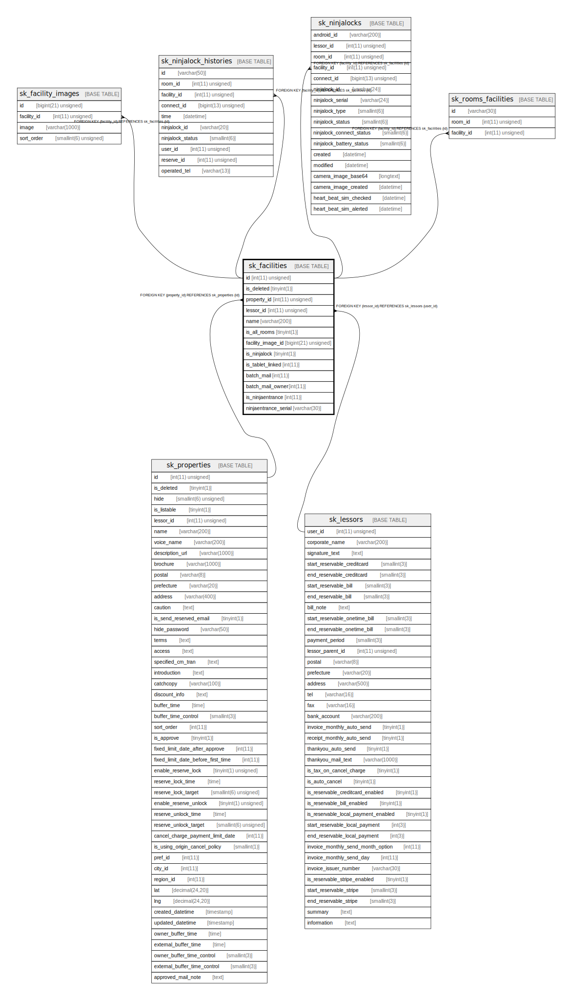

# sk_facilities

## Description

設備

<details>
<summary><strong>Table Definition</strong></summary>

```sql
CREATE TABLE `sk_facilities` (
  `id` int(11) unsigned NOT NULL AUTO_INCREMENT,
  `is_deleted` tinyint(1) DEFAULT '0' COMMENT '削除フラグ',
  `property_id` int(11) unsigned NOT NULL,
  `lessor_id` int(11) unsigned NOT NULL,
  `name` varchar(200) NOT NULL DEFAULT '' COMMENT '設備名',
  `is_all_rooms` tinyint(1) NOT NULL DEFAULT '0' COMMENT '物件の全室で利用可能',
  `facility_image_id` bigint(21) unsigned DEFAULT NULL COMMENT 'メイン設備画像ID',
  `is_ninjalock` tinyint(1) NOT NULL DEFAULT '1' COMMENT 'NinjaLock対応設備',
  `is_tablet_linked` int(11) DEFAULT '0',
  `batch_mail` int(11) DEFAULT '1' COMMENT 'cron処理のメール送信フラグ 0:送信しない、1:送信する',
  `batch_mail_owner` int(11) NOT NULL DEFAULT '0' COMMENT 'オーナーへのメール送信フラグ',
  `is_ninjaentrance` int(11) DEFAULT '0' COMMENT 'NinjaEntranceフラグ',
  `ninjaentrance_serial` varchar(30) DEFAULT NULL COMMENT 'NinjaEntranceのシリアルナンバー',
  PRIMARY KEY (`id`),
  KEY `sk_relation_facilities_and_properties` (`property_id`),
  KEY `sk_relation_facilities_and_lessors` (`lessor_id`),
  CONSTRAINT `sk_relation_facilities_and_lessors` FOREIGN KEY (`lessor_id`) REFERENCES `sk_lessors` (`user_id`) ON DELETE CASCADE ON UPDATE CASCADE,
  CONSTRAINT `sk_relation_facilities_and_properties` FOREIGN KEY (`property_id`) REFERENCES `sk_properties` (`id`) ON DELETE CASCADE ON UPDATE CASCADE
) ENGINE=InnoDB AUTO_INCREMENT=[Redacted by tbls] DEFAULT CHARSET=utf8 COMMENT='設備'
```

</details>

## Columns

| Name | Type | Default | Nullable | Extra Definition | Children | Parents | Comment |
| ---- | ---- | ------- | -------- | ---------------- | -------- | ------- | ------- |
| id | int(11) unsigned |  | false | auto_increment | [sk_facility_images](sk_facility_images.md) [sk_ninjalock_histories](sk_ninjalock_histories.md) [sk_ninjalocks](sk_ninjalocks.md) [sk_rooms_facilities](sk_rooms_facilities.md) |  |  |
| is_deleted | tinyint(1) | 0 | true |  |  |  | 削除フラグ |
| property_id | int(11) unsigned |  | false |  |  | [sk_properties](sk_properties.md) |  |
| lessor_id | int(11) unsigned |  | false |  |  | [sk_lessors](sk_lessors.md) |  |
| name | varchar(200) |  | false |  |  |  | 設備名 |
| is_all_rooms | tinyint(1) | 0 | false |  |  |  | 物件の全室で利用可能 |
| facility_image_id | bigint(21) unsigned |  | true |  |  |  | メイン設備画像ID |
| is_ninjalock | tinyint(1) | 1 | false |  |  |  | NinjaLock対応設備 |
| is_tablet_linked | int(11) | 0 | true |  |  |  |  |
| batch_mail | int(11) | 1 | true |  |  |  | cron処理のメール送信フラグ 0:送信しない、1:送信する |
| batch_mail_owner | int(11) | 0 | false |  |  |  | オーナーへのメール送信フラグ |
| is_ninjaentrance | int(11) | 0 | true |  |  |  | NinjaEntranceフラグ |
| ninjaentrance_serial | varchar(30) |  | true |  |  |  | NinjaEntranceのシリアルナンバー |

## Constraints

| Name | Type | Definition |
| ---- | ---- | ---------- |
| PRIMARY | PRIMARY KEY | PRIMARY KEY (id) |
| sk_relation_facilities_and_lessors | FOREIGN KEY | FOREIGN KEY (lessor_id) REFERENCES sk_lessors (user_id) |
| sk_relation_facilities_and_properties | FOREIGN KEY | FOREIGN KEY (property_id) REFERENCES sk_properties (id) |

## Indexes

| Name | Definition |
| ---- | ---------- |
| sk_relation_facilities_and_lessors | KEY sk_relation_facilities_and_lessors (lessor_id) USING BTREE |
| sk_relation_facilities_and_properties | KEY sk_relation_facilities_and_properties (property_id) USING BTREE |
| PRIMARY | PRIMARY KEY (id) USING BTREE |

## Relations



---

> Generated by [tbls](https://github.com/k1LoW/tbls)
