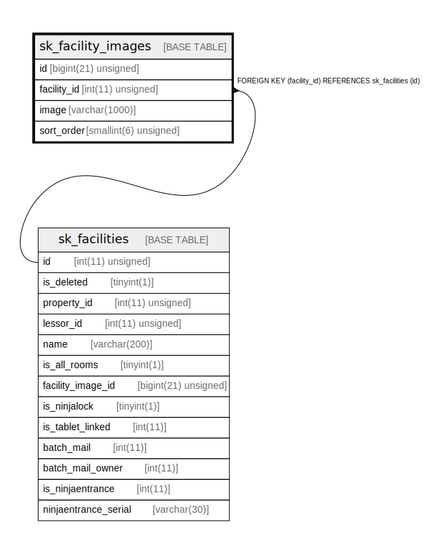

# sk_facility_images

## Description

設備画像

<details>
<summary><strong>Table Definition</strong></summary>

```sql
CREATE TABLE `sk_facility_images` (
  `id` bigint(21) unsigned NOT NULL AUTO_INCREMENT COMMENT '設備画像ID',
  `facility_id` int(11) unsigned NOT NULL COMMENT '設備ID',
  `image` varchar(1000) NOT NULL DEFAULT '' COMMENT '画像パス',
  `sort_order` smallint(6) unsigned NOT NULL DEFAULT '0' COMMENT 'ソート順',
  PRIMARY KEY (`id`),
  KEY `sk_relation_facility_images_and_facilities` (`facility_id`),
  CONSTRAINT `sk_relation_facility_images_and_facilities` FOREIGN KEY (`facility_id`) REFERENCES `sk_facilities` (`id`) ON DELETE CASCADE ON UPDATE CASCADE
) ENGINE=InnoDB AUTO_INCREMENT=[Redacted by tbls] DEFAULT CHARSET=utf8 COMMENT='設備画像'
```

</details>

## Columns

| Name | Type | Default | Nullable | Extra Definition | Children | Parents | Comment |
| ---- | ---- | ------- | -------- | ---------------- | -------- | ------- | ------- |
| id | bigint(21) unsigned |  | false | auto_increment |  |  | 設備画像ID |
| facility_id | int(11) unsigned |  | false |  |  | [sk_facilities](sk_facilities.md) | 設備ID |
| image | varchar(1000) |  | false |  |  |  | 画像パス |
| sort_order | smallint(6) unsigned | 0 | false |  |  |  | ソート順 |

## Constraints

| Name | Type | Definition |
| ---- | ---- | ---------- |
| PRIMARY | PRIMARY KEY | PRIMARY KEY (id) |
| sk_relation_facility_images_and_facilities | FOREIGN KEY | FOREIGN KEY (facility_id) REFERENCES sk_facilities (id) |

## Indexes

| Name | Definition |
| ---- | ---------- |
| sk_relation_facility_images_and_facilities | KEY sk_relation_facility_images_and_facilities (facility_id) USING BTREE |
| PRIMARY | PRIMARY KEY (id) USING BTREE |

## Relations



---

> Generated by [tbls](https://github.com/k1LoW/tbls)
