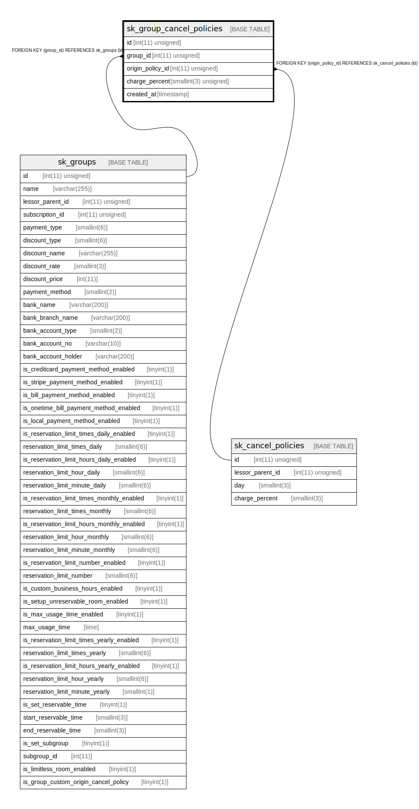

# sk_group_cancel_policies

## Description

<details>
<summary><strong>Table Definition</strong></summary>

```sql
CREATE TABLE `sk_group_cancel_policies` (
  `id` int(11) unsigned NOT NULL AUTO_INCREMENT,
  `group_id` int(11) unsigned NOT NULL,
  `origin_policy_id` int(11) unsigned DEFAULT NULL,
  `charge_percent` smallint(3) unsigned DEFAULT NULL,
  `created_at` timestamp NULL DEFAULT CURRENT_TIMESTAMP,
  PRIMARY KEY (`id`),
  KEY `fk_group_cancel_policy__group_id_idx` (`group_id`),
  KEY `fk_group_cancel_policy__origin_policy_id_idx` (`origin_policy_id`),
  CONSTRAINT `fk_group_cancel_policy__group_id` FOREIGN KEY (`group_id`) REFERENCES `sk_groups` (`id`) ON DELETE CASCADE ON UPDATE CASCADE,
  CONSTRAINT `fk_group_cancel_policy__origin_policy_id` FOREIGN KEY (`origin_policy_id`) REFERENCES `sk_cancel_policies` (`id`) ON DELETE CASCADE ON UPDATE CASCADE
) ENGINE=InnoDB AUTO_INCREMENT=[Redacted by tbls] DEFAULT CHARSET=utf8mb4 COLLATE=utf8mb4_unicode_ci
```

</details>

## Columns

| Name | Type | Default | Nullable | Extra Definition | Children | Parents | Comment |
| ---- | ---- | ------- | -------- | ---------------- | -------- | ------- | ------- |
| id | int(11) unsigned |  | false | auto_increment |  |  |  |
| group_id | int(11) unsigned |  | false |  |  | [sk_groups](sk_groups.md) |  |
| origin_policy_id | int(11) unsigned |  | true |  |  | [sk_cancel_policies](sk_cancel_policies.md) |  |
| charge_percent | smallint(3) unsigned |  | true |  |  |  |  |
| created_at | timestamp | CURRENT_TIMESTAMP | true |  |  |  |  |

## Constraints

| Name | Type | Definition |
| ---- | ---- | ---------- |
| fk_group_cancel_policy__group_id | FOREIGN KEY | FOREIGN KEY (group_id) REFERENCES sk_groups (id) |
| fk_group_cancel_policy__origin_policy_id | FOREIGN KEY | FOREIGN KEY (origin_policy_id) REFERENCES sk_cancel_policies (id) |
| PRIMARY | PRIMARY KEY | PRIMARY KEY (id) |

## Indexes

| Name | Definition |
| ---- | ---------- |
| fk_group_cancel_policy__group_id_idx | KEY fk_group_cancel_policy__group_id_idx (group_id) USING BTREE |
| fk_group_cancel_policy__origin_policy_id_idx | KEY fk_group_cancel_policy__origin_policy_id_idx (origin_policy_id) USING BTREE |
| PRIMARY | PRIMARY KEY (id) USING BTREE |

## Relations



---

> Generated by [tbls](https://github.com/k1LoW/tbls)
