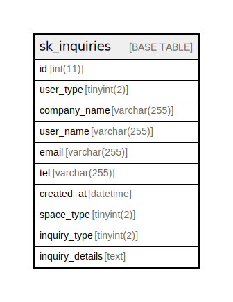

# sk_inquiries

## Description

<details>
<summary><strong>Table Definition</strong></summary>

```sql
CREATE TABLE `sk_inquiries` (
  `id` int(11) NOT NULL AUTO_INCREMENT,
  `user_type` tinyint(2) NOT NULL COMMENT 'タイプ',
  `company_name` varchar(255) COLLATE utf8mb4_unicode_ci DEFAULT NULL COMMENT '会社名',
  `user_name` varchar(255) COLLATE utf8mb4_unicode_ci DEFAULT NULL COMMENT '名前',
  `email` varchar(255) COLLATE utf8mb4_unicode_ci NOT NULL DEFAULT '' COMMENT 'メールアドレス',
  `tel` varchar(255) COLLATE utf8mb4_unicode_ci NOT NULL DEFAULT '' COMMENT '電話番号',
  `created_at` datetime NOT NULL DEFAULT CURRENT_TIMESTAMP COMMENT 'お問い合わせ日',
  `space_type` tinyint(2) DEFAULT NULL,
  `inquiry_type` tinyint(2) DEFAULT NULL,
  `inquiry_details` text COLLATE utf8mb4_unicode_ci COMMENT '問い合わせ内容詳細',
  PRIMARY KEY (`id`)
) ENGINE=InnoDB AUTO_INCREMENT=[Redacted by tbls] DEFAULT CHARSET=utf8mb4 COLLATE=utf8mb4_unicode_ci
```

</details>

## Columns

| Name | Type | Default | Nullable | Extra Definition | Children | Parents | Comment |
| ---- | ---- | ------- | -------- | ---------------- | -------- | ------- | ------- |
| id | int(11) |  | false | auto_increment |  |  |  |
| user_type | tinyint(2) |  | false |  |  |  | タイプ |
| company_name | varchar(255) |  | true |  |  |  | 会社名 |
| user_name | varchar(255) |  | true |  |  |  | 名前 |
| email | varchar(255) |  | false |  |  |  | メールアドレス |
| tel | varchar(255) |  | false |  |  |  | 電話番号 |
| created_at | datetime | CURRENT_TIMESTAMP | false |  |  |  | お問い合わせ日 |
| space_type | tinyint(2) |  | true |  |  |  |  |
| inquiry_type | tinyint(2) |  | true |  |  |  |  |
| inquiry_details | text |  | true |  |  |  | 問い合わせ内容詳細 |

## Constraints

| Name | Type | Definition |
| ---- | ---- | ---------- |
| PRIMARY | PRIMARY KEY | PRIMARY KEY (id) |

## Indexes

| Name | Definition |
| ---- | ---------- |
| PRIMARY | PRIMARY KEY (id) USING BTREE |

## Relations



---

> Generated by [tbls](https://github.com/k1LoW/tbls)
