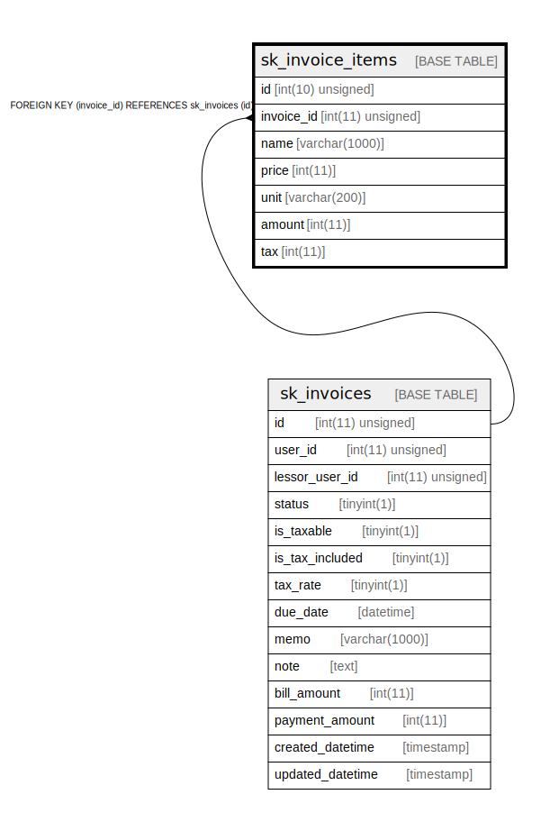

# sk_invoice_items

## Description

<details>
<summary><strong>Table Definition</strong></summary>

```sql
CREATE TABLE `sk_invoice_items` (
  `id` int(10) unsigned NOT NULL AUTO_INCREMENT,
  `invoice_id` int(11) unsigned NOT NULL,
  `name` varchar(1000) COLLATE utf8mb4_unicode_ci NOT NULL COMMENT '名前',
  `price` int(11) NOT NULL COMMENT '単価',
  `unit` varchar(200) COLLATE utf8mb4_unicode_ci DEFAULT NULL COMMENT '単位',
  `amount` int(11) NOT NULL COMMENT '数量',
  `tax` int(11) NOT NULL COMMENT '税金',
  PRIMARY KEY (`id`),
  KEY `fk_invoice_items__invoice_idx` (`invoice_id`),
  CONSTRAINT `fk_invoice_items__invoice_idx` FOREIGN KEY (`invoice_id`) REFERENCES `sk_invoices` (`id`) ON DELETE CASCADE ON UPDATE NO ACTION
) ENGINE=InnoDB AUTO_INCREMENT=[Redacted by tbls] DEFAULT CHARSET=utf8mb4 COLLATE=utf8mb4_unicode_ci
```

</details>

## Columns

| Name | Type | Default | Nullable | Extra Definition | Children | Parents | Comment |
| ---- | ---- | ------- | -------- | ---------------- | -------- | ------- | ------- |
| id | int(10) unsigned |  | false | auto_increment |  |  |  |
| invoice_id | int(11) unsigned |  | false |  |  | [sk_invoices](sk_invoices.md) |  |
| name | varchar(1000) |  | false |  |  |  | 名前 |
| price | int(11) |  | false |  |  |  | 単価 |
| unit | varchar(200) |  | true |  |  |  | 単位 |
| amount | int(11) |  | false |  |  |  | 数量 |
| tax | int(11) |  | false |  |  |  | 税金 |

## Constraints

| Name | Type | Definition |
| ---- | ---- | ---------- |
| fk_invoice_items__invoice_idx | FOREIGN KEY | FOREIGN KEY (invoice_id) REFERENCES sk_invoices (id) |
| PRIMARY | PRIMARY KEY | PRIMARY KEY (id) |

## Indexes

| Name | Definition |
| ---- | ---------- |
| fk_invoice_items__invoice_idx | KEY fk_invoice_items__invoice_idx (invoice_id) USING BTREE |
| PRIMARY | PRIMARY KEY (id) USING BTREE |

## Relations



---

> Generated by [tbls](https://github.com/k1LoW/tbls)
