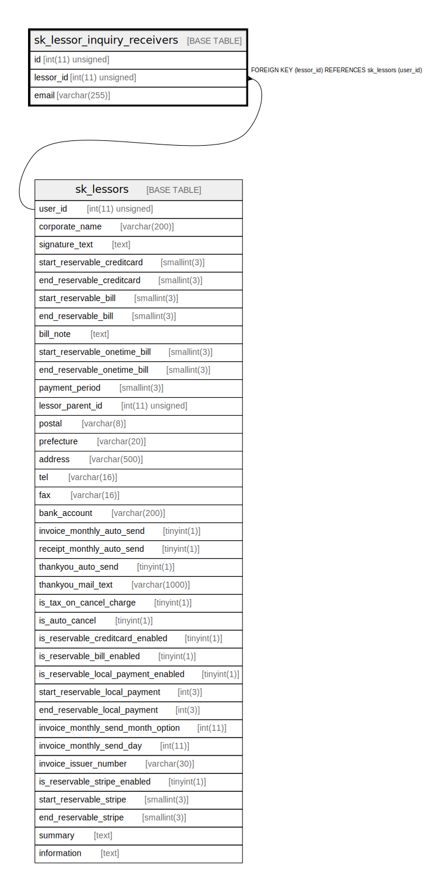

# sk_lessor_inquiry_receivers

## Description

<details>
<summary><strong>Table Definition</strong></summary>

```sql
CREATE TABLE `sk_lessor_inquiry_receivers` (
  `id` int(11) unsigned NOT NULL AUTO_INCREMENT,
  `lessor_id` int(11) unsigned NOT NULL,
  `email` varchar(255) NOT NULL,
  PRIMARY KEY (`id`),
  UNIQUE KEY `lessor_id` (`lessor_id`,`email`),
  CONSTRAINT `fk_lessor_inquiry_receivers__lessors_idx` FOREIGN KEY (`lessor_id`) REFERENCES `sk_lessors` (`user_id`) ON DELETE CASCADE ON UPDATE CASCADE
) ENGINE=InnoDB AUTO_INCREMENT=[Redacted by tbls] DEFAULT CHARSET=utf8
```

</details>

## Columns

| Name | Type | Default | Nullable | Extra Definition | Children | Parents | Comment |
| ---- | ---- | ------- | -------- | ---------------- | -------- | ------- | ------- |
| id | int(11) unsigned |  | false | auto_increment |  |  |  |
| lessor_id | int(11) unsigned |  | false |  |  | [sk_lessors](sk_lessors.md) |  |
| email | varchar(255) |  | false |  |  |  |  |

## Constraints

| Name | Type | Definition |
| ---- | ---- | ---------- |
| fk_lessor_inquiry_receivers__lessors_idx | FOREIGN KEY | FOREIGN KEY (lessor_id) REFERENCES sk_lessors (user_id) |
| lessor_id | UNIQUE | UNIQUE KEY lessor_id (lessor_id, email) |
| PRIMARY | PRIMARY KEY | PRIMARY KEY (id) |

## Indexes

| Name | Definition |
| ---- | ---------- |
| PRIMARY | PRIMARY KEY (id) USING BTREE |
| lessor_id | UNIQUE KEY lessor_id (lessor_id, email) USING BTREE |

## Relations



---

> Generated by [tbls](https://github.com/k1LoW/tbls)
