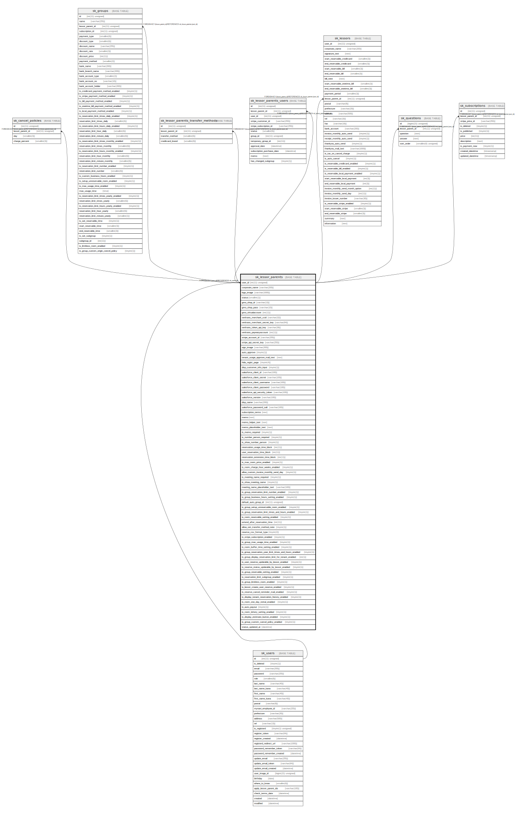

# sk_lessor_parents

## Description

本店

<details>
<summary><strong>Table Definition</strong></summary>

```sql
CREATE TABLE `sk_lessor_parents` (
  `user_id` int(11) unsigned NOT NULL COMMENT 'ユーザーID(本店ID)',
  `corporate_name` varchar(200) NOT NULL DEFAULT '' COMMENT '法人名',
  `logo_image` varchar(1000) DEFAULT NULL COMMENT 'ロゴ画像パス',
  `status` smallint(1) DEFAULT NULL COMMENT '1-契約中, 2-解約, 3-デモ, 4-解約予定',
  `gmo_shop_id` varchar(13) DEFAULT NULL,
  `gmo_shop_pass` varchar(10) DEFAULT NULL,
  `gmo_virtualaccount` int(11) NOT NULL DEFAULT '0' COMMENT 'バーチャル口座の利用可否ステータス 0:不可 1:可能',
  `veritrans_merchant_ccid` varchar(32) DEFAULT NULL COMMENT 'ベリトランスCCID',
  `veritrans_merchant_secret_key` varchar(64) DEFAULT NULL COMMENT 'ベリトランスシークレット',
  `veritrans_token_api_key` varchar(36) DEFAULT NULL COMMENT 'ベリトランスAPIトークン',
  `veritrans_payeasyaccount` int(11) NOT NULL DEFAULT '0' COMMENT 'ペイジーの利用可否ステータス 0:不可 1:可能',
  `stripe_account_id` varchar(255) DEFAULT NULL,
  `stripe_api_secret_key` varchar(255) DEFAULT NULL,
  `sign_image` varchar(200) DEFAULT NULL COMMENT '社判の画像',
  `auto_approve` tinyint(1) DEFAULT '0' COMMENT '加入申請の承認処理　0:手動、1:自動',
  `tenant_usage_approve_mail_text` text COMMENT 'Approve tenant usage mail content',
  `hide_regist_page` tinyint(4) NOT NULL DEFAULT '0' COMMENT 'ユーザー登録ページからグループ申請を非表示にする',
  `disp_customer_info_input` tinyint(1) DEFAULT '0' COMMENT 'ユーザー予約画面に利用者情報の表示有無の設定',
  `salesforce_client_id` varchar(100) DEFAULT NULL COMMENT 'コンシューマ鍵',
  `salesforce_client_secret` varchar(100) DEFAULT NULL COMMENT 'コンシューマの秘密',
  `salesforce_client_username` varchar(100) DEFAULT NULL COMMENT 'Salesforceユーザー名',
  `salesforce_client_password` varchar(100) DEFAULT NULL COMMENT 'Salesforceユーザーパスワード',
  `salesforce_api_security_token` varchar(100) DEFAULT NULL COMMENT 'Salesforceセキュリティトークン',
  `salesforce_version` varchar(100) DEFAULT NULL COMMENT 'Salesforceのバージョン情報',
  `disp_name` varchar(200) DEFAULT NULL COMMENT '管理画面表示名',
  `salesforce_password_salt` varchar(100) DEFAULT NULL COMMENT 'パスワードを暗号化する際のsalt',
  `subscription_terms` text,
  `memo` text COMMENT 'メモ',
  `memo_helper_text` text COMMENT 'notes memo',
  `memo_placeholder_text` text,
  `is_memo_required` tinyint(1) DEFAULT '0' COMMENT 'is memo required',
  `is_number_person_required` tinyint(1) DEFAULT '0',
  `is_show_number_person` tinyint(1) NOT NULL DEFAULT '1',
  `reservation_usage_time_block` int(11) NOT NULL DEFAULT '30' COMMENT '利用料金や最低利用時間の分単位',
  `user_reservation_time_block` int(11) NOT NULL DEFAULT '30',
  `reservation_extension_time_block` int(11) NOT NULL DEFAULT '30',
  `is_max_room_price_enabled` tinyint(1) DEFAULT '0',
  `is_room_charge_hour_weeks_enabled` tinyint(1) DEFAULT '0',
  `allow_custom_invoice_monthly_send_day` tinyint(1) DEFAULT '0',
  `is_meeting_name_required` tinyint(1) DEFAULT '0',
  `is_show_meeting_name` tinyint(1) NOT NULL DEFAULT '1',
  `meeting_name_placeholder_text` varchar(100) DEFAULT NULL,
  `is_group_reservation_limit_number_enabled` tinyint(1) DEFAULT '0',
  `is_group_business_hours_setting_enabled` tinyint(1) DEFAULT '0',
  `default_auto_group_id` int(11) unsigned DEFAULT NULL,
  `is_group_setup_unreservable_room_enabled` tinyint(1) NOT NULL DEFAULT '0',
  `is_group_reservation_limit_times_and_hours_enabled` tinyint(1) NOT NULL DEFAULT '0',
  `is_room_reservable_setting_enabled` tinyint(1) DEFAULT '0',
  `extend_after_reservation_time` int(11) NOT NULL DEFAULT '0' COMMENT '予約終了時間後でも延長ができる時間',
  `allow_set_transfer_method_note` tinyint(1) NOT NULL DEFAULT '0' COMMENT '支払い方法に関するメモの設定可否',
  `reserve_csv_format_type` tinyint(2) DEFAULT '0',
  `is_stripe_subscription_enabled` tinyint(1) DEFAULT '0',
  `is_group_max_usage_time_enabled` tinyint(1) DEFAULT '0',
  `is_room_buffer_time_setting_enabled` tinyint(1) NOT NULL DEFAULT '0',
  `is_group_reservation_year_limit_times_and_hours_enabled` tinyint(1) NOT NULL DEFAULT '0',
  `is_group_display_reservation_limit_for_tenant_enabled` int(1) NOT NULL DEFAULT '0',
  `is_user_reserve_updatable_by_lessor_enabled` tinyint(1) NOT NULL DEFAULT '0',
  `is_reserve_status_updatable_by_lessor_enabled` tinyint(1) DEFAULT '0',
  `is_group_reservable_setting_enabled` tinyint(1) DEFAULT '0',
  `is_reservation_limit_subgroup_enabled` tinyint(1) DEFAULT '0',
  `is_group_limitless_room_enabled` tinyint(1) DEFAULT '0',
  `is_lessor_create_user_reserve_enabled` tinyint(1) DEFAULT '0',
  `is_reserve_cancel_reminder_mail_enabled` tinyint(1) DEFAULT '0',
  `is_display_tenant_reservation_history_enabled` tinyint(1) NOT NULL DEFAULT '0',
  `is_room_one_day_rental_enabled` tinyint(1) DEFAULT NULL,
  `is_auto_payout` tinyint(1) DEFAULT '1',
  `is_room_lottery_setting_enabled` tinyint(1) NOT NULL DEFAULT '0',
  `is_display_estimate_button_enabled` tinyint(1) DEFAULT '1',
  `is_group_custom_cancel_policy_enabled` tinyint(1) DEFAULT '0',
  `status_updated_at` datetime DEFAULT NULL,
  PRIMARY KEY (`user_id`),
  CONSTRAINT `sk_relation_lessor_parents_and_users` FOREIGN KEY (`user_id`) REFERENCES `sk_users` (`id`) ON DELETE CASCADE ON UPDATE CASCADE
) ENGINE=InnoDB DEFAULT CHARSET=utf8 COMMENT='本店'
```

</details>

## Columns

| Name | Type | Default | Nullable | Children | Parents | Comment |
| ---- | ---- | ------- | -------- | -------- | ------- | ------- |
| user_id | int(11) unsigned |  | false | [sk_cancel_policies](sk_cancel_policies.md) [sk_groups](sk_groups.md) [sk_lessor_parents_transfer_methods](sk_lessor_parents_transfer_methods.md) [sk_lessor_parents_users](sk_lessor_parents_users.md) [sk_lessors](sk_lessors.md) [sk_questions](sk_questions.md) [sk_subscriptions](sk_subscriptions.md) | [sk_users](sk_users.md) | ユーザーID(本店ID) |
| corporate_name | varchar(200) |  | false |  |  | 法人名 |
| logo_image | varchar(1000) |  | true |  |  | ロゴ画像パス |
| status | smallint(1) |  | true |  |  | 1-契約中, 2-解約, 3-デモ, 4-解約予定 |
| gmo_shop_id | varchar(13) |  | true |  |  |  |
| gmo_shop_pass | varchar(10) |  | true |  |  |  |
| gmo_virtualaccount | int(11) | 0 | false |  |  | バーチャル口座の利用可否ステータス 0:不可 1:可能 |
| veritrans_merchant_ccid | varchar(32) |  | true |  |  | ベリトランスCCID |
| veritrans_merchant_secret_key | varchar(64) |  | true |  |  | ベリトランスシークレット |
| veritrans_token_api_key | varchar(36) |  | true |  |  | ベリトランスAPIトークン |
| veritrans_payeasyaccount | int(11) | 0 | false |  |  | ペイジーの利用可否ステータス 0:不可 1:可能 |
| stripe_account_id | varchar(255) |  | true |  |  |  |
| stripe_api_secret_key | varchar(255) |  | true |  |  |  |
| sign_image | varchar(200) |  | true |  |  | 社判の画像 |
| auto_approve | tinyint(1) | 0 | true |  |  | 加入申請の承認処理　0:手動、1:自動 |
| tenant_usage_approve_mail_text | text |  | true |  |  | Approve tenant usage mail content |
| hide_regist_page | tinyint(4) | 0 | false |  |  | ユーザー登録ページからグループ申請を非表示にする |
| disp_customer_info_input | tinyint(1) | 0 | true |  |  | ユーザー予約画面に利用者情報の表示有無の設定 |
| salesforce_client_id | varchar(100) |  | true |  |  | コンシューマ鍵 |
| salesforce_client_secret | varchar(100) |  | true |  |  | コンシューマの秘密 |
| salesforce_client_username | varchar(100) |  | true |  |  | Salesforceユーザー名 |
| salesforce_client_password | varchar(100) |  | true |  |  | Salesforceユーザーパスワード |
| salesforce_api_security_token | varchar(100) |  | true |  |  | Salesforceセキュリティトークン |
| salesforce_version | varchar(100) |  | true |  |  | Salesforceのバージョン情報 |
| disp_name | varchar(200) |  | true |  |  | 管理画面表示名 |
| salesforce_password_salt | varchar(100) |  | true |  |  | パスワードを暗号化する際のsalt |
| subscription_terms | text |  | true |  |  |  |
| memo | text |  | true |  |  | メモ |
| memo_helper_text | text |  | true |  |  | notes memo |
| memo_placeholder_text | text |  | true |  |  |  |
| is_memo_required | tinyint(1) | 0 | true |  |  | is memo required |
| is_number_person_required | tinyint(1) | 0 | true |  |  |  |
| is_show_number_person | tinyint(1) | 1 | false |  |  |  |
| reservation_usage_time_block | int(11) | 30 | false |  |  | 利用料金や最低利用時間の分単位 |
| user_reservation_time_block | int(11) | 30 | false |  |  |  |
| reservation_extension_time_block | int(11) | 30 | false |  |  |  |
| is_max_room_price_enabled | tinyint(1) | 0 | true |  |  |  |
| is_room_charge_hour_weeks_enabled | tinyint(1) | 0 | true |  |  |  |
| allow_custom_invoice_monthly_send_day | tinyint(1) | 0 | true |  |  |  |
| is_meeting_name_required | tinyint(1) | 0 | true |  |  |  |
| is_show_meeting_name | tinyint(1) | 1 | false |  |  |  |
| meeting_name_placeholder_text | varchar(100) |  | true |  |  |  |
| is_group_reservation_limit_number_enabled | tinyint(1) | 0 | true |  |  |  |
| is_group_business_hours_setting_enabled | tinyint(1) | 0 | true |  |  |  |
| default_auto_group_id | int(11) unsigned |  | true |  |  |  |
| is_group_setup_unreservable_room_enabled | tinyint(1) | 0 | false |  |  |  |
| is_group_reservation_limit_times_and_hours_enabled | tinyint(1) | 0 | false |  |  |  |
| is_room_reservable_setting_enabled | tinyint(1) | 0 | true |  |  |  |
| extend_after_reservation_time | int(11) | 0 | false |  |  | 予約終了時間後でも延長ができる時間 |
| allow_set_transfer_method_note | tinyint(1) | 0 | false |  |  | 支払い方法に関するメモの設定可否 |
| reserve_csv_format_type | tinyint(2) | 0 | true |  |  |  |
| is_stripe_subscription_enabled | tinyint(1) | 0 | true |  |  |  |
| is_group_max_usage_time_enabled | tinyint(1) | 0 | true |  |  |  |
| is_room_buffer_time_setting_enabled | tinyint(1) | 0 | false |  |  |  |
| is_group_reservation_year_limit_times_and_hours_enabled | tinyint(1) | 0 | false |  |  |  |
| is_group_display_reservation_limit_for_tenant_enabled | int(1) | 0 | false |  |  |  |
| is_user_reserve_updatable_by_lessor_enabled | tinyint(1) | 0 | false |  |  |  |
| is_reserve_status_updatable_by_lessor_enabled | tinyint(1) | 0 | true |  |  |  |
| is_group_reservable_setting_enabled | tinyint(1) | 0 | true |  |  |  |
| is_reservation_limit_subgroup_enabled | tinyint(1) | 0 | true |  |  |  |
| is_group_limitless_room_enabled | tinyint(1) | 0 | true |  |  |  |
| is_lessor_create_user_reserve_enabled | tinyint(1) | 0 | true |  |  |  |
| is_reserve_cancel_reminder_mail_enabled | tinyint(1) | 0 | true |  |  |  |
| is_display_tenant_reservation_history_enabled | tinyint(1) | 0 | false |  |  |  |
| is_room_one_day_rental_enabled | tinyint(1) |  | true |  |  |  |
| is_auto_payout | tinyint(1) | 1 | true |  |  |  |
| is_room_lottery_setting_enabled | tinyint(1) | 0 | false |  |  |  |
| is_display_estimate_button_enabled | tinyint(1) | 1 | true |  |  |  |
| is_group_custom_cancel_policy_enabled | tinyint(1) | 0 | true |  |  |  |
| status_updated_at | datetime |  | true |  |  |  |

## Constraints

| Name | Type | Definition |
| ---- | ---- | ---------- |
| PRIMARY | PRIMARY KEY | PRIMARY KEY (user_id) |
| sk_relation_lessor_parents_and_users | FOREIGN KEY | FOREIGN KEY (user_id) REFERENCES sk_users (id) |

## Indexes

| Name | Definition |
| ---- | ---------- |
| PRIMARY | PRIMARY KEY (user_id) USING BTREE |

## Relations



---

> Generated by [tbls](https://github.com/k1LoW/tbls)
