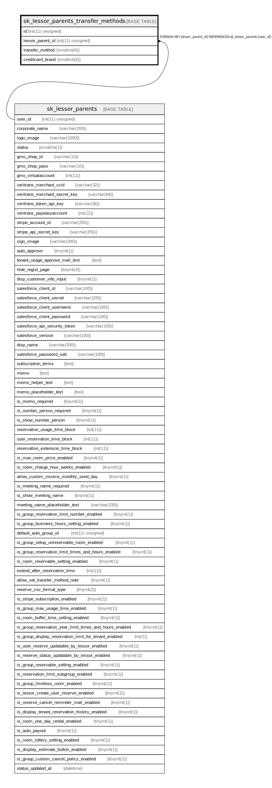

# sk_lessor_parents_transfer_methods

## Description

本店の決済手段

<details>
<summary><strong>Table Definition</strong></summary>

```sql
CREATE TABLE `sk_lessor_parents_transfer_methods` (
  `id` int(11) unsigned NOT NULL AUTO_INCREMENT COMMENT 'ID',
  `lessor_parent_id` int(11) unsigned NOT NULL COMMENT '本店ID',
  `transfer_method` smallint(6) NOT NULL DEFAULT '0' COMMENT '決済方法　1:クレジットカード、2:銀行振込、3:請求書払い',
  `creditcard_brand` smallint(6) DEFAULT NULL COMMENT 'クレジットカード種別',
  PRIMARY KEY (`id`),
  KEY `sk_relation_lessor_parents_transfer_methods_and_lessor_parents` (`lessor_parent_id`),
  CONSTRAINT `sk_relation_lessor_parents_transfer_methods_and_lessor_parents` FOREIGN KEY (`lessor_parent_id`) REFERENCES `sk_lessor_parents` (`user_id`) ON DELETE CASCADE ON UPDATE CASCADE
) ENGINE=InnoDB AUTO_INCREMENT=[Redacted by tbls] DEFAULT CHARSET=utf8 COMMENT='本店の決済手段'
```

</details>

## Columns

| Name | Type | Default | Nullable | Extra Definition | Children | Parents | Comment |
| ---- | ---- | ------- | -------- | ---------------- | -------- | ------- | ------- |
| id | int(11) unsigned |  | false | auto_increment |  |  | ID |
| lessor_parent_id | int(11) unsigned |  | false |  |  | [sk_lessor_parents](sk_lessor_parents.md) | 本店ID |
| transfer_method | smallint(6) | 0 | false |  |  |  | 決済方法　1:クレジットカード、2:銀行振込、3:請求書払い |
| creditcard_brand | smallint(6) |  | true |  |  |  | クレジットカード種別 |

## Constraints

| Name | Type | Definition |
| ---- | ---- | ---------- |
| PRIMARY | PRIMARY KEY | PRIMARY KEY (id) |
| sk_relation_lessor_parents_transfer_methods_and_lessor_parents | FOREIGN KEY | FOREIGN KEY (lessor_parent_id) REFERENCES sk_lessor_parents (user_id) |

## Indexes

| Name | Definition |
| ---- | ---------- |
| sk_relation_lessor_parents_transfer_methods_and_lessor_parents | KEY sk_relation_lessor_parents_transfer_methods_and_lessor_parents (lessor_parent_id) USING BTREE |
| PRIMARY | PRIMARY KEY (id) USING BTREE |

## Relations



---

> Generated by [tbls](https://github.com/k1LoW/tbls)
