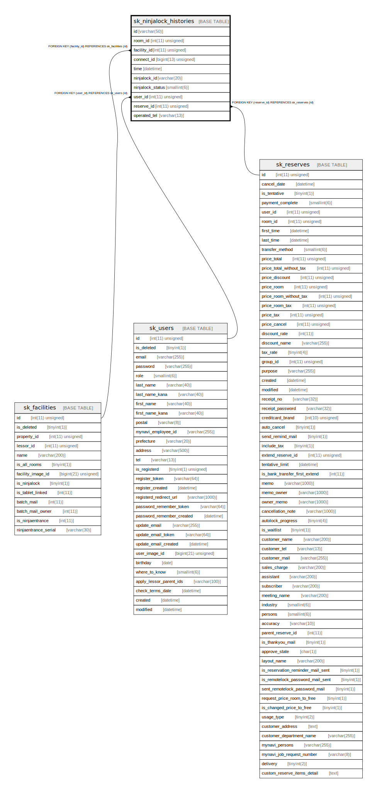

# sk_ninjalock_histories

## Description

NinjaLock使用履歴

<details>
<summary><strong>Table Definition</strong></summary>

```sql
CREATE TABLE `sk_ninjalock_histories` (
  `id` varchar(50) NOT NULL DEFAULT '' COMMENT '[connect_id] + _ + [time]',
  `room_id` int(11) unsigned DEFAULT NULL COMMENT '部屋ID',
  `facility_id` int(11) unsigned DEFAULT NULL COMMENT '設備ID',
  `connect_id` bigint(13) unsigned NOT NULL COMMENT 'NinjaLockに伝える紐づく施設のID、部屋と設備の2種類があるため、先頭の数値で判別、部屋:先頭1+部屋ID11桁、設備:先頭2+設備ID11桁',
  `time` datetime NOT NULL COMMENT '操作時間',
  `ninjalock_id` varchar(20) NOT NULL DEFAULT '' COMMENT 'NinjaLockのMACアドレス',
  `ninjalock_status` smallint(6) NOT NULL COMMENT '0:施錠、1:解錠、-1:通信失敗',
  `user_id` int(11) unsigned DEFAULT NULL COMMENT 'ユーザID',
  `reserve_id` int(11) unsigned DEFAULT NULL COMMENT '予約ID。予約者が開いた際は予約ID、オーナーが開いた際はNull',
  `operated_tel` varchar(13) DEFAULT NULL COMMENT '電話による鍵開閉を行った電話番号',
  PRIMARY KEY (`id`),
  UNIQUE KEY `sk_index_ninjalock_histories_on_connect_id_and_time` (`connect_id`,`time`),
  KEY `sk_relation_ninjalock_histories_reserves` (`reserve_id`),
  KEY `sk_relation_ninjalock_histories_users` (`user_id`),
  KEY `sk_relation_ninjalock_histories_and_facilities` (`facility_id`),
  CONSTRAINT `sk_relation_ninjalock_histories_and_facilities` FOREIGN KEY (`facility_id`) REFERENCES `sk_facilities` (`id`) ON DELETE CASCADE ON UPDATE CASCADE,
  CONSTRAINT `sk_relation_ninjalock_histories_and_reserves` FOREIGN KEY (`reserve_id`) REFERENCES `sk_reserves` (`id`) ON DELETE SET NULL ON UPDATE SET NULL,
  CONSTRAINT `sk_relation_ninjalock_histories_and_users` FOREIGN KEY (`user_id`) REFERENCES `sk_users` (`id`) ON DELETE SET NULL ON UPDATE SET NULL
) ENGINE=InnoDB DEFAULT CHARSET=utf8 COMMENT='NinjaLock使用履歴'
```

</details>

## Columns

| Name | Type | Default | Nullable | Children | Parents | Comment |
| ---- | ---- | ------- | -------- | -------- | ------- | ------- |
| id | varchar(50) |  | false |  |  | [connect_id] + _ + [time] |
| room_id | int(11) unsigned |  | true |  |  | 部屋ID |
| facility_id | int(11) unsigned |  | true |  | [sk_facilities](sk_facilities.md) | 設備ID |
| connect_id | bigint(13) unsigned |  | false |  |  | NinjaLockに伝える紐づく施設のID、部屋と設備の2種類があるため、先頭の数値で判別、部屋:先頭1+部屋ID11桁、設備:先頭2+設備ID11桁 |
| time | datetime |  | false |  |  | 操作時間 |
| ninjalock_id | varchar(20) |  | false |  |  | NinjaLockのMACアドレス |
| ninjalock_status | smallint(6) |  | false |  |  | 0:施錠、1:解錠、-1:通信失敗 |
| user_id | int(11) unsigned |  | true |  | [sk_users](sk_users.md) | ユーザID |
| reserve_id | int(11) unsigned |  | true |  | [sk_reserves](sk_reserves.md) | 予約ID。予約者が開いた際は予約ID、オーナーが開いた際はNull |
| operated_tel | varchar(13) |  | true |  |  | 電話による鍵開閉を行った電話番号 |

## Constraints

| Name | Type | Definition |
| ---- | ---- | ---------- |
| PRIMARY | PRIMARY KEY | PRIMARY KEY (id) |
| sk_index_ninjalock_histories_on_connect_id_and_time | UNIQUE | UNIQUE KEY sk_index_ninjalock_histories_on_connect_id_and_time (connect_id, time) |
| sk_relation_ninjalock_histories_and_facilities | FOREIGN KEY | FOREIGN KEY (facility_id) REFERENCES sk_facilities (id) |
| sk_relation_ninjalock_histories_and_reserves | FOREIGN KEY | FOREIGN KEY (reserve_id) REFERENCES sk_reserves (id) |
| sk_relation_ninjalock_histories_and_users | FOREIGN KEY | FOREIGN KEY (user_id) REFERENCES sk_users (id) |

## Indexes

| Name | Definition |
| ---- | ---------- |
| sk_relation_ninjalock_histories_and_facilities | KEY sk_relation_ninjalock_histories_and_facilities (facility_id) USING BTREE |
| sk_relation_ninjalock_histories_reserves | KEY sk_relation_ninjalock_histories_reserves (reserve_id) USING BTREE |
| sk_relation_ninjalock_histories_users | KEY sk_relation_ninjalock_histories_users (user_id) USING BTREE |
| PRIMARY | PRIMARY KEY (id) USING BTREE |
| sk_index_ninjalock_histories_on_connect_id_and_time | UNIQUE KEY sk_index_ninjalock_histories_on_connect_id_and_time (connect_id, time) USING BTREE |

## Relations



---

> Generated by [tbls](https://github.com/k1LoW/tbls)
