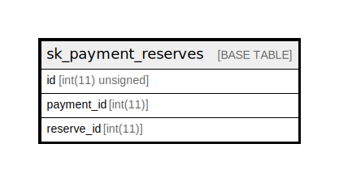

# sk_payment_reserves

## Description

<details>
<summary><strong>Table Definition</strong></summary>

```sql
CREATE TABLE `sk_payment_reserves` (
  `id` int(11) unsigned NOT NULL AUTO_INCREMENT,
  `payment_id` int(11) DEFAULT NULL,
  `reserve_id` int(11) DEFAULT NULL,
  PRIMARY KEY (`id`),
  KEY `index_payment_reserve_on_reserve_id` (`reserve_id`)
) ENGINE=InnoDB AUTO_INCREMENT=[Redacted by tbls] DEFAULT CHARSET=utf8
```

</details>

## Columns

| Name | Type | Default | Nullable | Extra Definition | Children | Parents | Comment |
| ---- | ---- | ------- | -------- | ---------------- | -------- | ------- | ------- |
| id | int(11) unsigned |  | false | auto_increment |  |  |  |
| payment_id | int(11) |  | true |  |  |  |  |
| reserve_id | int(11) |  | true |  |  |  |  |

## Constraints

| Name | Type | Definition |
| ---- | ---- | ---------- |
| PRIMARY | PRIMARY KEY | PRIMARY KEY (id) |

## Indexes

| Name | Definition |
| ---- | ---------- |
| index_payment_reserve_on_reserve_id | KEY index_payment_reserve_on_reserve_id (reserve_id) USING BTREE |
| PRIMARY | PRIMARY KEY (id) USING BTREE |

## Relations



---

> Generated by [tbls](https://github.com/k1LoW/tbls)
