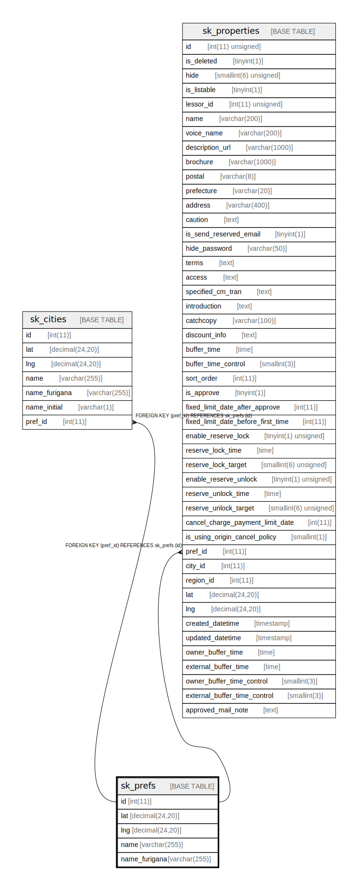

# sk_prefs

## Description

<details>
<summary><strong>Table Definition</strong></summary>

```sql
CREATE TABLE `sk_prefs` (
  `id` int(11) NOT NULL AUTO_INCREMENT,
  `lat` decimal(24,20) NOT NULL,
  `lng` decimal(24,20) NOT NULL,
  `name` varchar(255) NOT NULL,
  `name_furigana` varchar(255) NOT NULL,
  PRIMARY KEY (`id`),
  KEY `sk_pref_b068931c` (`name`)
) ENGINE=InnoDB AUTO_INCREMENT=[Redacted by tbls] DEFAULT CHARSET=utf8
```

</details>

## Columns

| Name | Type | Default | Nullable | Extra Definition | Children | Parents | Comment |
| ---- | ---- | ------- | -------- | ---------------- | -------- | ------- | ------- |
| id | int(11) |  | false | auto_increment | [sk_cities](sk_cities.md) [sk_properties](sk_properties.md) |  |  |
| lat | decimal(24,20) |  | false |  |  |  |  |
| lng | decimal(24,20) |  | false |  |  |  |  |
| name | varchar(255) |  | false |  |  |  |  |
| name_furigana | varchar(255) |  | false |  |  |  |  |

## Constraints

| Name | Type | Definition |
| ---- | ---- | ---------- |
| PRIMARY | PRIMARY KEY | PRIMARY KEY (id) |

## Indexes

| Name | Definition |
| ---- | ---------- |
| sk_pref_b068931c | KEY sk_pref_b068931c (name) USING BTREE |
| PRIMARY | PRIMARY KEY (id) USING BTREE |

## Relations



---

> Generated by [tbls](https://github.com/k1LoW/tbls)
