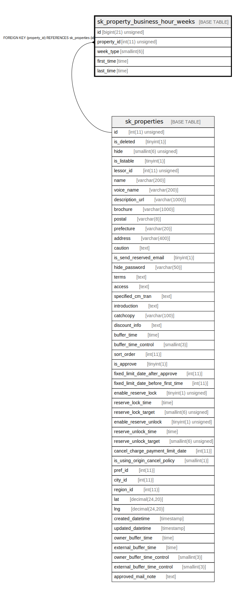

# sk_property_business_hour_weeks

## Description

曜日＋祝日毎の営業時間

<details>
<summary><strong>Table Definition</strong></summary>

```sql
CREATE TABLE `sk_property_business_hour_weeks` (
  `id` bigint(21) unsigned NOT NULL AUTO_INCREMENT COMMENT '営業時間(曜日)ID',
  `property_id` int(11) unsigned NOT NULL COMMENT '物件ID',
  `week_type` smallint(6) NOT NULL COMMENT '0:日、1:月、2:火、3:水、4:木、5:金、6:土、7:祝',
  `first_time` time NOT NULL COMMENT '営業開始時間',
  `last_time` time NOT NULL COMMENT '営業終了時間',
  PRIMARY KEY (`id`),
  KEY `sk_relation_property_business_hour_weeks_and_properties` (`property_id`),
  CONSTRAINT `sk_relation_property_business_hour_weeks_and_properties` FOREIGN KEY (`property_id`) REFERENCES `sk_properties` (`id`) ON DELETE CASCADE ON UPDATE CASCADE
) ENGINE=InnoDB AUTO_INCREMENT=[Redacted by tbls] DEFAULT CHARSET=utf8 COMMENT='曜日＋祝日毎の営業時間'
```

</details>

## Columns

| Name | Type | Default | Nullable | Extra Definition | Children | Parents | Comment |
| ---- | ---- | ------- | -------- | ---------------- | -------- | ------- | ------- |
| id | bigint(21) unsigned |  | false | auto_increment |  |  | 営業時間(曜日)ID |
| property_id | int(11) unsigned |  | false |  |  | [sk_properties](sk_properties.md) | 物件ID |
| week_type | smallint(6) |  | false |  |  |  | 0:日、1:月、2:火、3:水、4:木、5:金、6:土、7:祝 |
| first_time | time |  | false |  |  |  | 営業開始時間 |
| last_time | time |  | false |  |  |  | 営業終了時間 |

## Constraints

| Name | Type | Definition |
| ---- | ---- | ---------- |
| PRIMARY | PRIMARY KEY | PRIMARY KEY (id) |
| sk_relation_property_business_hour_weeks_and_properties | FOREIGN KEY | FOREIGN KEY (property_id) REFERENCES sk_properties (id) |

## Indexes

| Name | Definition |
| ---- | ---------- |
| sk_relation_property_business_hour_weeks_and_properties | KEY sk_relation_property_business_hour_weeks_and_properties (property_id) USING BTREE |
| PRIMARY | PRIMARY KEY (id) USING BTREE |

## Relations



---

> Generated by [tbls](https://github.com/k1LoW/tbls)
