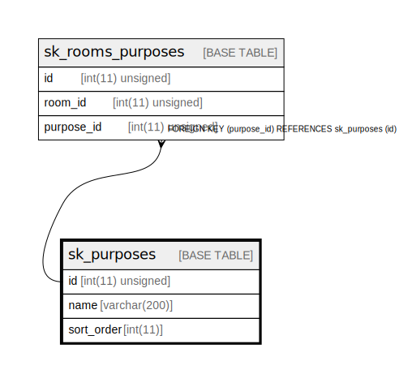

# sk_purposes

## Description

部屋の利用用途

<details>
<summary><strong>Table Definition</strong></summary>

```sql
CREATE TABLE `sk_purposes` (
  `id` int(11) unsigned NOT NULL AUTO_INCREMENT,
  `name` varchar(200) NOT NULL DEFAULT '' COMMENT '利用用途',
  `sort_order` int(11) NOT NULL DEFAULT '0' COMMENT 'ソート順',
  PRIMARY KEY (`id`)
) ENGINE=InnoDB AUTO_INCREMENT=[Redacted by tbls] DEFAULT CHARSET=utf8 COMMENT='部屋の利用用途'
```

</details>

## Columns

| Name | Type | Default | Nullable | Extra Definition | Children | Parents | Comment |
| ---- | ---- | ------- | -------- | ---------------- | -------- | ------- | ------- |
| id | int(11) unsigned |  | false | auto_increment | [sk_rooms_purposes](sk_rooms_purposes.md) |  |  |
| name | varchar(200) |  | false |  |  |  | 利用用途 |
| sort_order | int(11) | 0 | false |  |  |  | ソート順 |

## Constraints

| Name | Type | Definition |
| ---- | ---- | ---------- |
| PRIMARY | PRIMARY KEY | PRIMARY KEY (id) |

## Indexes

| Name | Definition |
| ---- | ---------- |
| PRIMARY | PRIMARY KEY (id) USING BTREE |

## Relations



---

> Generated by [tbls](https://github.com/k1LoW/tbls)
